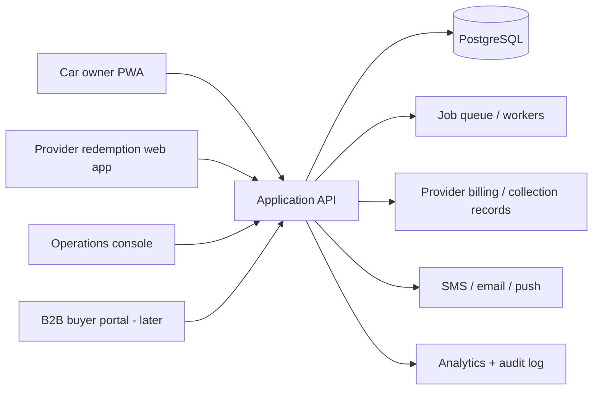

# WaffarhaCars product and delivery pack

Status: **Draft for legal, operations, finance, and engineering review**
Confirmed: Egypt-first; Cairo MVP during the first two months; Arabic/English; EGP; sales-managed provider catalogue; reservation-first/pay-at-center; commission on mutually confirmed completed services; responsive web/PWA first.

This repository pack is the source of truth for an AI-assisted build supervised by a product manager and reviewed by human engineers. It defines what should be built, what must not be built yet, and the evidence required before work is accepted.

## The decision in one paragraph

Do not build a literal Waffarha clone. Build a car-care marketplace that uses a lower-friction pattern—discover, reserve, check in, pay the center, mutually confirm completion, and bill provider commission—while adding the vehicle fit, provider trust, booking, scope clarity, and extra-work authorization that automotive services require. Launch through sequential Cairo clusters with fixed, comparable services. General repair begins as a diagnostic reservation and separate quote, not a fixed-price promise. Start with a mobile-first PWA, provider redemption web app, and operations console; native apps, customer prepayment, wallet, loyalty, fleet management, and open-ended repair payment are later bets.

## Non-negotiable warning

`WaffarhaCars` is only a temporary working name. This repository is not affiliated with, sponsored by, or authorized by Waffarha. The repository owner has authorized public technical review and evaluation under this temporary working name as an accepted working-name risk. This decision does not constitute legal, domain, or trademark clearance. Do not proceed with consumer launch, provider contracting, paid media, app-store release, or final branding under this name until Egyptian legal counsel completes trademark, unfair-competition, domain, and licensing checks—or Waffarha grants written permission. “Same everything” is also rejected as a product instruction: workflows and market conventions can inspire the product; copyrighted copy, images, code, distinctive visual expression, and brand assets cannot be copied.

## Product pack map

| File                                                                              | Purpose                                                                               |
| --------------------------------------------------------------------------------- | ------------------------------------------------------------------------------------- |
| [01-product-strategy.md](docs/01-product-strategy.md)                             | Positioning, hypotheses, launch wedge, business model, success gates                  |
| [02-reference-analysis.md](docs/02-reference-analysis.md)                         | Observable Waffarha model, automotive references, transferable patterns               |
| [03-prd.md](docs/03-prd.md)                                                       | MVP requirements, actors, journeys, stories, acceptance criteria                      |
| [04-ux-information-architecture.md](docs/04-ux-information-architecture.md)       | Navigation, screen inventory, content rules, Arabic/RTL, service UX                   |
| [05-domain-and-architecture.md](docs/05-domain-and-architecture.md)               | Domain model, state machines, system architecture, API boundaries                     |
| [06-operations-and-commercial.md](docs/06-operations-and-commercial.md)           | Provider recruitment, vetting, offer design, B2B, support and commission collection   |
| [07-delivery-and-backlog.md](docs/07-delivery-and-backlog.md)                     | Discovery gates, build slices, backlog, dependencies, release plan                    |
| [08-quality-security-observability.md](docs/08-quality-security-observability.md) | Definition of done, threat controls, test strategy, SLOs and telemetry                |
| [09-antigravity-playbook.md](docs/09-antigravity-playbook.md)                     | How the AI agent is supervised, PR size, evidence, escalation rules                   |
| [10-decisions-risks-open-questions.md](docs/10-decisions-risks-open-questions.md) | ADR summary, risk register, unresolved founder decisions                              |
| [11-transaction-redemption-sop.md](docs/11-transaction-redemption-sop.md)         | Exact reservation, redemption, commission billing, collection and exception workflows |
| [12-demo-slice.md](docs/12-demo-slice.md)                                         | High-fidelity clickable demo scope for customers, providers, sales and reviewers      |
| [13-production-foundation-plan.md](docs/13-production-foundation-plan.md)         | Production backend foundation, Prisma 7 ADR, state machine, and PR sequence           |
| [ANTIGRAVITY_DEMO_PROMPT.md](ANTIGRAVITY_DEMO_PROMPT.md)                          | Single copy-paste instruction for Antigravity to build and verify the showcase        |
| [SOURCES.md](SOURCES.md)                                                          | Full cited source inventory and access notes                                          |

## Product surfaces



## First release definition

The MVP is release-ready only when a real customer can select a saved vehicle and Cairo area, understand a fixed-scope offer entered by sales and approved by operations, reserve a slot without prepayment, receive a single-use discount pass, pay the locked price directly to the center, and mutually confirm completion through authenticated provider scan plus customer PIN—while operations can support the customer, accrue and invoice commission, record provider payment, control overdue exposure, and audit the complete journey.

## How to start

1. Complete the founder decisions in [10-decisions-risks-open-questions.md](docs/10-decisions-risks-open-questions.md).
2. Run the no-code supply-and-demand pilot in [07-delivery-and-backlog.md](docs/07-delivery-and-backlog.md).
3. Have counsel/accounting close the name, consumer terms, pay-at-center responsibility, commission invoicing/tax, privacy, discount-pass validity, and marketplace-liability questions.
4. Initialize the implementation repository with the `.agents/rules` and `.github` files in this pack.
5. In Antigravity's Rules panel, configure `00-product-guardrails.md` and `10-engineering-quality.md` as Always On; configure `20-review-evidence.md` as Model Decision using the description inside the file.
6. Give Antigravity one vertical slice at a time. Require a human-approved PR for every slice.

For the first visible artifact, build only the showcase slice in [12-demo-slice.md](docs/12-demo-slice.md). It demonstrates the proposition end to end without pretending production operations exist.

## Clickable Demo Showcase: Installation, Verification & Execution

This repository contains the interactive, responsive, bilingual showcase prototype demonstrating the end-to-end WaffarhaCars proposition (reserve free, pay center directly, mutual PIN completion, and single commission accrual).

### Prerequisites

- **Required Runtime**: Node.js 24 LTS (`>=24.0.0 <25.0.0`, `.nvmrc` and `.node-version` set to `24`)
- **Package Manager**: npm pinned via the `packageManager` field in `package.json` (clean install via `npm ci`)
- **Database (PostgreSQL 17)**: Official pinned image `postgres:17.11-alpine3.24` (disposable local container managed via `npm run db:test:up` and `npm run db:test:down`)

### Database Foundation & Health Probes

- **Start Local Test Database**: `npm run db:test:up` (launches health-checked PostgreSQL 17.11-alpine3.24 on port 5432)
- **Stop & Clean Test Database**: `npm run db:test:down` (destroys local test container and volumes)
- **Prisma Schema Validation**: `npm run prisma:validate` (validates `prisma/schema.prisma` without requiring database connection)
- **Prisma Client Generation**: `npm run prisma:generate` (reproducibly generates client into `src/generated/prisma`)
- **Deploy Migrations**: `npm run prisma:migrate:deploy` (executes declarative SQL migrations in production/CI via `DATABASE_DIRECT_URL`)
- **Migration Status**: `npm run prisma:migrate:status` (inspects database schema vs migration ledger)
- **Real PostgreSQL Integration Tests**: `npm run test:integration` (runs genuine Node.js integration tests against PostgreSQL 17)
- **Better Auth Schema Generation**: `npm run auth:schema:generate` (generates Prisma schema models deterministically via pinned `auth@1.7.5` CLI)
- **Better Auth Schema Drift Check**: `npm run auth:schema:check` (verifies zero schema drift against committed `prisma/schema.prisma`)
- **Liveness Probe**: `GET /api/live` (returns HTTP 200 `{ "status": "ok" }` with `Cache-Control: no-store`)
- **Readiness Probe**: `GET /api/ready` (returns HTTP 200 `{ "status": "ready" }` or HTTP 503 `{ "status": "unavailable" }`)
- **Protected Session Probe**: `GET /api/auth/probe` (returns RFC 7807 401 Problem Details when unauthenticated, or 200 `{ "authenticated": true }` when session is valid)
- **Staff Provisioning CLI**: `node scripts/provision-staff.mjs` (server-only credential provisioning with scrypt hashing, preflight conflict checks, compensating rollback, and bootstrap mode)
- **Staff Authentication & Mandatory TOTP**: `/staff/login` (email/password), `/staff/activate-password` (forced initial password change), `/staff/mfa/enroll` (RFC 6238 TOTP with single-use backup codes), `/staff/mfa/verify` (two-factor challenge gate), `/staff` (landing dashboard)
- **Server-Side Trusted Device Policy**: Zero bypass enforcement via `trustedDeviceGuardPlugin` (all `trustDevice: true` requests overridden to `false`, zero bypass cookies or records)

### Separate Verification Commands

All quality gates are isolated into discrete scripts and aggregated into `npm run verify` in the exact contract sequence:

```bash
# 1. Check code formatting across all maintained files
npm run format:check

# 2. Strict static analysis (zero errors, zero warnings: --max-warnings=0, no-explicit-any enforced)
npm run lint

# 3. TypeScript compiler type-check (zero type errors)
npm run typecheck

# 4. Run Vitest domain unit tests (62 unit tests under JSDOM environment)
npm run test:unit

# 5. Validate Prisma schema syntax
npm run prisma:validate

# 6. Run real PostgreSQL integration tests (Node environment against PostgreSQL container)
npm run test:integration

# 7. Build optimized production Next.js application
npm run build

# 8. Run Playwright automated acceptance tests (21 tests across Desktop and Mobile viewports)
npm run test:e2e

# 9. Run hermetic verification pipeline (format -> lint -> typecheck -> unit tests -> prisma validate -> build -> E2E)
npm run verify
```

### Running the Application

```bash
# Development mode with hot reload
npm run dev

# Production mode (must run npm run build first)
npm run build
npm start
# Server listens on http://localhost:3000
```

### Architecture & Toolchain Note

- **Compiler**: Next.js 16 uses Turbopack natively for builds and development. `@next/swc-wasm-nodejs` has been removed in favor of platform-native compilation.
- **Unit Testing**: Vitest 5 configured via ESM (`vitest.config.mts`) using `import.meta.dirname`.
- **E2E Testing**: Playwright launches the production Next.js server directly via `node` for clean process lifecycle management on Windows and POSIX runners.

### Review Surfaces & Visual Evidence

Portable full-page screenshots are saved under `artifacts/screenshots/`:

1. `mobile_en_home.png` (Mobile 390x844 English Home)
2. `mobile_ar_rtl.png` (Mobile 390x844 Arabic RTL Home)
3. `desktop_en_home.png` (Desktop 1440x900 English Home)
4. `desktop_ar_rtl.png` (Desktop 1440x900 Arabic RTL Home)
5. `provider_checked_in.png` (Desktop Provider Check-in Reception)
6. `provider_complete_success.png` (Desktop Provider Mutual PIN Completion)
7. `ops_commission_ledger.png` (Desktop Operations Commission Receivables Ledger)
8. `sales_missing_evidence_error.png` (Desktop Sales Price Evidence Validation Error)

### Navigating the Demo Showcase

- **Customer Surface:** `http://localhost:3000/` (Home), `/results` (Compatible search), `/offers/offer-oil-change-sunny` (Offer details), `/reserve/offer-oil-change-sunny` (Confirmation), `/my-reservations` (Discount pass).
- **Provider Workshop:** `http://localhost:3000/provider/check-in` (Scanner & arrival), `/provider/complete` (Mutual PIN completion).
- **Customer Audit & Review:** `http://localhost:3000/my-reservations/res-sunny-5688/completed` (Honored scope/price checklist).
- **Sales & Operations:** `http://localhost:3000/sales/new-offer` (Offer draft wizard with mandatory price evidence), `http://localhost:3000/ops/approvals` (Maker-checker approvals & commission receivables ledger).
- **Internal Staff Portal:** `http://localhost:3000/staff/login` (Staff sign-in), `/staff/activate-password` (Forced password change), `/staff/mfa/enroll` (TOTP MFA setup), `/staff/mfa/verify` (TOTP challenge), `/staff` (Internal staff dashboard).
- **Global Control:** Click **"Demo Scenarios"** in the top navigation banner to switch roles instantly or test all 11 preset states (clean empty, loading, incompatible vehicle, confirmed, checked in unissued, checked in valid PIN, wrong PIN, expired PIN, cancelled, no show, already completed).

## Document conventions

- **Requirement** means mandatory for the named release.
- **Recommendation** is a product or engineering judgment.
- **Hypothesis** must be validated; it is not a fact.
- **Later** means explicitly out of MVP scope.
- Every metric has an event definition and owner before implementation is accepted.
- All money is stored in integer minor units; all times are UTC in storage and rendered in Africa/Cairo.

## License and permitted use

This repository and documentation are source-available under the terms of the [LICENSE](LICENSE) file. Access to this public repository is provided solely for personal inspection and technical evaluation. GitHub users may view and fork the repository as permitted by GitHub's Terms of Service. This project is not licensed under an open-source license, and commercial use, production deployment, redistribution, modification, and derivative works are strictly prohibited without prior separate written permission from the copyright holder, Mohamed Hany Ahmed (or a future legal successor or assignee), except where GitHub's Terms of Service necessarily provide otherwise. Final commercial licensing terms remain subject to legal review.
