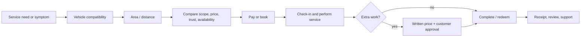

# Reference analysis

## Research boundary

Waffarha's private source code, databases, services, internal admin tools, and operating procedures are not public. The model below is an inference from observable public pages, policies, purchase instructions, merchant intake, app-store information, and visible UI. It is a product reconstruction, not a claim about Waffarha's actual implementation.

## Observable Waffarha product structure

Public evidence shows a two-sided Egypt-only marketplace based on coupons. Customers create an account, choose offers, add coupon quantities to a cart, select a payment method, receive coupons in “My Orders,” and redeem a coupon code at a merchant. Waffarha also exposes wallet/credit, promo code, cashback, refund, merchant lead-capture, category merchandising, location, ratings, and multiple local payment methods. Its public merchant form gathers company identity, industry, branches, social/website presence, tax card, and commercial registration.^1 ^2 ^3 ^4 ^5

### Inferred customer domains

- identity and account;
- editorial home/category catalogue;
- offer, merchant, branch, location, price and discount;
- cart and coupon quantity;
- payment orchestration;
- order and single-use coupon issuance;
- “My Orders,” coupon state and redemption;
- wallet/credit, cashback and promo codes;
- refund/support;
- ratings and recommendations;
- notifications and transactional messaging.

### Inferred merchant/operations domains

- merchant acquisition and compliance documents;
- branches and offer creation/approval;
- coupon validation/redemption;
- transaction reconciliation and settlement;
- campaign merchandising;
- customer support and refunds;
- fraud/abuse controls;
- content and reporting.

## What transfers to WaffarhaCars

| Pattern                         | Keep       | Adapt                                                                                        |
| ------------------------------- | ---------- | -------------------------------------------------------------------------------------------- |
| Offer-led discovery             | Yes        | Start from service need, vehicle and area—not lifestyle categories                           |
| Old price / deal price / saving | Yes        | Also show parts, labor, taxes, eligibility and exclusions                                    |
| Cart and local payments         | Later      | MVP uses one-service reservation and pay-at-center to remove early payment friction          |
| Single-use voucher              | Adapt      | Use a free discount pass: QR + provider authentication + customer completion PIN             |
| My Orders                       | Adapt      | Rename to My Reservations; show vehicle, branch, appointment, locked price and support state |
| Merchant lead form              | Yes        | Expand into vetting, technical capability, service bays, warranties and documents            |
| Wallet/cashback                 | Later      | Avoid regulated/accounting complexity in MVP                                                 |
| Broad category home             | No         | Use “What does your car need?” and recent vehicle context                                    |
| “Up to X%” as hero promise      | Cautiously | Show exact savings for selected variant; avoid bait-like maximum discounts                   |

## Automotive reference patterns

RepairPal demonstrates that trust is a system: location- and vehicle-aware price estimates, provider certification, verified satisfaction, quality criteria, and warranty expectations.^6 Openbay demonstrates symptom/service capture, comparable quotes including parts/labor/taxes, scheduling, provider vetting, and a service guarantee.^7 BookMyGarage demonstrates registration/vehicle and postcode inputs, comparison by price, availability, distance and reviews, and an explicit rule that extra work cannot change price without customer permission.^8 CAFU demonstrates a regional service taxonomy spanning wash, battery, tyres, oil, inspection and at-location convenience, plus B2B/fleet propositions.^9

### The combined best-practice pattern

## UI/UX implications

Waffarha's landing page uses a familiar conversion structure: compact header, singular value proposition, app-store calls to action, merchant social proof, feature cards, team/mission/values, and a second download call to action. Its product marketplace uses discount-first cards and category merchandising. WaffarhaCars should keep the clarity and repeated calls to action, but replace generic lifestyle imagery and deal browsing with vehicle relevance, verified-provider signals, service scope, nearby availability, and transparent fine print.

## Anti-patterns to avoid

- Copying Waffarha's orange palette, logo geometry, marketing copy, screen composition, imagery, or trade dress.
- Showing an offer before confirming vehicle/branch compatibility.
- Treating a fluctuating repair as a fixed-price product.
- Letting the center redeem without an authenticated employee and immutable audit event.
- Marking a reservation completed when it is created rather than after service and customer confirmation.
- Hiding exclusions or “starting from” conditions below the reservation action.
- Paying providers from mutable order totals instead of append-only ledger entries.
- Incentivizing reviews without disclosing the incentive or allowing provider suppression.

## Source notes

1. Waffarha, “How To Buy.”
2. Waffarha, “FAQ / My Coupons.”
3. Waffarha, “Use Policy.”
4. Waffarha, “Refund Policy.”
5. Waffarha, “Join as a Merchant.”
6. RepairPal, “Certified Shops” and FAQ.
7. Openbay, “How Openbay Works.”
8. BookMyGarage, FAQ.
9. CAFU, official website and ESG report.
   Full links and access dates are in [SOURCES.md](../SOURCES.md).
