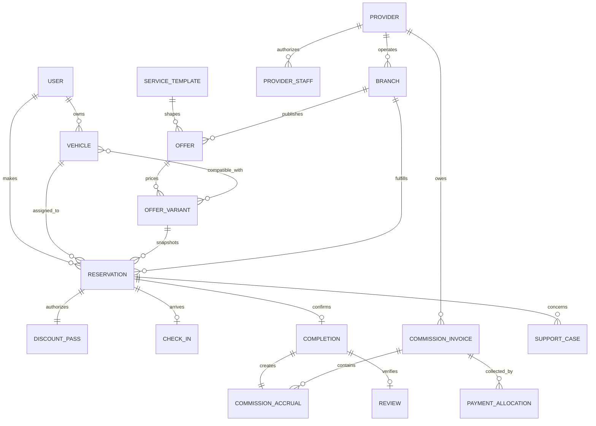

# Domain and architecture

## Architecture decision

Build a **modular monolith** with asynchronous workers, not microservices. A small team needs one deployable application, one transactional database, observable module boundaries, and reliable money-state invariants. Extract a service only after measured scaling or ownership pressure exists.

Recommended initial stack, subject to engineering approval:

- TypeScript monorepo;
- responsive Next.js PWA for customer, provider, and admin surfaces with separate route groups and authorization boundaries;
- backend application layer in the same deployable repository, exposing versioned REST/OpenAPI endpoints;
- PostgreSQL as system of record;
- Redis only for rate limits, short-lived cache and job coordination—not financial truth;
- durable job queue/outbox worker;
- S3-compatible object storage for provider/evidence documents;
- no customer payment gateway in MVP; retain a later integration boundary without implementing it;
- managed deployment with separate dev/staging/production, infrastructure as code, secrets manager and point-in-time database recovery.

React Native/Expo can be added later against the same API. Starting with three native codebases would be unjustified before retention is proven.

## Bounded modules

| Module          | Owns                                                                                              | Must not own                               |
| --------------- | ------------------------------------------------------------------------------------------------- | ------------------------------------------ |
| Identity        | users, sessions, roles, OTP challenges, consent                                                   | reservations or provider commercial status |
| Vehicles        | canonical makes/models, customer vehicles, compatibility attributes                               | offer prices                               |
| Providers       | legal entity, sales ownership, branches, documents, staff membership, lifecycle                   | customer payment                           |
| Catalogue       | service taxonomy/templates, sales-entered drafts, approved offer versions, variants, terms, media | reservations after confirmation            |
| Discovery       | query/ranking projections, geo filters                                                            | source-of-truth offer mutation             |
| Reservations    | vehicle/branch/slot, price/terms/commission snapshot, lifecycle                                   | mutable offer content                      |
| Discount passes | opaque token, check-in and completion authorization                                               | pricing or catalogue mutation              |
| Commission      | immutable accruals, reversals, statements, invoices, allocations                                  | editing completion history                 |
| Collections     | provider credit limit, invoice aging and recorded payments                                        | customer payment processing                |
| Reviews         | verified reviews, moderation                                                                      | provider vetting decision                  |
| Support         | cases, evidence, resolution                                                                       | silent state mutation                      |
| Notifications   | templates, preferences, delivery attempts                                                         | business-state authority                   |
| Audit           | privileged and security events                                                                    | editable operational data                  |

## Core entities



## State machines

### Reservation

`confirmed -> checked_in -> completed`
Alternates: `customer_cancelled`, `provider_cancelled`, `no_show`, `expired`, `disputed`, `rescheduled`.

### Commission accrual

`unbilled -> statement_pending -> invoiced -> paid`
Alternates: `disputed`, `reversed`, `overdue`, `written_off`.

Only mutually confirmed completion can create the original commission accrual. Corrections create append-only reversals/adjustments with maker-checker approval.

## Financial integrity model

- Store currency as ISO code and money as integer minor units.
- Snapshot offer title, scope, terms version, locked discounted price, commission rule, tax treatment, provider and branch on the reservation.
- Commission schedules store the agreed basis, rate, effective period, thresholds/caps and fee allocation. Sales cannot alter a schedule after approval.
- Use an append-only commission subledger from day one; never derive provider debt from the current offer or a mutable completion total.
- Use unique constraints on reservation-to-pass, pass token hash, completion terminal event, completion-to-accrual and invoice line membership.
- Use an outbox table committed with business transitions; workers publish notifications/analytics after commit.
- Reconcile completed reservations, commission accruals, invoices and provider payment allocations daily.
- Admin “fixes” create compensating entries and reasoned transitions, never SQL edits.

## API conventions

- `/api/v1` with OpenAPI committed and diff-reviewed.
- Resource identifiers are opaque UUID/ULID values; public codes are separate and rate-limited.
- Commands accept an idempotency key for reservation creation, check-in, completion, invoice generation and payment allocation.
- Cursor pagination; bounded filters; validated sort keys.
- RFC 7807-style problem responses with stable machine codes and localized UI copy handled at clients.
- Optimistic concurrency/version column on frequently edited admin resources.
- Authorization occurs server-side at resource and action level; hiding UI is not authorization.

Example endpoints:

```text
GET    /api/v1/service-families
GET    /api/v1/offers?vehicle_id=&area_id=&service_family=&cursor=
GET    /api/v1/offers/{offer_id}
POST   /api/v1/reservations
GET    /api/v1/reservations/{reservation_id}
POST   /api/v1/reservations/{reservation_id}/reschedule
POST   /api/v1/reservations/{reservation_id}/cancel
POST   /api/v1/provider/check-ins
POST   /api/v1/provider/completions
GET    /api/v1/provider/commission-statements
POST   /api/v1/admin/commission-invoices
POST   /api/v1/finance/payment-allocations
```

## Search and ranking

Use PostgreSQL geo/text capabilities first. Build a deterministic relevance score from compatibility, active/available status, distance, service match, verified rating confidence, price/value, provider reliability and explicitly labeled sponsorship. Log the score components for debugging and fairness review. Do not introduce Elasticsearch until query evidence requires it.

## Deployment boundaries

- Completion, commission, finance and admin routes receive stricter authorization/rate controls.
- Provider and admin sessions use MFA and shorter lifetimes.
- Dev/staging use synthetic or scrubbed data; never copy production personal data casually.
- Database migrations are forward-compatible, reviewed, backed up and tested on realistic volume.
- Feature flags separate deploy from release; financial code paths require kill switches.
