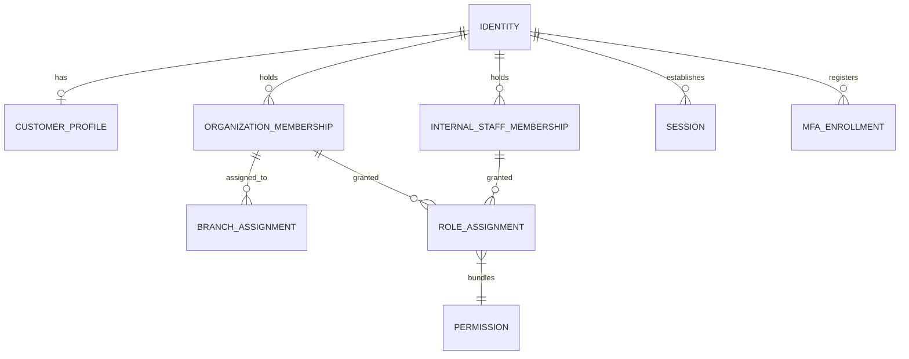
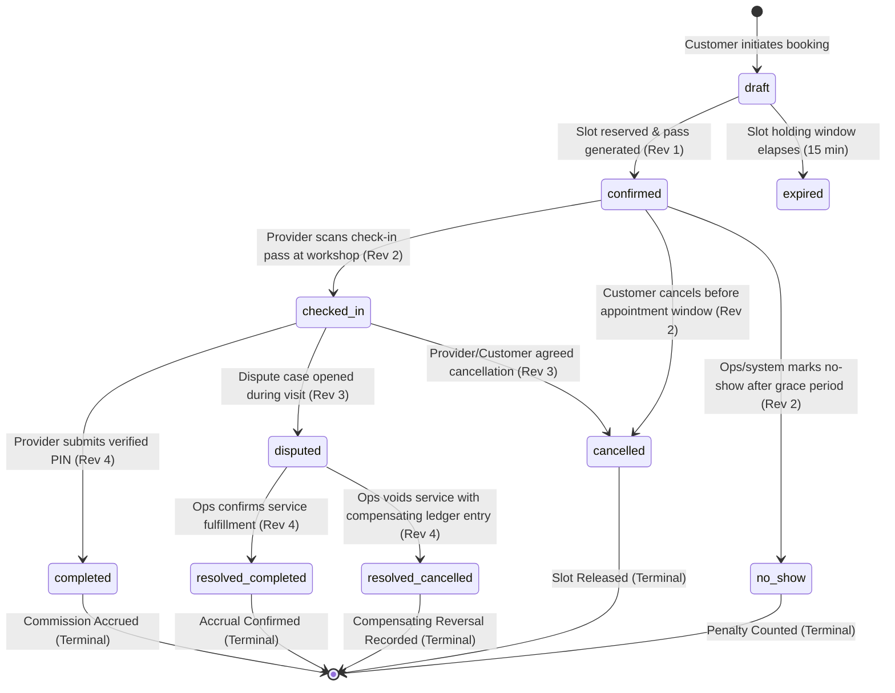
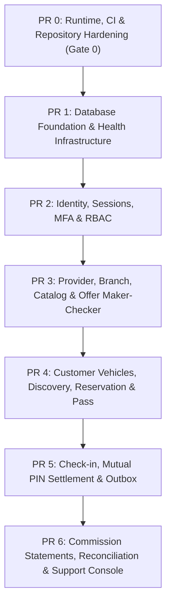

# WaffarhaCars Production Foundation & Backend Architecture Plan

**Document ID:** `docs/13-production-foundation-plan.md`
**Status:** Submitted for Architecture Review & Explicit PM Approval
**Author:** Senior Implementation Engineer
**Target Runtime:** Node.js 24 LTS
**Review Date:** September 14, 2026

---

## 1. Architectural Decision Record: Data Access & ORM (Prisma 7)

### Context & Assessment

The production backend requires type-safe query execution, checked-in SQL migrations, compile-time schema validation, and predictable connection pooling across Next.js Server Components and Route Handlers.

- **Prisma 7 Selection:** Prisma 7 is a deliberate, fully supported GA choice for this release. It provides first-class TypeScript configuration (`prisma.config.ts`), strict ESM alignment, and mature `@prisma/adapter-pg` driver adapter integration with PostgreSQL 17.
- **Prisma 8 Status:** Prisma 8 is no longer a release candidate; however, Prisma 7 is chosen as the standardized, vetted foundation for this release to ensure operational stability, library compatibility, and predictable enterprise connection pooling.
- **Model-Free Baseline (PR 1):** In PR 1, the schema is model-free to establish the database connection pool, health infrastructure, and migration toolchain without manufacturing synthetic tables (e.g. fake metadata or healthcheck tables). The first genuine domain migration is deferred until PR 2 when actual domain entities are introduced.
- **No Automatic Rollback Safety:** Prisma Migrate does not provide automatic general-purpose schema rollbacks. All operational recoveries rely on forward-fixing with compensating migrations, strict expand/contract practices, or database Point-In-Time Recovery (PITR).
- **Decision:** Standardize on **Prisma ORM 7.10.0** with `@prisma/adapter-pg` and `pg.Pool`, pinned intentionally in `package.json`.

### Prisma 7 Implementation Requirements

1. **Native ESM:** The backend application and Prisma toolchain operate strictly in ECMAScript Modules mode (`"type": "module"`).
2. **`prisma.config.ts` Configuration:** Adopt Prisma 7's TypeScript configuration standard (`prisma.config.ts`), using `process.env.DATABASE_DIRECT_URL` for migration operations.
3. **Explicit Environment Loading:** Database URLs (`DATABASE_URL`, `DATABASE_DIRECT_URL`) must be explicitly loaded and validated via Zod schemas (`src/lib/env.ts`) with no silent defaults and generic secret-free error messages.
4. **Current Client Generator & Explicit Output Path:** Configure `generator client` with an explicit output destination (`output = "../src/generated/prisma"`), ignored in version control and generated during setup/build.
5. **Checked-In SQL Migrations & Immutability:** Schema changes are authored with `prisma migrate dev` producing immutable SQL migration files. In CI and production, migrations are executed strictly via `prisma migrate deploy`. Migrations are never executed implicitly during web application startup. `prisma db push` is strictly prohibited in deployment environments.
6. **Zero Preview Features:** The production schema uses only GA (General Availability) Prisma features. All `previewFeatures` flags are disallowed.

---

## 2. Server-Controlled Architecture & Demo Boundary

### Security Mandate: Server-Only Backend Selection

Client-side environment variables (such as `NEXT_PUBLIC_*`) are transmitted to the browser and are untrusted. Under no circumstances may a client dictate or select its authoritative database backend.

1. **Configuration Keys:** Environment profile and backend selection are governed strictly by server-only environment variables:
   ```bash
   APP_RUNTIME_PROFILE=showcase|production
   APP_DATA_BACKEND=demo|postgres
   ```
2. **Fail-Closed Production Invariant:**
   - Both `APP_RUNTIME_PROFILE` and `APP_DATA_BACKEND` must be explicitly declared (no silent defaults).
   - Commercial deployment discriminator is `APP_RUNTIME_PROFILE` (never `NODE_ENV`).
   - Showcase environments (`APP_RUNTIME_PROFILE=showcase`) may configure `APP_DATA_BACKEND=demo` or `APP_DATA_BACKEND=postgres`.
   - Production environments (`APP_RUNTIME_PROFILE=production`) **must configure** `APP_DATA_BACKEND=postgres`.
   - Backend initialization and readiness probes (`/api/ready`) **fail closed with a configuration error** if `APP_RUNTIME_PROFILE=production` and `APP_DATA_BACKEND` is set to `demo`.
   - When `APP_DATA_BACKEND=postgres`, Route Handlers instantiate production domain repositories backed by Prisma transactions and PostgreSQL 17. Demo endpoints, scenario controls, showcase fixtures, and localStorage adapters are completely excluded from and unreachable within the production deployment.
3. **Showcase Isolation:** The existing interactive demo, localStorage persistence, and Playwright acceptance tests remain completely isolated and functional until production vertical slices replace them.

---

## 3. Identity, Roles & Authorization Model

### Separation of Identity and Organizational Claims

A single `role` enum on a user table is fundamentally incapable of modeling multi-sided automotive marketplaces. One physical person may be:

- A car owner booking personal vehicle maintenance;
- A workshop manager at Provider Branch A;
- A regional sales agent managing merchant onboarding;
- An operations analyst reviewing commission disputes.



### Core Entities:

1. `Identity`: The core authentication subject (E.164 phone number with Egypt `+20` validation, verified status, active/suspended flag, created_at).
2. `CustomerProfile`: Consumer-specific attributes (preferred language: `ar` or `en`, notification preferences).
3. `ProviderOrganizationMembership`: Junction linking an `Identity` to a `ProviderOrganization` (merchant legal entity), with employment status and title.
4. `BranchAssignment`: Scopes provider staff to specific physical workshop locations (`ProviderBranch`). Staff cannot check in or complete reservations booked at branches they are not actively assigned to.
5. `InternalStaffMembership`: Links an `Identity` to internal departments (`SALES`, `OPERATIONS`, `FINANCE`, `SUPPORT`, `PLATFORM_ADMIN`).
6. `RoleAssignment`: Role bound to an identity within a specific organizational or internal scope.
7. `Permission`: Fine-grained permission strings (e.g., `offers:draft:create`, `offers:draft:approve`, `reservations:check_in`, `reservations:complete`, `settlements:batch:generate`).
8. `Session`: Server-managed session record (session ID, identity ID, hashed token, IP address, user agent, absolute expiry, idle expiry, revoked flag).
9. `MfaEnrollment`: Multi-factor authentication factors (encrypted TOTP secret at rest, individually hashed single-use recovery codes, enrolled timestamp, last used timestamp). MFA is mandatory for all provider staff and internal personnel.

### Personal Data Minimization (Vehicle Identification Policy)

To support data minimization and reduce privacy risk, subject to validation by Egyptian counsel, **vehicle plate numbers are strictly excluded from the MVP**.

- Service compatibility depends exclusively on: **Vehicle Make**, **Vehicle Model**, **Model Year**, and **Engine/Transmission Type**.
- Personal identifier data is not collected from customers without an approved operational and legal justification.

---

## 4. Authentication & Session Strategy

### Passwordless Architecture & Session Cookie Policy

The MVP eliminates application passwords entirely. Passwords introduce significant support friction for workshop personnel, present credential-stuffing vulnerabilities, and add unnecessary credential storage compliance burdens.

1. **Customer Authentication:** Passwordless phone OTP via an abstracted messaging adapter (`OtpGatewayAdapter`).
2. **Internal & Provider Staff Authentication:** Phone OTP combined with mandatory Multi-Factor Authentication (TOTP authenticator app or hardware token).
3. **Session Transport & Cookie Decision:** A single, strictly documented cookie policy:
   - `Secure: true` (HTTPS only);
   - `HttpOnly: true` (inaccessible to browser JavaScript);
   - `SameSite: "Lax"`;
   - Narrow `Path: "/"`;
   - Explicit `Domain` handling aligned with host;
   - Cryptographically random 256-bit session tokens with database-hashed tokens (`sha256(token)`);
   - Session rotation upon authentication, privilege changes, and explicit refresh;
   - 2-hour idle timeout, 14-day absolute maximum lifetime.
4. **CSRF & Request Integrity:**
   - Origin validation and Fetch Metadata headers (`Sec-Fetch-Site`, `Sec-Fetch-Mode`) verified on all mutating endpoints.
   - Synchronizer CSRF tokens required for sensitive state mutations.
5. **Credential Protection at Rest:**
   - TOTP secrets are encrypted at rest using AES-256-GCM with keys managed outside the database.
   - Backup recovery codes are individually hashed with Argon2id and marked consumed upon single use.
   - Managed authentication and OTP vendor selection remain subject to a separate evidence gate evaluating delivery reliability, fraud controls, and pricing.

---

## 5. Reservation Lifecycle & Dispute State Machine

The reservation aggregate adheres strictly to the defined business lifecycle. Credential states (such as active PINs) are metadata attributes of the reservation, not top-level business states.



### Business State Invariants:

1. `draft`: Ephemeral reservation during slot selection and vehicle compatibility verification.
2. `confirmed`: Reservation confirmed by customer. Generates the discount pass. Revision = 1.
3. `checked_in`: Customer has arrived at the workshop; provider scanned the single-use check-in pass. Revision = 2.
4. `completed`: Mutually confirmed fulfillment. Customer provided 6-digit confirmation code; provider entered matching code. Commission receivable created. Terminal state. Revision = 4.
5. `cancelled`: Reservation cancelled by customer prior to appointment cutoff, or cancelled jointly. Terminal state.
6. `expired`: Draft or unconfirmed reservation abandoned. Terminal state.
7. `no_show`: Customer failed to arrive within the scheduled appointment window plus the mandatory 60-minute grace period. **Workshop staff cannot unilaterally mark a reservation as `no_show`**; staff may only log an arrival failure request, which is finalized by the automated background scheduler or operations team after the grace period expires.
8. `disputed`: Formal dispute case attached to reservation. Handled by operations console:
   - **Outcome A (`resolved_completed`):** Operations confirms service scope was fulfilled; commission accrual stands.
   - **Outcome B (`resolved_cancelled`):** Operations voids service due to merchant default/overcharge; a compensating ledger credit entry is created to reverse the commission receivable. Existing financial accruals are **never deleted or silently modified**.

---

## 6. Pass & PIN Security Architecture

### Check-in Pass (Arrival Authentication)

- **Token Generation:** 128-bit cryptographically secure random token (URL-safe base64).
- **Storage:** Only the cryptographic hash (`sha256(token)`) is persisted in the database. Plaintext is never stored.
- **Payload Format:** A versioned non-URL QR payload:
  ```text
  wcpass:v1:<opaque_token>
  ```
  Raw bearer tokens are **never embedded in URLs** (e.g. `https://waffarhacars.com/p/...`) to prevent leakage into HTTP access logs, proxy caches, monitoring tools, or browser histories. The provider terminal scans the payload and transmits it in an authenticated POST request body.
- **Human Fallback Code:** An independently generated 6-character uppercase alphanumeric code (excluding ambiguous characters `0, O, 1, I`), stored only as a keyed hash, branch- and reservation-bound, rate-limited, attempt-limited, single-use, and fully audited.
- **Binding & Validity:** Bound strictly to `reservation_id` and `provider_branch_id`. Valid only from `scheduled_start - 30 minutes` until `scheduled_end + 60 minutes`.
- **Consumption:** Atomically invalidated upon first successful check-in or cancellation.

### Completion Confirmation Code (Mutual Fulfillment Settlement)

- **Nature:** A 6-digit low-entropy human confirmation code (`000000`–`999999`) generated on demand only after status is `checked_in`. Its security relies on short validity, keyed server verification, strict attempt limits, authenticated provider staff, and branch scoping.
- **Keyed Verification Mechanism (HMAC-SHA-256):**
  - Stored as an HMAC-SHA-256 hash using a dedicated secret key managed via environment/secret manager (`PIN_HMAC_SECRET`).
  - Stored along with an active `key_version`.
  - Supports key rotation by allowing verification against both current and immediately preceding key versions.
  - Constant-time comparison (`crypto.timingSafeEqual`) enforced to prevent timing side-channel attacks.
- **Time-to-Live & Lockout:** Valid for exactly 10 minutes from issuance. Maximum 3 failed entry attempts permitted. On the 3rd failed attempt, the credential is permanently locked, and the reservation is flagged for operational review.
- **Zero Offline Settlement:** Completion commands require live connection to the backend. Offline client-side tokens are explicitly prohibited from generating commission receivables. In connectivity outages, staff follow the Operations-Assisted Exception SOP requiring dual-party physical documentation and later manual reconciliation.

---

## 7. Atomic Completion & Financial Transaction Engine

### Strict Financial Arithmetic Policy

To prevent IEEE-754 floating-point inaccuracies, currency conversions, and round-trip calculation drift:

1. All currency values are strictly stored and computed as **integers representing minor units (piastres)** (`1 EGP = 100 piastres`) using native TypeScript `BigInt`.
2. Commission rates are stored as **integer basis points** (`1% = 100 bps`, `10% = 1000 bps`, `100% = 10000 bps`) with an enforced range of `0` to `10,000`. Basis points are converted to `BigInt` only for arithmetic multiplication.
3. JavaScript `Number` and `Math.round` are **strictly forbidden** in financial calculations.
4. **Deterministic Integer Half-Up Rounding Policy:**
   $\text{commissionMinor} = \left\lfloor \frac{\text{customerPriceMinor} \times \text{commissionBasisPoints} + 5000\text{n}}{10000\text{n}} \right\rfloor$

### Atomic Completion Transaction Specification

Rather than relying on unverified speculative ORM pseudo-code, production completion commands adhere to this strict transactional specification and execution contract:

#### Idempotency & Concurrency Invariants:

1. **Unique Idempotency Scope:** Every command is scoped to the tuple `(actor_id, operation, idempotency_key)` with a unique database constraint.
2. **Canonical Request Fingerprint:** A SHA-256 digest computed over the normalized, sorted request payload: `sha256(canonical_json(payload))`.
3. **Fingerprint Conflict Policy:** Retrying a scoped idempotency key with a differing request fingerprint is immediately rejected with HTTP 409 Conflict.
4. **Failure Persistence & Atomic Rate-Limiting:**
   - Expected domain failures that require persistent state mutations (specifically, an invalid confirmation code attempt) must atomically persist both the incremented `failed_attempts` count and the stored failure response in the idempotency record.
   - Retrying the same wrong-code request returns the cached failure response without incrementing the failure counter a second time.
5. **Infrastructure Rollback:** Unexpected infrastructure exceptions (database connectivity, deadlock aborts, constraint violations) roll back all transactional writes.
6. **Replay Determinism:** Retrying a completed transaction with the identical fingerprint returns the committed result payload without re-executing business logic.
7. **Defense in Depth:** The database enforces an immutable `UNIQUE(reservation_id)` constraint on both `completion_records` and `commission_accruals`, ensuring impossible duplicate receivables even under hypothetical isolation breakdowns.

#### Strict 13-Step Transaction Execution Sequence:

1. **Authenticate Actor:** Verify caller session and identity outside the database transaction.
2. **Validate Request Shape:** Validate parameters (`reservationId`, 6-digit confirmation code, `expectedRevision`, `idempotencyKey`) via Zod schemas outside the transaction.
3. **Begin Transaction:** Open an explicit PostgreSQL transaction at `READ COMMITTED` with consistent row-level locking (`FOR UPDATE`).
4. **Atomically Claim Idempotency Key with Lease:** Execute an atomic claim including a bounded 60-second lease to guarantee no failure leaves a permanent unresolvable `PENDING` state. An expired `PENDING` claim may be reclaimed **only when the request fingerprint strictly matches**, preventing any differing payload from taking over or overwriting the original fingerprint:
   ```sql
   INSERT INTO idempotency_records (actor_id, operation, idempotency_key, request_fingerprint, status, created_at, expires_at)
   VALUES ($1, 'RESERVATION_COMPLETE', $2, $3, 'PENDING', NOW(), NOW() + INTERVAL '60 seconds')
   ON CONFLICT (actor_id, operation, idempotency_key) DO UPDATE
     SET expires_at = NOW() + INTERVAL '60 seconds'
     WHERE idempotency_records.status = 'PENDING'
       AND idempotency_records.request_fingerprint = EXCLUDED.request_fingerprint
       AND idempotency_records.expires_at < NOW()
   RETURNING id, status, request_fingerprint, response_payload, expires_at;
   ```
5. **Resolve Idempotency State & Enforce Deterministic Failure Handling:**
   - If row was not inserted or updated: load existing claim.
   - If existing fingerprint does not match incoming fingerprint: abort immediately with HTTP 409 Conflict without altering state or lease. A differing fingerprint must never overwrite the stored fingerprint, even after lease expiry.
   - If existing status is `COMPLETED`: commit/close and return cached `response_payload`.
   - If existing status is `PENDING` and unexpired: reject concurrent in-flight command with HTTP 409 Conflict.
   - **Deterministic Resolution Contract (No Permanent PENDING Records):**
     1. **Wrong confirmation code (requires aggregate state mutation):** Commit the incremented `failed_attempts` and store the cached error response (HTTP 401 / HTTP 423) with status `COMPLETED` so subsequent identical retries return the memoized lockout/error without double-incrementing attempts.
     2. **Other handled errors without required state mutation (e.g., authorization rejection, branch mismatch, invalid revision):** Explicitly remove the newly claimed idempotency record (`DELETE FROM idempotency_records WHERE id = $claim_id`) before returning the error response, ensuring authorization or prerequisites may be reevaluated on future requests.
     3. **Successful result:** Mark status as `COMPLETED` with the success payload.
     4. **Unexpected infrastructure error:** Transaction `ROLLBACK` automatically drops the uncommitted claim.
     5. Under this contract, no transaction may commit a permanently unresolved `PENDING` record, and ambiguous `FAILED or COMPLETED` policies are strictly avoided.
6. **Lock Reservation Aggregate:** Execute `SELECT ... FROM reservations WHERE id = $1 FOR UPDATE` (ensuring consistent parent-first lock ordering across all mutation routes).
7. **Verify Authorization & Scoping:** Query active `provider_staff_assignments` matching the reservation's exact `provider_organization_id` and `provider_branch_id`, requiring the `reservations:complete` permission claim.
8. **Lock Completion Credential:** Execute `SELECT ... FROM completion_credentials WHERE reservation_id = $1 FOR UPDATE`.
9. **Evaluate Business & Expiry Rules:** Verify reservation status is `checked_in`, current revision matches `expectedRevision`, credential is not consumed, attempts < 3, and credential is not expired.
10. **Process Expected Domain Failures:** If confirmation code verification fails:
    - Increment `failed_attempts`.
    - If attempts reach 3: transition credential to `LOCKED`.
    - Update idempotency record status to `COMPLETED` storing the error payload.
    - Commit transaction and return HTTP 401 / HTTP 423.
11. **Apply Success Mutations:** If confirmation code is valid:
    - Advance reservation status to `completed` and increment revision to `currentVersion + 1`.
    - Mark credential as `consumed`.
    - Insert immutable `completion_records` row (`amount_paid_piastres`, staff ID, timestamp).
    - Insert unique `commission_accruals` row with integer half-up commission piastres.
    - Insert immutable `audit_events` record.
    - Insert `outbox_events` record for asynchronous notification dispatch.
    - Update idempotency record status to `COMPLETED` with the success payload.
12. **Commit Transaction:** Commit all atomic operations in a single commit.
13. **Return Response:** Return the committed response payload to the caller with HTTP 200 OK.

### Mandatory Automated Verification Suite for Completion Engine:

1. **Simultaneous Same Key & Same Payload:** Assert exactly one execution succeeds and the parallel request receives the cached success payload.
2. **Same Key with Different Payload:** Assert rejection with HTTP 409 Conflict without altering reservation state.
3. **Competing Commands Racing for One Reservation:** Assert one succeeds (advancing to `currentVersion + 1`) and the competing command fails with revision conflict (HTTP 409).
4. **Staff Assigned to Multiple Branches:** Assert completion is permitted only when staff assignment matches the reservation's specific booking branch.
5. **Staff from Different Provider Organization:** Assert rejection with HTTP 403 Forbidden.
6. **Expired Code:** Assert rejection with HTTP 410 Gone; reservation remains `checked_in`.
7. **Third Failed Attempt:** Assert credential lockout; attempts count frozen at 3; operational alert recorded; retries return cached lockout.
8. **Duplicate Accrual Constraint:** Database test asserting that inserting a duplicate `commission_accruals` row throws a unique constraint error.
9. **Rollback Integrity:** Assert full rollback of reservation revision and completion records if outbox or audit table insertion fails.

---

## 8. Relational Data Model (Complete Entity Architecture)

Standard UUIDv4 primary keys exclusively for all entities in the MVP, integer minor units, and strict foreign-key integrity.

### Structural Entity Inventory:

1. `identities`: User identity table (phone, verified status, active flag).
2. `customer_profiles`: Car owner profile and notification preferences.
3. `provider_organizations`: Legal workshop entity, commercial registry, tax number.
4. `provider_branches`: Workshop facility, coordinates, active flag, operating hours.
5. `organization_memberships`: Ties identities to provider organizations.
6. `branch_assignments`: Restricts staff to authorized physical branches.
7. `internal_staff_memberships`: Internal operations, sales, finance roles.
8. `role_assignments`: Binds fine-grained permissions to identities.
9. `sessions`: Active server-side sessions with token hashes and expirations.
10. `mfa_enrollments`: Encrypted TOTP secrets and hashed recovery codes.
11. `service_categories`: Catalog taxonomies (e.g. brakes, periodic maintenance).
12. `service_definitions`: Fixed-scope standard service items.
13. `vehicle_makes`: Supported automotive brands.
14. `vehicle_models`: Models, generation years, engine/transmission variants.
15. `customer_vehicles`: Customer garage entries (Make, Model, Year, Fuel — **no license plate numbers**).
16. `offers`: Merchant offers linking services to branches.
17. `offer_revisions`: Maker-checker pricing versions (`draft`, `pending_approval`, `active`, `rejected`).
18. `offer_evidences`: Mandatory photos/documents verifying street price.
19. `reservations`: The core transactional aggregate.
20. `reservation_snapshots`: Immutable snapshot of price, inclusions, exclusions at booking.
21. `discount_check_in_passes`: Opaque arrival check-in token hashes and appointment window constraints.
22. `check_in_events`: Check-in arrival records.
23. `completion_credentials`: Domain-separated HMAC-SHA256 signature with key version, attempt counters, and expiration.
24. `completion_records`: Mutual fulfillment receipts (`UNIQUE(reservation_id)`).
25. `commission_accruals`: Financial receivables (`UNIQUE(reservation_id)`).
26. `dispute_cases`: Formal dispute tracking attached to reservations.
27. `settlement_batches`: Periodic billing statements generated for merchants.
28. `settlement_line_items`: Ledger mapping accruals to settlement invoices.
29. `verified_reviews`: Ratings and reviews strictly guarded by verified completion.
30. `idempotency_records`: Idempotent command deduplication.
31. `audit_events`: Immutable audit trail for all aggregate mutations.
32. `outbox_events`: Transactional outbox events for messaging and analytics.

---

## 9. Sanitized Health, Liveness & Readiness Endpoints

To protect system topology from adversarial reconnaissance, public health checks must not expose internal details, database error messages, memory usage, or server uptimes.

### `/api/live` (Liveness Probe)

- **Purpose:** Verifies that the Node.js application process is running and accepting HTTP requests.
- **Access:** Public / Unauthenticated.
- **Success Response:** HTTP `200 OK`
  ```json
  { "status": "alive" }
  ```

### `/api/ready` (Readiness Probe)

- **Purpose:** Verifies that critical backend dependencies (PostgreSQL connection pool) are initialized and responsive.
- **Access:** Restricted at the network/platform layer (accessible only to internal load balancers or orchestrators).
- **Execution:** Executes a fast ping query (`SELECT 1`).
- **Success Response:** HTTP `200 OK`
  ```json
  { "status": "ready" }
  ```
- **Degraded / Failure Response:** HTTP `503 Service Unavailable`
  ```json
  { "status": "unready" }
  ```
  _Note:_ The HTTP response body is strictly sanitized. Connection pool errors, query exceptions, or stack traces are **never** returned in the HTTP response; they are emitted exclusively to internal structured telemetry logs.

---

## 10. Objective Deployment Evaluation Framework

Infrastructure selection will follow a rigorous, scored evaluation once live benchmark measurements from Cairo networks are obtained.

### 9-Point Evaluation Matrix

| Evaluation Criteria                             | Weight | Target Metric / Evaluation Standard                                                                                            |
| :---------------------------------------------- | :----: | :----------------------------------------------------------------------------------------------------------------------------- |
| **1. Customer Latency (Cairo RTT)**             |  20%   | Measured round-trip time across Egyptian mobile providers (Vodafone, Orange, WE, Etisalat). Target: < 60ms median.             |
| **2. Co-Location of App & DB**                  |  15%   | Application containers and database clusters within same low-latency VPC (< 2ms inter-tier latency).                           |
| **3. Egypt Privacy Compliance**                 |  15%   | Privacy and data-residency assessment to support data minimization and risk reduction, subject to Egyptian counsel validation. |
| **4. Backups & PITR Recovery**                  |  10%   | Automated daily snapshots, continuous WAL archiving, Point-in-Time Recovery with RPO < 5 min, RTO < 1 hour.                    |
| **5. Availability & Infrastructure SLA**        |  10%   | Contractual uptime SLA >= 99.95% with multi-zone failover.                                                                     |
| **6. Operational Effort & Team Overhead**       |  10%   | Fully managed database and zero-ops container orchestration to minimize ongoing systems maintenance.                           |
| **7. Total Cost of Ownership (Pilot vs Scale)** |  10%   | Predictable monthly pricing during initial Cairo pilot (under $200/mo) with transparent scaling tiers.                         |
| **8. Portability & Data Export**                |   5%   | Standard PostgreSQL dumps and non-root OCI-compliant Docker containers preventing vendor lock-in.                              |
| **9. Incident Support & Response**              |   5%   | 24/7 automated platform alerting and rapid enterprise technical support response.                                              |

### Benchmark Execution Plan:

Before PR 6 (Production Deployment), network probes will be executed against test endpoints across target candidates (AWS eu-central-1 Frankfurt, AWS me-central-1 UAE, DigitalOcean Frankfurt, OVH, and local Egyptian cloud providers) to populate the matrix with verified measurements.

---

## 11. Production/Demo Separation Architecture & Acceptance Tests

A runtime environment variable alone does not prove demo code is excluded from a production bundle. The architecture establishes strict architectural and build-level separation:

### Build-Level & Architectural Separation:

1. **Separate Import & Entry Boundaries:** Production route handlers and server actions import only production repository implementations. Demo repositories, mock scenario stores, and localStorage adapters are isolated under dedicated demo modules and excluded from production compilation graphs.
2. **No Production Fixture Leaks:** Production database migrations and production runtime bundles contain zero demo seed fixtures, hardcoded scenario data, or test account credentials.
3. **Route & Component Tree Exclusion:** All demo drawer components, scenario pickers, and debug simulation endpoints are guarded by build-time tree shaking and respond with HTTP 404 in production mode.
4. **Source & Bundle Scan Gate:** CI includes an automated bundle inspection script scanning production build artifacts for prohibited demo tokens (`DEMO_SCENARIOS`, `LocalDemoRepository`).
5. **Zero Client Trust:** Security and repository selection boundaries are enforced 100% on the server; no security decision relies on browser-visible headers, cookies, or localStorage state.

### Automated Acceptance Tests:

1. **Production Refuses Demo Backend:** Assert application container crashes on startup if `NODE_ENV=production` and `APP_DATA_BACKEND=demo`.
2. **Production Refuses Missing Database:** Assert application container crashes on startup if `DATABASE_URL` is missing.
3. **Browser Cannot Dictate Backend:** Assert tampering with client storage or headers cannot force a database-backed environment into demo mode.
4. **Demo Endpoints & Controls Excluded:** Assert `/api/demo/*` and demo scenario components return HTTP 404 in production builds.
5. **Zero Fixture Contamination:** Assert production database migrations contain zero demo seed records or mock provider data.
6. **Error Sanitization:** Assert production HTTP 500 error responses never leak database table names, column names, connection strings, or stack traces.

---

## 12. PR-by-PR Implementation Sequence

The transition from the clickable showcase to the production backend will proceed through seven small, independently reviewable Pull Requests:



### PR 0: Runtime, CI & Governance (Gate 0 — Current)

- **Scope:** Node 24 LTS, Next 16.3.5, Vitest 5, zero-vulnerability audit, CI action modernization, custom E2E runner, governance policies.
- **Exclusions:** No database or production API implementation.

### PR 1: Database Foundation & Health Infrastructure

- **Business Outcome:** Production-ready Prisma 7 configuration, PostgreSQL 17 local test environment, database migration pipeline, sanitized health probes, and operational runbook.
- **Schema Changes:** Baseline reviewed initial migration. No premature application tables.
- **API Contracts:** `/api/live` (liveness) and `/api/ready` (readiness).
- **Test Strategy:** Automated integration tests verifying container startup, schema migration, connection pool recovery, and sanitized probe responses.
- **Rollback & Migration Policy:** Standard git revert for application code. Database schema changes adhere strictly to the expand/contract pattern with forward-fix as the default operational recovery path; `prisma migrate resolve` is utilized solely for unblocking failed migrations, while verified hosting provider backups and Point-In-Time Recovery (PITR) govern destructive disaster recovery (no automatic general-purpose `DOWN` procedure guarantee).

### PR 2: Identity, Sessions, MFA & RBAC

- **Business Outcome:** Phone OTP authentication abstraction, secure session management, role/branch authorization guards, and MFA enrollment for workshop/internal staff.
- **Schema Changes:** `identities`, `customer_profiles`, `provider_organizations`, `organization_memberships`, `branch_assignments`, `internal_staff_memberships`, `sessions`, `mfa_enrollments`.
- **API Contracts:** `/api/v1/auth/otp/request`, `/api/v1/auth/otp/verify`, `/api/v1/auth/session`, `/api/v1/auth/logout`.
- **Test Strategy:** Unit tests for OTP rate-limiting and E.164 phone normalization; integration tests for session rotation and cookie security flags.

### PR 3: Provider Onboarding, Catalog & Offer Maker-Checker

- **Business Outcome:** Workshop branch registration, standard service definitions, and sales offer draft wizard with mandatory price evidence and ops approval workflow.
- **Schema Changes:** `provider_branches`, `service_categories`, `service_definitions`, `offers`, `offer_revisions`, `offer_evidences`.
- **API Contracts:** `/api/v1/provider/branches`, `/api/v1/catalog/services`, `/api/v1/sales/offers`, `/api/v1/ops/offers/pending`, `/api/v1/ops/offers/:id/approve`.
- **Test Strategy:** Automated tests enforcing maker-checker segregation (creator cannot approve their own draft); presigned upload validation.

### PR 4: Customer Vehicles, Discovery, Reservation & Pass

- **Business Outcome:** Customer garage profiles, compatible offer search, slot locking, and discount check-in pass generation with immutable commercial snapshots.
- **Schema Changes:** `vehicle_makes`, `vehicle_models`, `customer_vehicles`, `reservations`, `reservation_snapshots`, `discount_check_in_passes`.
- **API Contracts:** `/api/v1/customer/vehicles`, `/api/v1/offers`, `/api/v1/reservations`, `/api/v1/reservations/:id/pass`.
- **Test Strategy:** Concurrency tests for slot double-booking; immutability tests asserting reservation snapshot preserves agreed price and scope.

### PR 5: Workshop Check-In, Mutual PIN Settlement & Outbox

- **Business Outcome:** Provider QR check-in, on-demand customer 6-digit confirmation code, atomic completion transaction, unique commission accrual creation, and idempotency engine.
- **Schema Changes:** `check_in_events`, `completion_credentials`, `completion_records`, `commission_accruals`, `idempotency_records`, `audit_events`, `outbox_events`.
- **API Contracts:** `/api/v1/provider/check-in`, `/api/v1/reservations/:id/reveal-pin`, `/api/v1/provider/complete`.
- **Test Strategy:** Concurrency tests verifying competing completion commands reject with revision conflict; boundary tests for integer-only commission rounding.

### PR 6: Commission Statements, Reconciliation & Support Console

- **Business Outcome:** Periodic merchant statement batch generation, commission collection tracking, customer dispute workflows, and verified reviews.
- **Schema Changes:** `dispute_cases`, `settlement_batches`, `settlement_line_items`, `verified_reviews`.
- **API Contracts:** `/api/v1/ops/settlements`, `/api/v1/provider/statements`, `/api/v1/customer/reviews`.
- **Test Strategy:** End-to-end tests from settlement batch creation through payment status update; review submission assertion requiring completed reservation.

---

## 13. Scope & Complete File Inventory Proposed for PR 1 (`db-foundation`)

When authorized to initiate PR 1, the following files will be introduced or modified:

### New Infrastructure Files:

1. `prisma.config.ts`: Modern Prisma 7 TypeScript configuration.
2. `prisma/schema.prisma`: Initial baseline schema configuring generator, PostgreSQL provider, and connection URLs.
3. `prisma/migrations/.gitkeep`: Preserves migrations directory in version control. The baseline schema in PR 1 is deliberately model-free (no synthetic dummy or healthcheck tables), so the first genuine domain SQL migrations arrive in PR 2.
4. `docker-compose.test.yml`: Ephemeral PostgreSQL 17 test container for local development (`npm run db:test:up`).
5. `src/lib/db.ts`: Robust Prisma client singleton with connection pooling limits.
6. `src/lib/env.ts`: Zod environment schema validating `DATABASE_URL` and `APP_DATA_BACKEND`.
7. `src/app/api/live/route.ts`: Sanitized liveness probe.
8. `src/app/api/ready/route.ts`: Sanitized readiness probe.
9. `src/test/integration/health.test.ts`: Integration test suite verifying liveness and readiness responses.
10. `docs/runbooks/database-migrations.md`: Operational runbook for running, deploying, and rolling back migrations.

### Modified Existing Files:

11. `package.json`: Adding Prisma 7 dependencies (`@prisma/client`, `prisma`) and migration scripts.
12. `package-lock.json`: Clean lockfile update with zero vulnerabilities.
13. `tsconfig.json`: Path mappings for generated Prisma client if needed.
14. `.github/workflows/ci.yml`: Integrating pinned PostgreSQL 17 (`postgres:17.11-alpine3.24`) as a native GitHub Actions service container and adding migration verification steps.
15. `.env.example`: Documenting PostgreSQL connection strings and `APP_DATA_BACKEND`.
16. `README.md`: Updating prerequisites and database setup instructions.

---

## 14. Decisions Requiring Explicit Owner or PM Approval

1. **OTP Messaging Vendor:** Selection of the primary Egyptian SMS/WhatsApp messaging vendor following the benchmark evaluation.
2. **Staff Identity Provider:** Approval of phone OTP + TOTP MFA for internal staff versus federated Google Workspace SSO.
3. **Formal Corporate Licensing:** Final approval of the source-available license notice by legal counsel.
4. **Primary Cloud Hosting Target:** Selection of the cloud provider based on the completed 9-point latency and compliance matrix.

---

## 15. Dependency Security Overrides

To ensure a zero-vulnerability security posture across production and development dependency trees (`npm audit --omit=dev` and `npm audit`), explicit overrides are configured in `package.json`:

1. **`deepmerge-ts` (`8.0.2` overriding `^7.1.3`):**
   - **Vulnerability Remediated:** Prototype pollution vulnerability (GHSA-ggr8-5vv4-36mx / CVE-2024-51752).
   - **Upstream Origin:** Transitive dependency pulled via tooling / testing packages.
   - **Cross-Major Risk Assessment:** Upgraded across a major version boundary (`7.x` -> `8.x`). Full test suites (`test:unit`, `test:integration`, and Playwright E2E) verify compatibility without regressions or runtime breakages.

2. **`mysql2` (`3.24.4` overriding `^3.9.0`):**
   - **Vulnerability Remediated:** Remote Code Execution and prototype pollution vulnerabilities (GHSA-3f6p-5ww8-9rcr, GHSA-rgwj-5xj2-c3m3).
   - **Upstream Origin:** Transitive dependency from database tooling.
   - **Risk Assessment:** WaffarhaCars runtime and testing infrastructure targets PostgreSQL 17 exclusively; MySQL drivers are not utilized in application runtime paths. The override neutralizes security scanners and npm audit findings safely.
