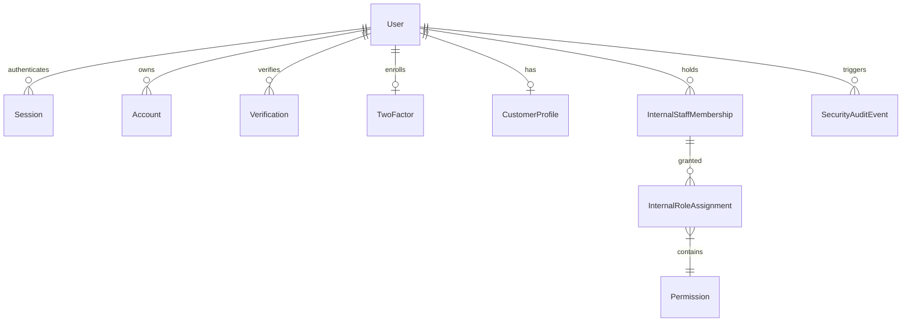
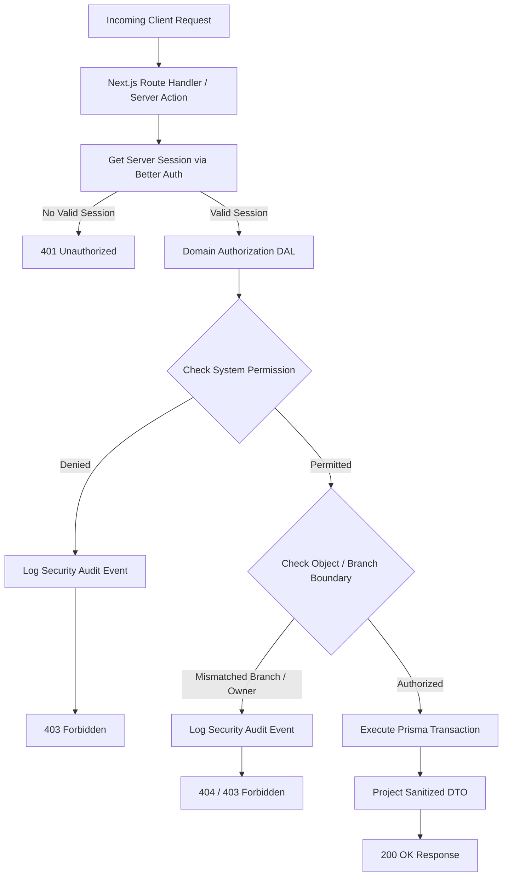
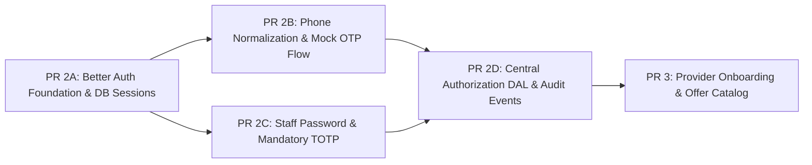

# ADR 14: Identity, Authentication, Sessions, MFA & Authorization Architecture

**Document ID:** `docs/14-identity-authentication-adr.md`  
**Status:** PROPOSED (Documentation Architecture Gate)  
**Date:** 2026-09-16  
**Target Runtime:** Node.js 24 LTS, Next.js 16.3.5 (App Router), Prisma 7.10.0, PostgreSQL 17.11  
**Decision Driver:** Decompose oversized PR 2 into secure, small, reviewable implementation PRs while establishing an evidence-backed authentication and authorization architecture for the Cairo marketplace.

---

## 1. Decision Statement

**We recommend [Better Auth](https://www.better-auth.com) as the core authentication foundation for WaffarhaCars**, supplemented by a **domain-owned, server-side Data Access Layer (DAL) for granular authorization and branch scoping**, and an **internal pluggable OTP Adapter** for phone-based authentication.

### Strategic Rationale for the Cairo MVP:

1. **First-Class App Router & Server Actions Architecture:** Better Auth was engineered specifically for TypeScript-first Next.js App Router and modern server runtimes. It avoids the legacy JWT/callback complexity and NextAuth v4/v5 migration turbulence of Auth.js.
2. **Native Prisma 7 & Node 24 ESM Support:** Better Auth operates natively with Prisma ORM driver adapters (`@prisma/adapter-pg`) and Node.js 24 native ESM without bundler shims.
3. **Built-in First-Party Plugins for Key Requirements:**
   - `phoneNumber`: Provides native phone-based authentication and verification state transitions without requiring custom credential providers.
   - `twoFactor`: Delivers RFC 6238 TOTP enrollment, verification, backup code generation, and factor challenge gates out of the box.
4. **Database-Backed Session Ownership:** Sessions are stored directly in PostgreSQL with cryptographic session tokens stored in secure, `HttpOnly`, `SameSite=Lax` cookies, fulfilling OWASP session management requirements.
5. **Clean Separation of Authentication vs. Authorization:** Authentication (verifying caller identity) is delegated to Better Auth; Authorization (evaluating business permissions, multi-role claims, organization memberships, and workshop branch boundaries) remains strictly owned by WaffarhaCars application domain repositories.

---

## 2. Actor and Authentication Matrix

WaffarhaCars serves distinct operational actors across consumer, provider, and internal organizational boundaries. Each actor presents a distinct threat profile and operational context:

| Actor                         | Primary Authentication                       | Required Second Factor                        | Session Duration (Absolute) | Idle Timeout | Reauthentication Triggers                                      | Account Recovery Method                                           | Initial Provisioning                                                  | Risk Basis & Context                                                                                                                       |
| :---------------------------- | :------------------------------------------- | :-------------------------------------------- | :-------------------------- | :----------- | :------------------------------------------------------------- | :---------------------------------------------------------------- | :-------------------------------------------------------------------- | :----------------------------------------------------------------------------------------------------------------------------------------- |
| **Anonymous Visitor**         | None (Public Browsing)                       | None                                          | N/A                         | N/A          | N/A                                                            | N/A                                                               | N/A                                                                   | Unauthenticated catalog browsing. Zero access to personal data, reservations, or internal tools.                                           |
| **Customer / Car Owner**      | Egyptian Mobile OTP (`+20`)                  | None (SMS OTP is restricted primary factor)   | 30 Days                     | 7 Days       | Reservation cancellation; Profile phone change                 | Re-verification of new mobile number via live OTP challenge       | Self-service on-demand upon first reservation booking                 | Low administrative privilege; high consumer convenience requirement. 7-day idle timeout prevents repeat logins on personal mobile devices. |
| **Provider Workshop Worker**  | Egyptian Mobile OTP (`+20`)                  | None (Pilot baseline)                         | 12 Hours                    | 2 Hours      | Daily shift start; Sensitive check-in dispute                  | Provider Manager / Internal Ops manual verification               | Pre-provisioned by Provider Manager or Ops; invited via mobile number | High device sharing risk on workshop floor. Strict 2-hour idle timeout and 12-hour shift limit prevent session hijacking across shifts.    |
| **Provider Workshop Manager** | Egyptian Mobile OTP (`+20`)                  | Optional TOTP (Pilot); Mandatory (Post-Pilot) | 12 Hours                    | 2 Hours      | Bank detail modification; Staff assignment changes             | Internal Ops identity proofing and verification                   | Provisioned during merchant onboarding by WaffarhaCars Ops            | Access to branch commission summaries and worker invitations requires short sessions and re-auth on financial changes.                     |
| **Internal Sales Staff**      | Work Email + Strong Password                 | Mandatory TOTP (RFC 6238)                     | 10 Hours                    | 1 Hour       | Draft offer commercial submission                              | Single-use hashed backup codes or Platform Admin reset            | Provisioned by Platform Admin / HR during onboarding                  | Segregation of duties (Maker role). 1-hour idle timeout protects unattended corporate workstations.                                        |
| **Internal Operations Staff** | Work Email + Strong Password                 | Mandatory TOTP (RFC 6238)                     | 10 Hours                    | 1 Hour       | Offer approval (Checker); Commission dispute adjustment        | Single-use hashed backup codes or Platform Admin reset            | Provisioned by Platform Admin during onboarding                       | Highest operational impact (Checker role). Approvals require fresh active session and mandatory MFA.                                       |
| **Internal Finance Staff**    | Work Email + Strong Password                 | Mandatory TOTP (RFC 6238)                     | 8 Hours                     | 30 Minutes   | Merchant payout batch generation                               | Single-use hashed backup codes or Platform Admin reset            | Provisioned by Platform Admin during onboarding                       | Direct financial impact. Strictest idle timeout (30 min) aligned with banking/fintech standards.                                           |
| **Platform Administrator**    | Work Email + Strong Password (Passkey-ready) | Mandatory TOTP + Backup Codes                 | 4 Hours                     | 15 Minutes   | Role escalation; System configuration changes; Staff MFA reset | Offline break-glass procedure (Founder / CTO manual intervention) | Seeded via secure environment orchestration at platform deployment    | Total system authority. Minimum session duration (4 hours) and aggressive idle timeout (15 minutes).                                       |

---

## 3. Comprehensive Library Comparison Matrix

| Evaluation Dimension                     | Better Auth                                                                                                         | Auth.js (NextAuth v5)                                                                          | Fully Custom Auth                                                                                  | External Managed IdP (Clerk / Auth0 / Supabase)                                              |
| :--------------------------------------- | :------------------------------------------------------------------------------------------------------------------ | :--------------------------------------------------------------------------------------------- | :------------------------------------------------------------------------------------------------- | :------------------------------------------------------------------------------------------- |
| **Next.js 16 App Router Support**        | **Native & Optimized** (Engineered specifically for App Router, Route Handlers, and Server Actions)                 | Partial / Mixed (Turbulent transition from v4 to v5 beta; ongoing documentation fragmentation) | Requires custom session middleware and route guards                                                | Strong Next.js SDKs, but tightly coupled to vendor middleware                                |
| **Prisma 7 & PostgreSQL 17**             | **First-Class Adapter** (Compatible with `@prisma/adapter-pg`, modern schema generators, and connection pooling)    | Supported via `@auth/prisma-adapter` (often lags Prisma major releases)                        | Fully custom schema and queries (Highest maintenance burden)                                       | External database or webhook synchronization required                                        |
| **Phone Number OTP Support**             | **First-Class Official Plugin** (`phoneNumber` plugin handles verification tokens, rate limits, and custom senders) | Poor (Requires complex `CredentialsProvider` hacks; verification flow not native)              | Full control, but requires hand-rolling token crypto, expiry, attempt limits, and race protections | Supported at significant pricing tier premiums; vendor controls delivery logic               |
| **Email / Password Support**             | **Built-in** (Secure Argon2id/bcrypt hashing, timing-safe checks, password policy enforcement)                      | Built-in via Credentials (Requires custom password verification callback)                      | Must implement hashing, salt management, timing-safe comparison                                    | Built-in                                                                                     |
| **TOTP & Backup Codes**                  | **Official `twoFactor` Plugin** (Handles TOTP secrets, URI generation, backup codes, and factor challenge state)    | Incomplete (Requires custom implementation or external packages for TOTP)                      | Extremely high implementation and cryptographic audit burden                                       | Built-in, but locked to vendor UI components and tiers                                       |
| **Database Sessions**                    | **Native Database Sessions** (Stateful records in PostgreSQL; instant server-side revocation)                       | Defaults to JWT; database sessions have complex edge/middleware caveats                        | Custom implementation required                                                                     | Managed externally; session state not in primary PostgreSQL                                  |
| **Session Revocation**                   | **Built-in** (`revokeSession`, `revokeOtherSessions`, `revokeAllSessions`)                                          | Limited out of the box with JWTs; requires custom token blacklisting                           | Must hand-roll revocation tokens and tracking tables                                               | Supported via vendor API calls                                                               |
| **Rate Limiting & Abuse Controls**       | **Built-in Storage-Backed Rate Limiting** for auth endpoints                                                        | Minimal (Requires external Upstash/Redis integration)                                          | Must hand-roll sliding window rate limiters                                                        | Built-in on vendor edge                                                                      |
| **CSRF & Cookie Protections**            | **Strict Built-in CSRF**, Origin verification, and secure cookie attribute management                               | Built-in CSRF                                                                                  | Vulnerable to subtle misconfigurations (CSRF tokens, SameSite bugs)                                | Handled by vendor domain/cookies                                                             |
| **Account Linking & Duplicate Handling** | **Native Account & User Model** (Clean linking of credentials, phone, and OAuth to single User ID)                  | Supported, but phone-to-email linking requires custom adapter logic                            | Full control, high bug risk                                                                        | Managed by vendor rules                                                                      |
| **Testability Without Sending Messages** | **Exceptional** (Pluggable `sendVerificationSMS` hook accepts deterministic mock adapter for CI/local)              | Difficult due to CredentialsProvider constraints                                               | High testability, high code volume                                                                 | Requires third-party mocking or vendor sandbox accounts                                      |
| **Vendor Lock-In**                       | **Zero** (Open source, self-hosted, all data resides in PostgreSQL)                                                 | **Zero** (Open source, self-hosted)                                                            | **Zero**                                                                                           | **High** (Proprietary APIs, schema locked in vendor cloud, painful export migrations)        |
| **Operational Complexity**               | **Low** (Single library integrated directly into Next.js application process)                                       | **Moderate** (Complex debugging across v5 beta changes and edge handlers)                      | **Very High** (Ongoing maintenance of crypto, cookies, security patches, session caches)           | **Low Initially, High Later** (Managing external webhooks, user sync drift, network latency) |
| **Package Maturity & Maintenance**       | **Rapidly Growing Standard** (Extensively tested, active community, modern codebase)                                | Long-standing history, but current v5 release has suffered extended instability                | N/A (Internal maintenance liability)                                                               | Highly mature commercial platforms                                                           |
| **Schema Ownership**                     | **Complete** (Tables live in `prisma/schema.prisma` under version control)                                          | Complete via Prisma adapter                                                                    | Complete                                                                                           | Fragmented across vendor cloud and local DB                                                  |
| **Egypt-First Mobile Experience**        | **High** (Completely headless; allows bespoke Arabic/English RTL mobile UI with local phone formatting)             | Moderate (Headless, but phone flows are awkward)                                               | High (Bespoke)                                                                                     | Often renders English-centric or inflexible vendor widgets                                   |
| **Cost Implications**                    | **Free / Source-Available** ($0 license; standard hosting resources)                                                | **Free** ($0 license)                                                                          | High initial engineering and ongoing maintenance cost                                              | Escalates steeply with Monthly Active Users (MAUs) and SMS costs                             |
| **Passkey (WebAuthn) Path**              | **Official `passkey` Plugin available** for post-pilot roadmap                                                      | Supported via experimental providers                                                           | Massive WebAuthn protocol implementation burden                                                    | Built-in on premium tiers                                                                    |

### Recommendation Conclusion:

**Better Auth is chosen.** Fully custom authentication is rejected due to the immense security and maintenance liability (re-inventing session fixation defense, CSRF mitigation, Argon2 hashing, TOTP secrets, and token rotation). Managed identity (Clerk/Auth0) is rejected due to data sovereignty concerns, severe vendor lock-in, recurring MAU cost escalation in an Egyptian marketplace, and lack of native Egyptian SMS gateway integration.

---

## 4. Proposed Identity & Database Model

To prevent duplicate or conflicting schema tables, WaffarhaCars will use Better Auth's standard schema as the foundation and attach domain-specific tables via explicit foreign keys.



### 4.1 Better Auth Owned Tables (Managed via Prisma):

1. `User` (`users`): Primary authentication record. Contains `id` (UUID), `name`, `email`, `emailVerified`, `phoneNumber`, `phoneNumberVerified`, `image`, `createdAt`, `updatedAt`, `isSuspended` (custom attribute).
2. `Session` (`sessions`): Active server-side session. Contains `id`, `userId`, `token` (hashed or unique lookup key), `expiresAt`, `ipAddress`, `userAgent`, `createdAt`, `updatedAt`.
3. `Account` (`accounts`): Authentication credentials. Contains `id`, `userId`, `accountId`, `providerId` (e.g. `"credential"`, `"phone"`), `password` (hashed with Argon2id), `createdAt`, `updatedAt`.
4. `Verification` (`verifications`): Temporary challenge tokens. Contains `id`, `identifier` (e.g. E.164 phone or email), `value` (hashed OTP/token), `expiresAt`, `createdAt`, `updatedAt`.
5. `TwoFactor` (`two_factors`): TOTP configuration for internal staff. Contains `id`, `userId`, `secret` (AES-256-GCM encrypted), `backupCodes` (hashed), `enabled`.

### 4.2 WaffarhaCars Domain Owned Tables (First Auth Release):

1. `CustomerProfile` (`customer_profiles`):
   - `id`: UUID (Primary Key)
   - `userId`: UUID (`UNIQUE`, Foreign Key -> `User.id` on delete CASCADE)
   - `preferredLanguage`: Enum (`ar`, `en`, default `ar`)
   - `notificationPreferences`: JSONB
   - `createdAt`, `updatedAt`: Timestamp
2. `InternalStaffMembership` (`internal_staff_memberships`):
   - `id`: UUID (Primary Key)
   - `userId`: UUID (`UNIQUE`, Foreign Key -> `User.id` on delete RESTRICT)
   - `department`: Enum (`SALES`, `OPERATIONS`, `FINANCE`, `ADMIN`)
   - `employeeNumber`: String (`UNIQUE`)
   - `isActive`: Boolean (default `true`)
   - `hiredAt`: Timestamp
3. `InternalRoleAssignment` (`internal_role_assignments`):
   - `id`: UUID (Primary Key)
   - `staffMembershipId`: UUID (Foreign Key -> `InternalStaffMembership.id` on delete CASCADE)
   - `role`: Enum (`SALES_AGENT`, `OPS_SUPERVISOR`, `FINANCE_OFFICER`, `PLATFORM_ADMIN`)
   - `assignedAt`: Timestamp
   - `assignedBy`: UUID (Foreign Key -> `User.id`)
4. `SecurityAuditEvent` (`security_audit_events`):
   - `id`: UUID (Primary Key)
   - `actorUserId`: UUID (Nullable, Foreign Key -> `User.id` on delete SET NULL)
   - `eventType`: Enum (`AUTH_LOGIN_SUCCESS`, `AUTH_LOGIN_FAILED`, `AUTH_MFA_CHALLENGE_FAILED`, `AUTH_SESSION_REVOKED`, `AUTH_ACCOUNT_LOCKED`, `ACCESS_DENIED_UNAUTHORIZED`, `PERMISSION_ELEVATION_ATTEMPT`)
   - `targetEntity`: String (e.g. `"Reservation:123"`)
   - `ipAddress`: String
   - `userAgent`: String
   - `metadata`: JSONB (Sanitized, zero credentials or raw tokens)
   - `timestamp`: Timestamp (default `now()`)

### 4.3 Explicit Scope Segregation:

> [!IMPORTANT]
> **Deferral of Provider Organization and Branch Tables to PR 3:**
> Provider merchant legal entities (`provider_organizations`), physical workshop locations (`provider_branches`), and staff branch assignments (`branch_assignments`) **will not be created in PR 2**. They belong strictly to **PR 3 (Provider Onboarding & Catalog)**. In PR 2, provider staff authenticate via the general phone OTP foundation, and their organizational links are attached when merchant domain entities are introduced in PR 3.

---

## 5. Phone-Number Policy & Egypt Normalization

Mobile numbers represent the primary consumer identity in Egypt. Strict validation, normalization, and privacy controls are mandatory.

### 5.1 Parsing Library Recommendation

Rather than handwritten regular expressions (which frequently fail on whitespace, Arabic-Indic digits, leading zeros, or carrier expansion), WaffarhaCars **mandates the use of [`libphonenumber-js`](https://www.npmjs.com/package/libphonenumber-js)** (zero-dependency, lightweight port of Google's libphonenumber).

### 5.2 Egyptian Mobile Specification:

- **Country Code:** `+20` (Egypt)
- **National Significant Number (NSN):** Exactly 10 digits starting with `1`.
- **Authorized Carrier Prefixes:**
  - `010` (Vodafone Egypt) -> Canonical: `+2010XXXXXXXX`
  - `011` (Etisalat by e&) -> Canonical: `+2011XXXXXXXX`
  - `012` (Orange Egypt) -> Canonical: `+2012XXXXXXXX`
  - `015` (Telecom Egypt / WE) -> Canonical: `+2015XXXXXXXX`

### 5.3 Normalization Invariant:

1. **Input Sanitization:** Convert Arabic-Indic numerals (`٠١٢٣٤٥٦٧٨٩`) to Latin digits (`0123456789`). Strip spaces, hyphens, and parentheses.
2. **Canonical E.164 Formatting:** Parse with default country code `EG`. If valid, serialize exclusively as E.164 (`+201[0125]XXXXXXXX`).
3. **Storage:** Only the canonical E.164 string is stored in the database `User.phoneNumber` column.
4. **Pre-Query Normalization:** All lookups, uniqueness checks, and OTP challenge dispatches normalize input to canonical E.164 before executing database queries.

### 5.4 Data Protection & Masking:

- **Masked Presentation:** In consumer UI, customer service views, and pass verification screens, phone numbers are masked:
  - Format: `+20 10 •••• 1234` (Country code + carrier prefix + 4 masked digits + last 4 digits).
- **Log Sanitization:** Application logs, error traces, and audit logs **must never record raw phone numbers**. If logging is necessary for operational correlation, log a SHA-256 HMAC of the canonical E.164 string: `hmac_sha256(phone, LOG_SALT)`.

### 5.5 Phone-Number Change & Account Linking:

- **Change Verification:** Changing an account phone number requires completing a valid OTP challenge delivered to the **new** phone number while maintaining an active authenticated session.
- **Collision Policy:** If the new phone number already exists in `User.phoneNumber`, the operation is aborted with a generic conflict message. Automatic account merging across phone numbers is prohibited to prevent account takeover via recycled SIM cards.

---

## 6. OTP Adapter Contract & Abuse Mitigations

### 6.1 Server-Side Ownership of OTP Verification

> [!IMPORTANT]
> **Architectural Invariant: WaffarhaCars Owns the Verification State:**
> Rather than delegating OTP generation and verification to an external messaging vendor's proprietary API (e.g. Twilio Verify), **WaffarhaCars generates, cryptographically hashes, stores, and validates OTP challenges locally** in the database (`verifications` table). The messaging vendor acts solely as a dumb transport delivery pipe (SMS or WhatsApp).
>
> _Rationale:_ This decouples authentication state from vendor availability, eliminates per-verification vendor fees, prevents vendor lock-in, and allows instant failover across Egyptian telecom gateways.

### 6.2 Adapter TypeScript Contract

```typescript
export interface OtpChallengeRequest {
  phoneNumber: string; // Canonical E.164
  channel: "sms" | "whatsapp";
  ipAddress: string;
  userAgent?: string;
}

export interface OtpChallengeResponse {
  requestId: string;
  expiresInSeconds: number;
  resendAvailableInSeconds: number;
}

export interface OtpVerificationRequest {
  phoneNumber: string; // Canonical E.164
  code: string; // 6 numeric digits
  ipAddress: string;
}

export interface OtpVerificationResult {
  success: boolean;
  reason?: "EXPIRED" | "INVALID_CODE" | "MAX_ATTEMPTS_EXCEEDED" | "NOT_FOUND";
}

export interface OtpMessagingTransport {
  sendOtp(
    toE164: string,
    code: string,
    requestId: string
  ): Promise<{ delivered: boolean; vendorMessageId?: string }>;
}
```

### 6.3 Abuse Mitigations & Rate Limiting:

1. **Challenge Characteristics:** Cryptographically secure 6-digit numeric code generated via `crypto.randomInt(100000, 999999)`.
2. **Expiry Window:** Exactly **180 seconds (3 minutes)**.
3. **Single-Use Enforcement:** The challenge is immediately deleted or marked consumed upon successful verification.
4. **Attempt Throttling:** Maximum **3 failed attempts per challenge**. Upon the 3rd failed attempt, the challenge is invalidated immediately, requiring a new request.
5. **Resend Cooldown:** Minimum **60 seconds** between consecutive challenge requests to the same phone number.
6. **Rate Limiting Tiers (Sliding Window):**
   - _Per Phone Number:_ Max 5 requests per hour; max 10 requests per 24 hours.
   - _Per Client IP Address:_ Max 10 requests per 15 minutes across all numbers.
   - _Global Cluster Guard:_ Absolute limit on total OTP dispatches per minute to prevent financial exhaustion attacks.
7. **Anti-Enumeration Responses:** Requests for OTP return identical HTTP 200 responses (`{ "status": "challenge_sent", "resendIn": 60 }`) regardless of whether the phone number is already registered or new.

### 6.4 Mock Adapter & Production Guard:

- In `development` and `test` environments (`APP_RUNTIME_PROFILE=showcase`), a `MockOtpAdapter` is used. It logs OTP codes to a secure local test inspector or deterministic test harness without dispatching SMS.
- **Fail-Closed Production Invariant:** If `APP_RUNTIME_PROFILE=production` and `OTP_PROVIDER` is set to `mock`, backend initialization and route handlers fail closed with a fatal configuration error.

---

## 7. Session Policy & Cookie Security

WaffarhaCars strictly adheres to the [OWASP Session Management Cheat Sheet](https://cheatsheetseries.owasp.org/cheatsheets/Session_Management_Cheat_Sheet.html):

```
Client (Browser)                           Next.js Server                       PostgreSQL (Session Store)
     │                                            │                                         │
     │ ── 1. Request with Cookie (Opaque ID) ───> │                                         │
     │                                            │ ── 2. Query session by hashed token ──> │
     │                                            │ <─ 3. Return active session + user ───  │
     │                                            │                                         │
     │                                            │ [Evaluate Idle & Absolute Timeouts]     │
     │                                            │ [Evaluate User isSuspended flag]        │
     │                                            │                                         │
     │ <── 4. Response with Rotated Token ─────── │ ── 5. Update lastActive / expire ─────> │
```

### 7.1 Cookie Attributes (Production Standards):

- **Opaque Session Identifier:** Cryptographically random 256-bit token. Tokens are hashed (SHA-256) prior to database persistence to prevent offline token compromise via database snapshot leaks.
- **`HttpOnly`:** Enabled. Client-side JavaScript (`document.cookie`) cannot read or manipulate session tokens, eliminating token theft via XSS.
- **`Secure`:** Enabled in production (`Secure=true`). Transmitted exclusively over TLS/HTTPS.
- **`SameSite=Lax`:** Default for top-level navigation, preventing Cross-Site Request Forgery (CSRF). State-changing endpoints require explicit CSRF token / origin validation.
- **`Path=/`** and Domain scoped strictly to application host (no overly broad parent domain cookies).
- **Prohibition of `localStorage`:** Authentication tokens, refresh tokens, and session secrets are **strictly forbidden from `localStorage` or `sessionStorage`**.

### 7.2 Session Lifecycle & Revocation:

1. **Session Rotation:** On every privilege elevation (e.g. login, completing TOTP second factor), the existing session ID is invalidated and a new session ID is generated, preventing **Session Fixation**.
2. **Idle Expiry vs. Absolute Expiry:**
   - Both timeouts are evaluated server-side against database timestamps.
   - If `now() > session.lastActiveAt + IDLE_TIMEOUT`, the session is expired.
   - If `now() > session.createdAt + ABSOLUTE_TIMEOUT`, the session is terminated regardless of activity.
3. **Immediate Server-Side Revocation Events:**
   - Explicit user logout (`/api/v1/auth/logout` deletes session record).
   - "Logout All Other Devices" (`DELETE FROM sessions WHERE userId = :id AND id <> :currentSessionId`).
   - Password reset or change (immediately deletes **all** active sessions for that user).
   - MFA factor disable/reset (deletes all active sessions).
   - Account suspension (`User.isSuspended = true` rejects active sessions on the next request).

---

## 8. Internal Staff Multi-Factor Authentication (MFA)

Internal personnel possess significant administrative capabilities (offer approval, merchant verification, commission disputes). High-assurance authentication is required.

### 8.1 First Factor: Passwords

- Passwords must be at least 12 characters, checked against common breach databases (HaveIBeenPwned / OWASP Top 10,000).
- Hashed using **Argon2id** (memory-hard, resistant to GPU/ASIC cracking) via Better Auth native configuration.

### 8.2 Second Factor: Mandatory TOTP (RFC 6238)

- **Zero-Bypass Policy:** Internal staff roles (`SALES`, `OPERATIONS`, `FINANCE`, `ADMIN`) cannot access staff portals without completing TOTP setup.
- **Algorithm:** TOTP (HMAC-SHA1 / HMAC-SHA256), 6-digit codes, 30-second time-step, ±1 step clock skew tolerance.
- **Enrollment Flow:**
  1. Staff logs in with email/password. Enters `MFA_SETUP_REQUIRED` session state.
  2. Server generates TOTP secret. Secret is encrypted with AES-256-GCM using `MFA_ENCRYPTION_KEY` before saving to `TwoFactor.secret`.
  3. Server displays QR code (`otpauth://totp/...`).
  4. Staff must input a valid code from authenticator app.
  5. Upon confirmation, 8 single-use recovery backup codes are generated, displayed once, and stored as salted hashes in the database.

### 8.3 Scientific Justification: NIST SP 800-63B-4 Non-Independence Warning

> [!CAUTION]
> **Why SMS OTP + App TOTP on the Same Phone Does Not Constitute Independent Factors:**
> Under [NIST SP 800-63B Section 5.1.3](https://pages.nist.gov/800-63-4/sp800-63b.html), multi-factor authentication requires **independent authentication factors** (something you know, something you have, something you are).
>
> If an application uses SMS OTP as Factor 1 and a TOTP Authenticator App on the same mobile device as Factor 2:
>
> 1. **Shared Possession Surface:** Both factors reside on the identical physical hardware endpoint.
> 2. **Common Mode Failure:** Device theft, mobile malware, lock-screen notification exposure, or physical shoulder surfing compromises both channels simultaneously.
> 3. **Regulatory Classification:** SMS is classified as a _restricted out-of-band authenticator_ vulnerable to SIM swapping, SS7 interception, and carrier social engineering.
>
> **WaffarhaCars Security Mandate:** Internal staff must use **Knowledge (Password) + Physical Possession (TOTP Authenticator)**. Mobile SMS OTP is never used as an MFA factor for internal personnel.

### 8.4 Future Passkey (FIDO2/WebAuthn) Roadmap:

Better Auth provides an official `passkey` plugin. Post-pilot, internal staff authentication will transition from passwords + TOTP to hardware-backed, phishing-resistant Passkeys (FIDO2).

---

## 9. Server-Side Data Access Layer (DAL) & Authorization Model

Authentication answers _"Who are you?"_; Authorization answers _"What are you permitted to do to this specific object?"_.

### 9.1 Core Principles:

1. **Deny by Default:** Unless a rule explicitly permits access, the request is rejected with HTTP 403 Forbidden.
2. **Centralized Data Access Layer (DAL):** Business logic and database operations are encapsulated in server-side repositories. Route Handlers and Server Actions cannot execute arbitrary raw database queries.
3. **No Client-Provided Authority:** Route parameters (e.g. `providerId`, `branchId`, `userId`, `role`) passed from client query parameters or request bodies are treated as untrusted. Authoritative identity and branch scopes are extracted exclusively from the validated database session.
4. **DTO-Based Response Minimization:** Queries project strictly necessary fields (`select: { id: true, name: true }`). Raw database model objects containing internal timestamps, hashes, or audit fields are never returned to clients.
5. **Separation of Roles:** Rejection of a single global `role` enum. One identity can hold consumer profiles, provider memberships, and internal staff memberships independently.

### 9.2 Authorization Architecture (Mermaid)



### 9.3 Enforcement Contract Examples:

- **Consumer Reservation Access:**
  `assertCanAccessReservation(session.userId, reservationId)` verifies `reservation.customerId == session.userId`.
- **Workshop Check-In:**
  `assertCanCheckInReservation(session.userId, reservationId)` verifies that `session.userId` has an active `branch_assignment` matching `reservation.branchId`.
- **Offer Approval (Maker-Checker):**
  `assertCanApproveOffer(session.userId, offerId)` verifies `session.userId` holds `OPS_SUPERVISOR` role AND `offer.createdById <> session.userId` (enforcing strict Segregation of Duties).

---

## 10. Threat Modeling & Security Invariants

| Threat Scenario                        | Attack Vector                                                               | Prevention Controls                                                                                                                   | Detection Controls                                               | Recovery & Compensating Controls                                            |
| :------------------------------------- | :-------------------------------------------------------------------------- | :------------------------------------------------------------------------------------------------------------------------------------ | :--------------------------------------------------------------- | :-------------------------------------------------------------------------- |
| **OTP Brute Force**                    | Automated script guessing 6-digit OTP codes                                 | - Max 3 attempts per challenge<br>- Immediate code invalidation on 3rd failure<br>- 180s expiry<br>- IP and phone sliding rate limits | Alert triggered on 3+ consecutive failed verification attempts   | Lock phone number from new challenges for 15 minutes; audit event logged.   |
| **OTP Replay**                         | Attacker intercepts or re-submits previously used OTP                       | - Atomic single-use consumption in DB transaction<br>- Token deleted upon first use                                                   | Database unique constraint violation on re-verification          | Challenge rejected immediately; zero session issued.                        |
| **SMS Interception / SIM Swap**        | Attacker takes over mobile number via telecom carrier                       | - SMS restricted to consumer/provider logins<br>- No internal staff SMS auth<br>- Financial changes require secondary verification    | Rapid IP/device change detection following login                 | Customer disputes freeze pending reservation pass; manual Ops review.       |
| **Account Enumeration**                | Attacker tests phone numbers to discover registered users                   | - Generic API responses (`challenge_sent` returned uniformly)<br>- Uniform timing via constant-time response logic                    | Spikes in unique phone number OTP requests from single IP/subnet | IP rate limiting blocks automated enumeration sweeps.                       |
| **Session Fixation**                   | Attacker forces known session token on victim                               | - Session rotation on every login and MFA completion<br>- Fresh cryptographically random cookie issued                                | Session token mismatch detection                                 | Existing session destroyed; caller redirected to clean login.               |
| **Session Theft (XSS / MITM)**         | Attacker steals session token via script or network sniffing                | - `HttpOnly` cookies block JS access<br>- `Secure` flag forces HTTPS<br>- No tokens in `localStorage`                                 | IP address and User-Agent drift monitoring on active sessions    | Immediate `revokeSession` via user security dashboard or Ops portal.        |
| **Cross-Site Request Forgery (CSRF)**  | Malicious third-party website tricks victim browser into submitting actions | - `SameSite=Lax` cookies<br>- Origin and Referer header verification on Route Handlers<br>- Double-submit CSRF protection             | Rejected requests logged on Origin header mismatch               | Request blocked before reaching Domain DAL.                                 |
| **Credential Stuffing**                | Automated spraying of leaked username/password combos                       | - Mandatory TOTP for internal staff<br>- Argon2id rate limits<br>- Progressive IP backoff lockout                                     | Failed login spike monitoring on `/api/auth/sign-in`             | Account lockout after 5 failed attempts; automated security alert to Admin. |
| **Privilege Escalation**               | Attacker tampers with request payload (`role: 'ADMIN'`)                     | - Zero trust in client payloads<br>- Authorization checked against server DB tables exclusively<br>- Input validated with Zod         | Zod schema rejection on unexpected fields                        | Payload stripped; attempt logged as `PERMISSION_ELEVATION_ATTEMPT`.         |
| **IDOR / Broken Object Authorization** | Attacker manipulates URL IDs (`/reservations/1234`)                         | - Central DAL asserts object ownership and branch assignment on every DB query                                                        | 403/404 security audit event on unauthorized ID queries          | Access denied; zero object data leaked in response.                         |
| **Staff Recovery Abuse**               | Rogue staff claims lost MFA to bypass second factor                         | - Platform Admin dual-authorization required for MFA reset<br>- All active sessions revoked immediately upon reset                    | Audit log records `STAFF_MFA_RESET` with admin ID                | Full audit trail reviewed in weekly security operations reconciliation.     |
| **Stolen Provider Device**             | Workshop tablet or phone stolen while logged in                             | - Strict 2-hour idle timeout<br>- 12-hour absolute shift limit<br>- Merchant Manager can revoke worker sessions instantly             | Provider manager notified of off-hours check-in attempts         | Remote session termination via Manager dashboard.                           |
| **Concurrent Verification Race**       | Two rapid concurrent requests submit the same OTP code                      | - Prisma database transaction with `FOR UPDATE` row lock on verification record                                                       | Idempotency engine detects duplicate concurrent submission       | Exactly one request consumes the token; second request fails.               |
| **Malicious Client Branch Claims**     | Worker passes altered `branchId` in check-in body                           | - Branch assignment resolved strictly from server DB session via worker Identity ID                                                   | Mismatch between session branch and payload branch detected      | Check-in rejected with 403; security alert logged.                          |

---

## 11. Proposed PR Split (Decomposing PR 2)

The original monolithic PR 2 ("Identity, Sessions, MFA & RBAC") is oversized and carries unacceptable review risk. We propose splitting the work into four focused, reviewable PRs:



---

### PR 2A: Authentication Library Foundation, Schema & Database Sessions

- **Business Outcome:** Establish the core Better Auth foundation, PostgreSQL session store, secure cookie transport, and foundational user identity models.
- **Exact Schema Ownership:**
  - `users`: Core identity table (UUID, name, email, phoneNumber, isSuspended).
  - `sessions`: Database-backed sessions (token hash, expiresAt, ipAddress, userAgent).
  - `accounts`: Auth provider linkages.
  - `verifications`: Generic verification challenge store.
- **File-Level Scope:**
  - `src/lib/auth.ts`: Better Auth server initialization with Prisma adapter.
  - `src/lib/auth-client.ts`: Headless client-side authentication hooks.
  - `src/app/api/auth/[...all]/route.ts`: Better Auth Next.js App Router Route Handler.
  - `prisma/schema.prisma`: Better Auth models added to baseline schema.
  - `prisma/migrations/<timestamp>_auth_core/migration.sql`: Generated SQL migration.
- **Security Invariants:**
  - Cookies configured `HttpOnly`, `Secure` (production), `SameSite=Lax`.
  - Zero tokens stored in `localStorage`.
  - Database sessions verified on server runtime (`nodejs`).
- **Integration Tests:**
  - Proves user creation in PostgreSQL via Better Auth client.
  - Proves session creation and persistence in `sessions` table.
  - Proves session destruction on logout.
  - Proves `isSuspended=true` halts active session resolution.
- **E2E Tests:**
  - Session cookie setting and persistence across server restarts.
- **Exclusions:** No OTP SMS delivery, no password hashing UI, no staff TOTP, no provider tables.
- **Rollback / Forward-Fix:** Forward-fix schema; standard git revert.

---

### PR 2B: Phone Normalization, Mock OTP Adapter & Mobile Authentication Flow

- **Business Outcome:** Complete headless phone OTP authentication for consumers and workshop staff using Egyptian mobile numbers with full anti-abuse controls.
- **Exact Schema Ownership:**
  - `customer_profiles`: Consumer-specific profile attributes (preferredLanguage, notificationPreferences).
  - `verifications`: Utilized for OTP challenge lifecycle.
- **File-Level Scope:**
  - `src/lib/phone.ts`: Egyptian phone normalization and validation using `libphonenumber-js`.
  - `src/lib/otp/adapter.ts`: Core OTP adapter interface and factory.
  - `src/lib/otp/mock-adapter.ts`: Deterministic in-memory / local mock adapter for test and dev environments.
  - `src/app/api/v1/auth/otp/request/route.ts`: Sanitized OTP challenge endpoint.
  - `src/app/api/v1/auth/otp/verify/route.ts`: Atomic OTP verification and session issuance.
  - `src/components/auth/PhoneLoginForm.tsx`: Accessible, bilingual (AR/EN) phone OTP input component.
- **Security Invariants:**
  - E.164 canonical storage (`+201XXXXXXXXX`).
  - Strict 3-attempt limit; 180s expiry; 60s resend cooldown.
  - Production fails closed if `OTP_PROVIDER=mock`.
  - Generic anti-enumeration response on challenge request.
  - Raw phone numbers excluded from logs.
- **Integration Tests:**
  - Unit tests validating Egyptian mobile prefixes (010, 011, 012, 015) and rejecting landlines/invalid numbers.
  - Integration tests verifying OTP challenge dispatch, single-use consumption, and 3-attempt invalidation.
  - Rate limiting enforcement tests across IP and phone sliding windows.
- **E2E Tests:**
  - End-to-end customer login journey: Enter Egyptian mobile number -> Receive mock OTP -> Enter code -> Authenticated session active.
- **Exclusions:** No third-party SMS vendor SDKs; no password authentication; no staff portal views.

---

### PR 2C: Internal Staff Provisioning, Password Authentication & Mandatory TOTP

- **Business Outcome:** High-assurance authentication for internal staff (Sales, Ops, Finance, Admin) with secure password hashing and mandatory RFC 6238 TOTP MFA.
- **Exact Schema Ownership:**
  - `internal_staff_memberships`: Internal employee records and department mapping.
  - `two_factors`: Encrypted TOTP secrets and hashed backup codes.
- **File-Level Scope:**
  - `src/lib/totp.ts`: TOTP helper wrapping Better Auth `twoFactor` plugin with AES-256-GCM secret encryption.
  - `src/app/api/v1/staff/auth/login/route.ts`: Email/password authentication gate.
  - `src/app/api/v1/staff/auth/mfa/enroll/route.ts`: TOTP enrollment and QR code generation.
  - `src/app/api/v1/staff/auth/mfa/verify/route.ts`: TOTP challenge verification and backup code issuance.
  - `src/components/staff/TotpEnrollmentModal.tsx`: Staff TOTP onboarding interface.
- **Security Invariants:**
  - Minimum 12-character passwords hashed with Argon2id.
  - Staff sessions blocked from administrative actions until TOTP enrollment is complete.
  - TOTP secrets encrypted at rest in database.
  - Backup codes single-use and hashed.
- **Integration Tests:**
  - Proves password validation and Argon2id timing resistance.
  - Proves TOTP secret generation, encryption, and time-step verification.
  - Proves backup code consumption and single-use invalidation.
  - Proves session elevation on successful MFA challenge.
- **E2E Tests:**
  - Staff login with email/password -> Prompted for TOTP -> Submits valid token -> Access granted.
- **Exclusions:** No provider workshop functionality; no offer approval logic.

---

### PR 2D: Central Authorization DAL, Internal Roles & Security Audit Events

- **Business Outcome:** Central server-side Data Access Layer enforcing deny-by-default permissions, object ownership, and tamper-evident security audit logging.
- **Exact Schema Ownership:**
  - `internal_role_assignments`: Role bindings for internal staff.
  - `security_audit_events`: Tamper-evident operational and access audit ledger.
- **File-Level Scope:**
  - `src/lib/dal/index.ts`: Central Data Access Layer base utilities and session assertion guards.
  - `src/lib/dal/permissions.ts`: Static permission catalog and role-to-permission resolution.
  - `src/lib/dal/audit.ts`: Sanitized audit logging helper writing to `security_audit_events`.
  - `src/lib/dal/guards.ts`: Object-level guards (`assertCanAccessReservation`, `assertCanApproveOffer`).
- **Security Invariants:**
  - Deny by default: unauthenticated or unauthorized requests throw structured HTTP 403 errors.
  - No client-provided role or branch claims trusted.
  - Denied access attempts log audit events with client IP and metadata.
  - Zero raw credentials or tokens stored in audit logs.
- **Integration Tests:**
  - Proves role-based access denial for unauthorized departments.
  - Proves object-level access denial when reservation owner does not match session user.
  - Proves Maker-Checker enforcement: creator of an offer cannot approve it.
  - Proves audit events are persisted with correct sanitized metadata on access denial.
- **E2E Tests:**
  - Route guard tests verifying unprivileged users are redirected/blocked from `/ops/*` and `/sales/*`.
- **Exclusions:** No provider catalog or branch creation (deferred to PR 3).

---

## 12. Open Decisions Requiring Explicit Founder Approval

| Decision Item                                    | Context & Trade-Offs                                                                                                                                                                                                                                  | Recommendation                                                                                                                             | Founder Action Required                                                            |
| :----------------------------------------------- | :---------------------------------------------------------------------------------------------------------------------------------------------------------------------------------------------------------------------------------------------------- | :----------------------------------------------------------------------------------------------------------------------------------------- | :--------------------------------------------------------------------------------- |
| **1. Live Egyptian OTP Vendor Selection**        | Evaluated: **Unifonic**, **Infobip**, **VictoryLink**, **CEQUENS**, **Twilio**. Local Egyptian gateways offer significantly higher delivery rates and lower per-message EGP costs than global aggregators.                                            | Start pilot with **Unifonic** or **Infobip** with domestic routing; maintain pluggable adapter for secondary fallback.                     | Select and approve commercial contracting with primary Egyptian SMS provider.      |
| **2. OTP Delivery Channel Strategy**             | **SMS vs. WhatsApp Business API vs. Fallback:** SMS delivery in Egypt occasionally suffers network congestion. WhatsApp provides verified business branding and higher deliverability, but requires pre-approved templates and distinct Meta pricing. | **Primary SMS** for pilot, with optional WhatsApp fallback if challenge is unacknowledged after 60 seconds.                                | Approve whether WhatsApp Business API should be enabled for the pilot or deferred. |
| **3. Internal Staff MFA Recovery Authority**     | If an Operations or Platform Admin loses their phone/authenticator app and backup codes: who holds the authoritative key to reset MFA?                                                                                                                | Mandate **Founder / Managing Director manual sign-off** in writing for any staff MFA reset during pilot.                                   | Formalize designated MFA recovery authority and escalation protocol.               |
| **4. Exact Production Session Timeouts**         | Balances consumer convenience against unauthorized access on shared devices. Current recommendation: Customers (30d absolute / 7d idle); Workshop Staff (12h absolute / 2h idle); Ops/Finance (8–10h absolute / 30–60m idle).                         | Adopt recommended risk-tiered timeout matrix defined in Section 2.                                                                         | Approve production session timeout parameters.                                     |
| **5. Passkey (FIDO2) Implementation Timeline**   | Phishing-resistant WebAuthn is the gold standard for staff. Better Auth supports passkeys natively.                                                                                                                                                   | Implement **Passwords + TOTP for Pilot (PR 2C)**; deploy **Passkeys as a post-pilot upgrade**.                                             | Confirm passkey rollout milestone.                                                 |
| **6. Provider Workshop Manager MFA Requirement** | Workshop managers access financial settlement and commission statements. Should they be required to enroll in TOTP during the pilot?                                                                                                                  | **Optional for Pilot** (SMS OTP only to minimize merchant onboarding friction); **Mandatory post-pilot** when self-service payouts launch. | Decide whether merchant managers must use TOTP during the Cairo pilot.             |

---

## 13. References & Standards Compliance

- **OWASP:** Authentication, Session Management, and Authorization Cheat Sheets.
- **NIST SP 800-63B-4:** Digital Identity Guidelines (Authenticator Assurance Levels, Out-of-Band Risk).
- **Egyptian Law 151/2020 & ER 816/2025:** Personal Data Protection (Data minimization, phone number masking).
- **RFC 6238:** TOTP: Time-Based One-Time Password Algorithm.
- **RFC 7807:** Problem Details for HTTP APIs (Sanitized structured errors).
- **libphonenumber-js:** Maintained Google libphonenumber standard for E.164 parsing.
