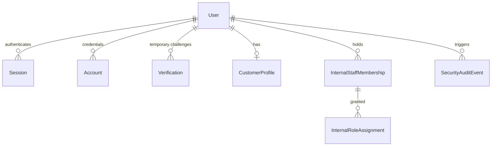
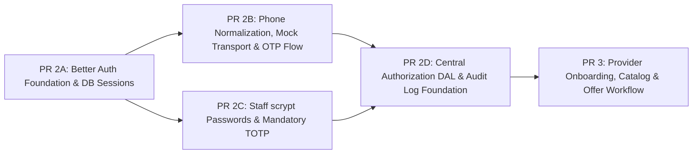

# ADR 14: Identity, Authentication, Sessions, MFA & Authorization Architecture

**Document ID:** `docs/14-identity-authentication-adr.md`
**Status:** PROPOSED (Architecture Decision Gate)
**Date:** 2026-09-16
**Evaluated Foundation:** Better Auth `1.7.5` (MIT License)
**Target Runtime:** Node.js 24 LTS, Next.js 16.3.5 (App Router), Prisma 7.10.0, PostgreSQL 17.11
**Decision Driver:** Decompose oversized PR 2 into small, reviewable implementation PRs while establishing an evidence-backed authentication and authorization architecture for the Cairo marketplace.

---

## 1. Decision Statement & Library Security Policy

**We recommend [Better Auth](https://www.better-auth.com) (evaluated at pinned release `1.7.5`) as the core authentication foundation for WaffarhaCars**, supplemented by a **domain-owned, server-side Data Access Layer (DAL) for granular authorization**, and an **internal pluggable OTP Transport Adapter** for Egyptian mobile authentication.

### 1.1 Evaluated Version & Compatibility Baseline:

- **Evaluated Version:** `better-auth@1.7.5` (latest release on 1.7.x line).
- **License:** **MIT License** (permissive open source; not "source-available").
- **Runtime Compatibility:** Verified compatible with Node.js 24 LTS native ESM, Next.js 16.3.5 App Router Route Handlers, and Prisma 7.10.0 with PostgreSQL driver adapters (`@prisma/adapter-pg`).

### 1.2 Upstream Maintenance & Security Vulnerability Policy:

1. **Supported Version Constraint:** Better Auth's official maintenance policy explicitly supports only the **`latest`** release line. Upstream security fixes and patches are applied exclusively to current releases.
2. **Mandatory Pre-Install Review of Security Advisories:** Before introducing or bumping Better Auth dependencies, the engineering team must review published [GitHub Security Advisories](https://github.com/better-auth/better-auth/security/policy) for the package.
3. **Exact-Version Pinning:** Better Auth and its subpackages must be pinned to exact versions in `package.json` (e.g. `"better-auth": "1.7.5"`, avoiding `^` or `~` semver ranges) to ensure deterministic builds and audit integrity.
4. **Dependabot & Security Upgrade Protocol:** Automated dependency updates must be reviewed promptly. Because Better Auth generates and manages database schema structures, **every minor or major upgrade requires re-running schema generation (`npx @better-auth/cli generate`), reviewing the resulting Prisma schema diff, and generating an explicit migration via `prisma migrate dev --create-only`**.
5. **Security Posture Realism:** Package maturity does not eliminate vulnerability risk. Better Auth is an actively evolving open-source framework with past security advisories (such as origin verification and session handling edge cases). Adopting Better Auth requires prompt, reviewed handling of security releases rather than assuming passive immunity.

---

## 2. Actor and Authentication Matrix

WaffarhaCars serves distinct operational actors across consumer, provider, and internal organizational boundaries. Session timeouts are **proposed pilot defaults** established to balance user convenience against operational risk:

| Actor                         | Primary Authentication                | Required Second Factor                        | Session Duration (Proposed Pilot Default) | Idle Timeout (Proposed Pilot Default) | Reauthentication Triggers                                      | Account Recovery Method                                                     | Initial Provisioning                                                  | Risk Basis & Operational Context                                                                                                           |
| :---------------------------- | :------------------------------------ | :-------------------------------------------- | :---------------------------------------- | :------------------------------------ | :------------------------------------------------------------- | :-------------------------------------------------------------------------- | :-------------------------------------------------------------------- | :----------------------------------------------------------------------------------------------------------------------------------------- |
| **Anonymous Visitor**         | None (Public Browsing)                | None                                          | N/A                                       | N/A                                   | N/A                                                            | N/A                                                                         | N/A                                                                   | Unauthenticated catalog browsing. Zero access to personal data, reservations, or internal tools.                                           |
| **Customer / Car Owner**      | Egyptian Mobile OTP (`+20`)           | None (SMS OTP is restricted primary factor)   | 30 Days (Absolute)                        | 7 Days (Idle)                         | Reservation cancellation; Profile phone change                 | Re-verification of new mobile number via live OTP challenge                 | Self-service on-demand upon first reservation booking                 | Low administrative privilege; convenience-first consumer flow. 7-day idle timeout prevents repeat logins on personal mobile devices.       |
| **Provider Workshop Worker**  | Egyptian Mobile OTP (`+20`)           | None (Pilot baseline)                         | 12 Hours (Absolute)                       | 2 Hours (Idle)                        | Daily shift start; Sensitive check-in dispute                  | Provider Manager / Internal Ops manual verification                         | Pre-provisioned by Provider Manager or Ops; invited via mobile number | High device sharing risk on workshop floor. Strict 2-hour idle timeout and 12-hour shift limit prevent session hijacking across shifts.    |
| **Provider Workshop Manager** | Egyptian Mobile OTP (`+20`)           | Optional TOTP (Pilot); Mandatory (Post-Pilot) | 12 Hours (Absolute)                       | 2 Hours (Idle)                        | Worker invitation; Staff assignment changes                    | Internal Ops identity proofing and verification                             | Provisioned during merchant onboarding by WaffarhaCars Ops            | Access to branch commission summaries. Payout/bank details cannot be modified via self-service in pilot (restricted to Ops maker-checker). |
| **Internal Sales Staff**      | Work Email + Password                 | Mandatory TOTP (RFC 6238)                     | 10 Hours (Absolute)                       | 1 Hour (Idle)                         | Draft offer commercial submission                              | Single-use encrypted backup codes or two-person Admin reset                 | Provisioned by Platform Admin / HR during onboarding                  | Segregation of duties (Maker role). 1-hour idle timeout protects unattended corporate workstations.                                        |
| **Internal Operations Staff** | Work Email + Password                 | Mandatory TOTP (RFC 6238)                     | 10 Hours (Absolute)                       | 1 Hour (Idle)                         | Offer approval (Checker); Commission dispute adjustment        | Single-use encrypted backup codes or two-person Admin reset                 | Provisioned by Platform Admin during onboarding                       | Highest operational impact (Checker role). Approvals require fresh active session and mandatory MFA.                                       |
| **Internal Finance Staff**    | Work Email + Password                 | Mandatory TOTP (RFC 6238)                     | 8 Hours (Absolute)                        | 30 Minutes (Idle)                     | Merchant payout batch generation                               | Single-use encrypted backup codes or two-person Admin reset                 | Provisioned by Platform Admin during onboarding                       | Direct financial impact. 30-minute idle timeout reduces unattended workstation exposure.                                                   |
| **Platform Administrator**    | Work Email + Password (Passkey-ready) | Mandatory TOTP + Backup Codes                 | 4 Hours (Absolute)                        | 15 Minutes (Idle)                     | Role escalation; System configuration changes; Staff MFA reset | Offline break-glass procedure (Managing Director / Founder manual sign-off) | Seeded via secure environment orchestration at platform deployment    | Total system authority. Minimum session duration (4 hours) and aggressive idle timeout (15 minutes).                                       |

---

## 3. Library Comparison Decision Matrix

| Evaluation Dimension                | Better Auth (1.7.5)                                                              | Auth.js (NextAuth v5)                                                              | Fully Custom Auth                                                             | External Managed IdP (Clerk / Auth0 / Supabase)                               |
| :---------------------------------- | :------------------------------------------------------------------------------- | :--------------------------------------------------------------------------------- | :---------------------------------------------------------------------------- | :---------------------------------------------------------------------------- |
| **Next.js 16 App Router Support**   | Native Route Handler and Server Action integration                               | Supported via `next-auth` beta handlers                                            | Requires custom middleware and session wrappers                               | Supported via vendor Next.js SDKs                                             |
| **Prisma 7 & PostgreSQL 17**        | Native Prisma adapter supporting `@prisma/adapter-pg`                            | Supported via `@auth/prisma-adapter`                                               | Fully manual schema authoring and migrations                                  | External database or webhook synchronization required                         |
| **Phone Number OTP Support**        | Official `phoneNumber` plugin with `sendOTP` hook                                | Not selected: equivalent native phone OTP support not established in this review   | Full control, but requires hand-rolling token crypto, expiry, and rate limits | Supported on select vendor tiers; proprietary SMS pipes                       |
| **Email / Password Support**        | Built-in using native Node.js `scrypt` hasher                                    | Supported via Credentials provider                                                 | Must implement hashing, salt management, timing-safe checks                   | Built-in on vendor console                                                    |
| **TOTP & Backup Codes**             | Official `twoFactor` plugin with encrypted secrets                               | Not selected: equivalent native TOTP plugin support not established in this review | High implementation and cryptographic audit burden                            | Built-in on vendor console                                                    |
| **Database Sessions**               | Native PostgreSQL `session` table with unique tokens                             | Primarily JWT-oriented; database sessions have framework caveats                   | Custom table design required                                                  | Managed in vendor cloud; not local PostgreSQL                                 |
| **Session Revocation**              | Built-in server-side revocation endpoints                                        | Limited out-of-the-box with JWTs                                                   | Must hand-roll revocation tokens and tracking tables                          | Supported via vendor management APIs                                          |
| **Rate Limiting & Abuse Controls**  | Built-in storage-backed rate limiting                                            | Requires external Redis / Upstash integration                                      | Must implement sliding window rate limiters                                   | Built-in on vendor edge                                                       |
| **Origin & Cookie Protections**     | Built-in Origin verification, Fetch Metadata headers, and `SameSite=Lax` cookies | Built-in CSRF protection                                                           | Vulnerable to subtle cookie attribute misconfigurations                       | Handled by vendor domain/cookies                                              |
| **Account Linking**                 | Native User / Account model                                                      | Supported via adapter callbacks                                                    | Full control, high logic complexity                                           | Managed by vendor rules                                                       |
| **Testability Without Sending SMS** | Native `testUtils({ captureOTP: true })` in test instances                       | Complex mocking of Credentials callbacks                                           | High testability, high code volume                                            | Requires third-party mocking or vendor sandbox                                |
| **Vendor Lock-In**                  | Zero (MIT open source; self-hosted in PostgreSQL)                                | Zero (Open source)                                                                 | Zero                                                                          | Deferred: vendor lock-in and migration barriers require commercial evaluation |
| **Operational Complexity**          | Low (Single library in application process)                                      | Moderate                                                                           | Very High (Ongoing maintenance of crypto and cookies)                         | Deferred: external webhook synchronization and drift management               |
| **Schema Ownership**                | Complete (`prisma/schema.prisma` under git control)                              | Complete via Prisma adapter                                                        | Complete                                                                      | Fragmented across vendor cloud and local database                             |
| **Egypt-First Mobile Experience**   | High (Headless API allows custom Arabic/English RTL screens)                     | Moderate (Headless)                                                                | High (Bespoke)                                                                | Often requires vendor hosted widgets or restricted UI customizability         |
| **Commercial / Cost Status**        | Free (MIT License, $0 software fee)                                              | Free (Open source)                                                                 | Engineering build/maintenance cost                                            | Deferred: requires detailed commercial pricing review per MAU                 |

### Decision Summary:

- **Better Auth is chosen** because its official `phoneNumber` and `twoFactor` plugins directly satisfy WaffarhaCars' core authentication requirements within a unified TypeScript codebase.
- **Auth.js is not selected** because equivalent native phone OTP and TOTP plugin support was not established in this review without custom credential shims.
- **Fully custom authentication is rejected** to avoid re-implementing session lifecycle, cookie attributes, scrypt password hashing, and TOTP verification from scratch.
- **Managed identity providers are deferred** pending future commercial, data-residency, and domestic integration evaluation.

---

## 4. Identity Model & Generated Schema Authority

> [!IMPORTANT]
> **Better Auth Generated Schema is the Authoritative Source of Truth:**
> The tables and fields described below represent the architectural mapping. The **exact, authoritative Prisma schema is produced directly by Better Auth's schema generator (`npx @better-auth/cli generate`) in PR 2A**. Engineering will not manually guess or hand-craft library-owned fields.

### 4.1 PR 2A Schema Generation Workflow:

1. Pin the reviewed version: `"better-auth": "1.7.5"` in `package.json`.
2. Author minimal configuration in `src/lib/auth.ts` defining plugins and adapters.
3. Run Better Auth CLI generator: `npx @better-auth/cli generate`.
4. Review the generated Prisma model definitions against architectural requirements.
5. Generate the database migration via `npx prisma migrate dev --create-only --name auth_core`.
6. Review the resulting SQL script in `prisma/migrations/`.
7. Commit the reviewed schema and migration.

### 4.2 Factual Storage & Configuration Semantics:

- **Identifier Strategy (UUIDs):** Better Auth generates random string/nanoid identifiers by default. Because WaffarhaCars standardizes on UUIDs (RFC 9562), Better Auth must be explicitly configured with:
  ```typescript
  database: {
    generateId: () => crypto.randomUUID(),
  }
  ```
- **Account Linking for Phone:** Phone authentication operates primarily via user record attributes and verification tokens; it does not automatically create an `Account` row with `providerId: "phone"` unless explicitly configured.
- **Session Tokens:** Session tokens in the `session` table are stored as **unique lookup strings**, not cryptographic hashes. The session cookie holds the plain token matching the database key.
- **Verification Values:** By default, values in the `verification` table are stored as plain or hashed strings depending on plugin options. PR 2B must verify the exact storage representation of OTP challenge values.
- **Server-Owned Custom Fields:** To protect server-owned attributes like `isSuspended` from client tampering, they must be registered with `input: false` in Better Auth's schema configuration:
  ```typescript
  user: {
    additionalFields: {
      isSuspended: {
        type: "boolean",
        defaultValue: false,
        input: false, // Prevents client from passing or mutating this field during registration/updates
      },
    },
  }
  ```

### 4.3 Proposed Schema Architecture:



1. **Better Auth Generated Models (PR 2A & PR 2C):**
   - `User`: `id`, `name`, `email`, `emailVerified`, `phoneNumber`, `phoneNumberVerified`, `image`, `isSuspended` (server-only), `twoFactorEnabled` (added by 2FA plugin), `createdAt`, `updatedAt`.
   - `Session`: `id`, `userId`, `token`, `expiresAt`, `ipAddress`, `userAgent`, `createdAt`, `updatedAt`.
   - `Account`: `id`, `userId`, `accountId`, `providerId`, `password` (hashed via scrypt), `createdAt`, `updatedAt`.
   - `Verification`: `id`, `identifier`, `value`, `expiresAt`, `createdAt`, `updatedAt`.
   - _Note on 2FA:_ Better Auth's `twoFactor` plugin adds `twoFactorSecret` and `twoFactorBackupCodes` directly to the `User` model (or dedicated model depending on generator version). Both fields are encrypted at rest using `BETTER_AUTH_SECRET`.

2. **WaffarhaCars Domain-Owned Models (PR 2B / 2C / 2D):**
   - `CustomerProfile` (`customer_profiles`): `id`, `userId` (`UNIQUE`), `preferredLanguage` (`ar` | `en`), `notificationPreferences` (JSONB), `createdAt`, `updatedAt`.
   - `InternalStaffMembership` (`internal_staff_memberships`): `id`, `userId` (`UNIQUE`), `department` (`SALES` | `OPERATIONS` | `FINANCE` | `ADMIN`), `employeeNumber` (`UNIQUE`), `isActive`, `hiredAt`.
   - `InternalRoleAssignment` (`internal_role_assignments`): `id`, `staffMembershipId`, `role` (`SALES_AGENT` | `OPS_SUPERVISOR` | `FINANCE_OFFICER` | `PLATFORM_ADMIN`), `assignedAt`, `assignedBy`.
   - `SecurityAuditEvent` (`security_audit_events`): `id`, `actorUserId` (Nullable), `eventType`, `targetEntity`, `ipAddress`, `metadata` (JSONB), `timestamp`.

3. **Explicit Scope Exclusion:** Provider merchant organizations (`provider_organizations`), workshop locations (`provider_branches`), and staff branch assignments (`branch_assignments`) are **strictly deferred to PR 3**.

---

## 5. Phone-Number Policy, Temporary Email Strategy & Recycled SIM Risk

### 5.1 Maintained Parsing Library

WaffarhaCars mandates **[`libphonenumber-js`](https://gitlab.com/catamphetamine/libphonenumber-js)**, a maintained zero-dependency JavaScript port based on Google's libphonenumber metadata (not Google-maintained code). Handwritten regular expressions are prohibited.

### 5.2 Egyptian Mobile Invariants:

- **Country Code:** `+20` (Egypt).
- **National Significant Number (NSN):** 10 digits starting with `1`.
- **Allocation Blocks:** `010` (Vodafone), `011` (Etisalat), `012` (Orange), `015` (WE).
- **Mobile Number Portability (MNP) Warning:** Initial prefix allocations identify format validity only. Because Egypt enforces Mobile Number Portability, **application logic must never use the prefix to infer the user's active mobile network operator**.
- **Canonical Storage:** Serialized exclusively as E.164: `+201[0125]XXXXXXXX`.
- **Masked Presentation:** `+20 10 •••• 1234`. Raw phone numbers must never be written to application logs.

### 5.3 Better Auth Phone Sign-Up: Temporary Email Strategy

Better Auth's core user model requires an email address. For Egyptian consumers registering via phone number, WaffarhaCars will implement Better Auth's documented `signUpOnVerification.getTempEmail` hook:

1. **Deterministic Pseudonymous Placeholder:** Generate a deterministic placeholder email using an HMAC of the canonical E.164 phone number:
   ```typescript
   const hash = crypto
     .createHmac("sha256", process.env.SYSTEM_PHONE_SALT!)
     .update(canonicalE164)
     .digest("hex")
     .slice(0, 32);
   const tempEmail = `phone_${hash}@phone.waffarhacars.invalid`;
   ```
2. **Reserved Non-Delivery Domain:** Uses the RFC 2606 reserved `.invalid` top-level domain to guarantee that placeholder addresses can never be routed or delivered on public networks.
3. **Privacy Invariant:** Raw phone numbers are never embedded in the placeholder email address.
4. **Exclusion from Communications:** Notification and transactional email dispatchers must explicitly check and skip addresses matching `*.invalid`.
5. **Secondary Email Attachment:** When a customer subsequently provides an email address, an explicit email verification challenge is completed, after which `User.email` is updated with the real verified address and `User.emailVerified` is set to `true`.

### 5.4 Phone-Number Change & Recycled-SIM Policy:

- **Phone-Number Change Procedure:**
  1. Caller must hold a fresh authenticated session (reauthenticated within the past 10 minutes).
  2. Live OTP challenge must be successfully completed on the **new** phone number.
  3. Upon successful verification, all other active sessions for the user are immediately revoked.
  4. An audit event is recorded, and an alert is dispatched to any previously verified communication channel (such as email).
- **Recycled-SIM Risk Analysis:** Egyptian telecom operators recycle inactive prepaid mobile numbers after extended dormancy (typically 90–180 days). If a previous customer abandons a number, a new subscriber receiving that SIM could theoretically authenticate via OTP into the previous owner's account.
  - _Compensating Controls:_
    - Inactive accounts past 180 days require profile re-confirmation upon first login.
    - Historical reservation details in customer views display service descriptions and vehicle models without exposing full payment receipts or sensitive contact data.
    - Sensitive account operations (such as viewing past invoices or modifying vehicles) require recent session activity.
  - _Residual Risk Acceptance:_ Short of requiring national ID verification (which creates unacceptable onboarding friction for consumer discount bookings), OTP access to a recycled phone number represents an accepted residual risk of mobile-first authentication.
- **Provider Manager Financial Guard:** During the Cairo pilot, SMS-only authenticated workshop managers **are prohibited from modifying bank account or settlement payout details via self-service**. All payout modifications require an internal Operations maker-checker verification workflow.

---

## 6. Simplified OTP Architecture & Pluggable Transport Adapter

Rather than building duplicate custom endpoints, WaffarhaCars leverages Better Auth's official `phoneNumber` plugin for the challenge lifecycle and owns an internal transport adapter.

```
Client (Browser)                           Next.js (Better Auth)              WaffarhaCars Transport Adapter           Domestic Gateway
     │                                               │                                      │                                 │
     │ ── 1. authClient.phoneNumber.sendOtp() ────>  │                                      │                                 │
     │                                               │ [Generate OTP & Store Verification]  │                                 │
     │                                               │ ── 2. sendOTP({ phone, code }) ────> │                                 │
     │                                               │                                      │ ── 3. Dispatch SMS API ───────> │
     │                                               │                                      │ <─ 4. Accepted (MessageId) ──── │
     │                                               │ <─ 5. Return Transport Result ────── │                                 │
     │ <─ 6. HTTP 200 (Challenge Sent) ────────────  │                                      │                                 │
     │                                               │                                      │                                 │
     │ ── 7. authClient.phoneNumber.verify() ──────> │                                      │                                 │
     │                                               │ [Verify & Consume Challenge]         │                                 │
     │ <─ 8. Session Cookie Issued ───────────────── │                                      │                                 │
```

### 6.1 Pluggable Transport Adapter Contract:

```typescript
export interface OtpTransportResult {
  accepted: boolean;
  vendorMessageId?: string;
  rejectionReason?: string;
}

export interface OtpTransportAdapter {
  send(toCanonicalE164: string, code: string): Promise<OtpTransportResult>;
}
```

- **Asynchronous Delivery Realism:** SMS transport is inherently asynchronous. The transport adapter returns whether the upstream gateway _accepted_ the message for delivery (`accepted: boolean`), not a synchronous guarantee that the handset received it (`delivered`).
- **Configurable Pilot Defaults (Not Architectural Constants):**
  - Code format: 6-digit numeric string.
  - Challenge expiry: **180 seconds** (configurable pilot default).
  - Maximum verification attempts: **3 attempts** per challenge before invalidation.
  - Resend cooldown: **60 seconds** minimum between requests.
- **Rate Limiting:** Multi-instance production deployments use database-backed storage for Better Auth's rate limiter.
- **Test Harness Isolation:** Deterministic test capture is enabled exclusively in test environments using Better Auth's official `testUtils({ captureOTP: true })`. Production initialization asserts that test plugins are excluded and fails closed if `OTP_PROVIDER=mock`.

### 6.2 PR 2B Concurrency Spike & Atomic Verification Requirement:

> [!WARNING]
> **OTP Race Condition Spike Mandate:**
> Official documentation notes that server-side OTP consumption does not automatically guarantee race condition prevention under rapid concurrent requests.
>
> **PR 2B must execute an explicit concurrency integration test:**
>
> - Submit two identical valid OTP verification requests simultaneously against the same challenge.
> - Assert that **exactly one request succeeds in issuing a session**, while the competing request is rejected.
> - If Better Auth's default verification handler permits a race condition, PR 2B must implement Better Auth's supported `verifyOTP` hook extension backed by a PostgreSQL row lock or atomic transaction before accepting the verification.

---

## 7. Session Policy & Capability-Gap Analysis

### 7.1 Factual Better Auth Session Mechanics:

- **Storage:** Stored in the PostgreSQL `session` table.
- **Token Format:** Better Auth stores an unhashed unique string token in the database and sets this value in an `HttpOnly`, `SameSite=Lax` cookie.
- **Expiration Controls:** Better Auth provides `expiresIn` (session lifetime in seconds) and rolling `updateAge` (window after which user activity extends `expiresAt`).
- **Cookie Cache:** Better Auth supports an optional `cookieCache` storing signed session data in a client cookie. **In PR 2A, `cookieCache` is disabled** to guarantee that session revocation takes effect immediately against PostgreSQL without waiting for cookie cache expiration.

### 7.2 Session Capability-Gap Analysis:

| Requirement                          | Better Auth Native (1.7.5)                    | WaffarhaCars Architecture                                 | Gap Resolution & Owning PR                                                  |
| :----------------------------------- | :-------------------------------------------- | :-------------------------------------------------------- | :-------------------------------------------------------------------------- |
| **Database Session Persistence**     | Native (`session` table in PostgreSQL)        | Direct PostgreSQL session store                           | **PR 2A:** Configured via Prisma adapter                                    |
| **Immediate Server-Side Revocation** | Native (`revokeSession`, `revokeAllSessions`) | Instant session termination on logout/suspension          | **PR 2A:** Native API calls; `cookieCache` disabled                         |
| **Rolling Session Refresh**          | Native (`updateAge` extends `expiresIn`)      | Extends active sessions on user interaction               | **PR 2A:** Configured pilot defaults                                        |
| **Dual Idle vs. Absolute Timeouts**  | Single rolling `expiresAt` timestamp          | Two-tier timeout policy (idle + absolute cap)             | **PR 2D:** DAL verifies `session.createdAt` against absolute ceiling        |
| **Actor-Specific Session Durations** | Uniform global `expiresIn`                    | Strict timeouts for staff vs. long sessions for customers | **PR 2C / 2D:** Staff layout and DAL assert stricter session freshness      |
| **Sensitive Reauthentication Gate**  | Not automatic per endpoint                    | Step-up reauthentication for critical actions             | **PR 2D:** DAL asserts recent authentication timestamp on sensitive actions |

### 7.3 Proposed Pilot Session Durations:

- **Customers:** `expiresIn: 30 days`, `updateAge: 24 hours`.
- **Workshop Staff / Managers:** `expiresIn: 12 hours`, `updateAge: 1 hour`.
- **Internal Staff (Sales/Ops/Finance):** `expiresIn: 8–10 hours`, DAL idle enforcement at 30–60 minutes.
- **Platform Administrators:** `expiresIn: 4 hours`, DAL idle enforcement at 15 minutes.

---

## 8. Internal Staff Password Authentication & Mandatory TOTP

### 8.1 First Factor: Passwords via Default `scrypt`

- Better Auth implements password hashing using Node.js's built-in, memory-hard **`scrypt`** algorithm by default.
- **Pilot Decision:** WaffarhaCars will use Better Auth's default `scrypt` implementation. Custom Argon2id wrappers or native C++ compilation dependencies are rejected for the Cairo pilot to maintain cross-platform simplicity and avoid unnecessary cryptographic reimplementation.
- **Password Policy:** Minimum 12 characters, enforced via Better Auth's `emailAndPassword.minPasswordLength: 12`.

### 8.2 Second Factor: Mandatory TOTP via Official `twoFactor` Plugin

- Internal staff accounts (`SALES`, `OPERATIONS`, `FINANCE`, `ADMIN`) require mandatory TOTP (RFC 6238).
- **Cryptographic Storage:** Better Auth's `twoFactor` plugin encrypts TOTP secrets (`twoFactorSecret`) and backup codes (`twoFactorBackupCodes`) at rest using `BETTER_AUTH_SECRET`. Custom encryption wrappers (`MFA_ENCRYPTION_KEY`) are rejected as redundant.
- **Backup Code Lifecycle:** Backup codes are single-use and encrypted. Upon successful consumption during recovery, the plugin removes the used code, preventing replay.
- **Trusted Devices Disabled for Admin:** Better Auth's `trustDevice` feature **must be disabled (`trustDevice: false`) for internal staff** to prevent 30-day MFA bypasses on administrative consoles.
- **Factor Independence Justification:**
  - Password (Knowledge) + Authenticator App TOTP (Physical Possession) = **Valid Multi-Factor Authentication**.
  - SMS OTP + App TOTP on the same phone represents two Possession factors sharing the same physical mobile device and does not satisfy two-factor independence under NIST SP 800-63B guidelines.
- **Administrative Recovery:** If a staff member loses their authenticator app and backup codes, MFA reset requires a **two-person administrative rule** (written authorization from the Managing Director / Founder and technical execution by Platform Admin).

---

## 9. Server-Side Data Access Layer (DAL) & Scoped Authorization

Authentication verifies identity; authorization determines object-level access permissions.

### 9.1 Core Architectural Invariants:

1. **Deny by Default:** Unauthenticated or unauthorized requests are rejected immediately with structured HTTP 403 Forbidden errors.
2. **Centralized Data Access Layer (DAL):** Domain business logic resides in server-side repositories. Route Handlers and Server Actions must call DAL functions rather than querying Prisma models directly.
3. **Zero Client Trust:** Route parameters (`userId`, `branchId`, `role`) provided in request bodies or query strings are untrusted. The DAL extracts caller identity and permissions strictly from the validated session.
4. **Append-Oriented Security Audit Log:** Denial events, authentication failures, and privilege elevations are written to `security_audit_events`.
   - _Security Limitation:_ The audit table is append-oriented with restricted application database permissions, but is **not cryptographically tamper-evident** (a database administrator with direct SQL access can modify records). Cryptographic hash-chaining or external WORM logging is deferred post-pilot.
   - _Abuse Guard:_ To prevent denial-of-service via database storage exhaustion, audit logging for unauthenticated requests is rate-limited and deduplicated.

### 9.2 Scoping Boundary by Pull Request:

- **PR 2D Scope:** Central session assertions, internal staff role resolution, static permission catalog, and generic protected test fixtures.
- **Offer Maker-Checker Rules:** Deferred to **PR 3** (where `offers` and offer revisions are introduced).
- **Workshop Branch Check-In Scoping:** Deferred to the **Provider Workshop slice** (where branch assignment tables are introduced).
- **Customer Reservation Ownership:** Deferred to the **Reservation slice** (where reservation domain tables are introduced).

---

## 10. Threat Modeling & Security Controls

| Threat Scenario            | Attack Vector                                   | Prevention Controls                                                                                                                  | Detection Controls                             | Recovery Controls                                             |
| :------------------------- | :---------------------------------------------- | :----------------------------------------------------------------------------------------------------------------------------------- | :--------------------------------------------- | :------------------------------------------------------------ |
| **OTP Brute Force**        | Script guessing 6-digit codes                   | - Max 3 attempts per challenge<br>- 180s expiry<br>- IP and phone sliding rate limits                                                | Logged failed verification attempts            | Challenge destroyed on 3rd failure; 15-minute phone cooldown. |
| **OTP Replay**             | Re-submitting previously used OTP               | - Atomic single-use consumption in database transaction                                                                              | Re-verification rejection                      | Zero session issued; challenge invalidated.                   |
| **Account Enumeration**    | Probing phone numbers to discover users         | - Better Auth returns uniform challenge-sent responses<br>- Uniform response timing                                                  | Spikes in unique phone requests from single IP | IP rate limiting blocks automated sweeps.                     |
| **Session Fixation**       | Forcing known session token on victim           | - Session rotation on login and MFA elevation                                                                                        | Session token mismatch detection               | Existing session destroyed; fresh token issued.               |
| **Session Theft**          | Stealing session cookie via XSS / sniffing      | - `HttpOnly` cookies block JS access<br>- `Secure` flag forces HTTPS<br>- No tokens in `localStorage`                                | IP / User-Agent drift monitoring               | Immediate session revocation via Better Auth API.             |
| **CSRF**                   | Cross-origin request forged by third-party site | - `SameSite=Lax` cookies<br>- Better Auth `Origin` validation against `trustedOrigins`<br>- Fetch Metadata (`Sec-Fetch-Site`) checks | Better Auth origin rejection logging           | Request rejected before reaching DAL.                         |
| **Credential Stuffing**    | Automated login using leaked password lists     | - Mandatory TOTP for internal staff<br>- Built-in rate limiting on sign-in                                                           | Failed login spike monitoring                  | Account lockout after consecutive failed attempts.            |
| **Client Role Tampering**  | Submitting `role: "ADMIN"` in request payload   | - Client inputs validated with Zod<br>- Authorization checked against server DB tables exclusively                                   | Zod schema rejection on unexpected fields      | Payload stripped; attempt logged to security audit log.       |
| **Stolen Provider Device** | Tablet stolen while logged in                   | - 12-hour absolute shift limit<br>- 2-hour idle timeout                                                                              | Off-hours check-in alerts                      | Remote session revocation by Provider Manager / Ops.          |
| **Concurrent OTP Race**    | Submitting valid OTP twice simultaneously       | - Transactional row lock on challenge verification record                                                                            | Idempotency violation detected                 | Exactly one request issues session; second request fails.     |

---

## 11. Proposed PR Split (Decomposing PR 2)

The original monolithic PR 2 ("Identity, Sessions, MFA & RBAC") is decomposed into four focused implementation PRs without circular domain dependencies:



---

### PR 2A: Authentication Library Foundation, Generated Schema & Database Sessions

- **Business Outcome:** Establish Better Auth 1.7.5 foundation, generated PostgreSQL session schema, secure cookie transport, and core user identity.
- **Exact Schema Ownership:** Better Auth generated schema (`User`, `Session`, `Account`, `Verification`).
- **File-Level Scope:**
  - `src/lib/auth.ts`: Better Auth server initialization with Prisma adapter and UUID generator.
  - `src/lib/auth-client.ts`: Better Auth client instance.
  - `src/app/api/auth/[...all]/route.ts`: App Router Route Handler mount.
  - `prisma/schema.prisma`: Generated Better Auth models committed after CLI generation.
  - `prisma/migrations/<timestamp>_auth_core/migration.sql`: Clean generated SQL migration.
- **Security Invariants:**
  - Pinned `"better-auth": "1.7.5"`.
  - Cookies configured `HttpOnly`, `Secure` (production), `SameSite=Lax`.
  - `cookieCache` disabled initially to ensure instant DB-backed session revocation.
  - Zero tokens stored in `localStorage`.
- **Integration Tests:**
  - User creation in PostgreSQL via Better Auth.
  - Session creation, persistence, and verification.
  - Session deletion on logout.
  - `isSuspended=true` blocks active session resolution.
- **Exclusions:** No SMS delivery, no staff TOTP UI, no domain tables.
- **Rollback / Forward-Fix:** Forward-fix schema; standard git revert.

---

### PR 2B: Phone Normalization, Mock Transport Adapter & Consumer OTP Flow

- **Business Outcome:** Headless phone OTP authentication for consumers and workshop staff using Egyptian mobile numbers with pluggable transport adapter.
- **Exact Schema Ownership:** `customer_profiles` (attached to `User`).
- **File-Level Scope:**
  - `src/lib/phone.ts`: Phone normalization and validation via `libphonenumber-js`.
  - `src/lib/otp/adapter.ts`: Transport adapter interface (`send`).
  - `src/lib/otp/mock-transport.ts`: Deterministic in-memory / local mock transport.
  - `src/components/auth/PhoneLoginForm.tsx`: Accessible bilingual (AR/EN) phone login form.
- **Security Invariants:**
  - Canonical E.164 storage (`+201XXXXXXXXX`).
  - Deterministic placeholder email strategy (`hmac@phone.waffarhacars.invalid`).
  - Production fails closed if `OTP_PROVIDER=mock`.
  - 3 attempts, 180s expiry, 60s cooldown defaults.
  - Raw phone numbers excluded from application logs.
- **Integration Tests:**
  - Phone validation unit tests for Egyptian prefixes (010, 011, 012, 015) and rejection of invalid numbers.
  - Concurrency spike test: concurrent submission of same valid OTP proves exactly one session issued.
  - Rate limiting enforcement tests across IP and phone sliding windows.
- **E2E Tests:**
  - Customer phone OTP login journey in Arabic and English using mock transport.
- **Exclusions:** No live SMS vendor SDKs; no staff portal views; no provider branch tables.

---

### PR 2C: Internal Staff Provisioning, scrypt Passwords & Mandatory TOTP

- **Business Outcome:** High-assurance authentication for internal staff with scrypt password hashing and mandatory Better Auth RFC 6238 TOTP.
- **Exact Schema Ownership:**
  - `internal_staff_memberships`: Employee record and department mapping.
  - Better Auth 2FA fields on `User` (`twoFactorEnabled`, `twoFactorSecret`, `twoFactorBackupCodes`).
- **File-Level Scope:**
  - Better Auth `twoFactor` plugin configuration in `src/lib/auth.ts`.
  - `src/app/api/v1/staff/auth/login/route.ts`: Staff credential login endpoint.
  - `src/components/staff/TotpEnrollmentModal.tsx`: Staff TOTP enrollment interface.
- **Security Invariants:**
  - Passwords hashed with native `scrypt` (minimum 12 characters).
  - TOTP secrets and backup codes encrypted at rest by Better Auth using `BETTER_AUTH_SECRET`.
  - Single-use backup codes removed upon consumption.
  - `trustDevice: false` enforced for staff roles.
- **Integration Tests:**
  - Staff password authentication and rate-limited lockout.
  - TOTP secret generation, QR URI generation, and time-step verification.
  - Backup code verification and single-use invalidation.
- **E2E Tests:**
  - Staff login with email/password -> prompted for TOTP -> submits code -> access granted.
- **Exclusions:** No offer maker-checker approval logic; no provider catalog.

---

### PR 2D: Central Authorization DAL Primitives, Internal Roles & Security Audit Log

- **Business Outcome:** Central server-side Data Access Layer enforcing deny-by-default primitives, internal staff role resolution, and security audit logging.
- **Exact Schema Ownership:**
  - `internal_role_assignments`: Role bindings for internal staff.
  - `security_audit_events`: Append-oriented security audit ledger.
- **File-Level Scope:**
  - `src/lib/dal/index.ts`: Central DAL session assertions (`assertAuthenticated`).
  - `src/lib/dal/permissions.ts`: Static permission catalog and role-to-permission mapping.
  - `src/lib/dal/audit.ts`: Bounded/deduplicated security audit logging helper.
- **Security Invariants:**
  - Deny by default: unauthenticated or unauthorized calls throw structured HTTP 403 errors.
  - Client-submitted role or branch claims ignored; identity resolved strictly from session.
  - Audit log recording rate-limited against unauthenticated probes to prevent storage exhaustion.
  - Zero raw tokens or passwords in audit metadata.
- **Integration Tests:**
  - Role-based permission checks for internal departments.
  - Security audit event persistence on access denial.
  - Generic protected fixture assertions.
- **E2E Tests:**
  - Unauthorized navigation attempts to staff portal views blocked.
- **Exclusions:** No offer approval logic (PR 3); no reservation ownership checks (Reservation slice); no workshop branch checks (Provider slice).

---

## 12. Open Decisions Requiring Founder Approval

| Decision Item                                    | Context & Trade-Offs                                                                                                      | Status                                                                                                                                                | Founder Action Required                                               |
| :----------------------------------------------- | :------------------------------------------------------------------------------------------------------------------------ | :---------------------------------------------------------------------------------------------------------------------------------------------------- | :-------------------------------------------------------------------- |
| **1. Live Egyptian OTP Gateway Selection**       | Domestic Egyptian gateways (e.g. Unifonic, Infobip, VictoryLink, CEQUENS) versus international aggregators (e.g. Twilio). | **Undecided.** Requires dedicated technical benchmark and commercial RFP.                                                                             | Authorize vendor evaluation benchmark for Egyptian SMS gateway.       |
| **2. OTP Delivery Channel Strategy**             | Primary SMS versus WhatsApp Business API versus multi-channel fallback.                                                   | **Undecided.** Pilot baseline recommends SMS; WhatsApp fallback requires distinct commercial terms and template approval.                             | Decide whether WhatsApp Business API is required for the Cairo pilot. |
| **3. Two-Person Staff MFA Reset Protocol**       | Recovery procedure when internal staff lose authenticator access and backup codes.                                        | **Recommended:** Two-person authorization (Managing Director / Founder manual sign-off + Platform Admin execution).                                   | Formally designate authorized recovery signatories.                   |
| **4. Exact Production Session Timeouts**         | Balances customer convenience against unauthorized access on shared devices.                                              | **Proposed pilot defaults:** Customers (30d absolute / 7d idle); Workshop Staff (12h absolute / 2h idle); Ops/Finance (8–10h absolute / 30–60m idle). | Review and approve proposed pilot session timeout defaults.           |
| **5. Passkey (FIDO2) Implementation Timeline**   | Phishing-resistant WebAuthn authentication for internal staff.                                                            | **Recommended:** Deploy passwords + TOTP for Cairo pilot (PR 2C); evaluate FIDO2 passkeys post-pilot.                                                 | Confirm passkey rollout milestone.                                    |
| **6. Provider Workshop Manager MFA Requirement** | Workshop managers access financial settlement statements. Should TOTP be mandatory during the pilot?                      | **Recommended:** Optional SMS OTP for pilot to minimize merchant friction; mandatory TOTP post-pilot when self-service payouts launch.                | Decide whether merchant managers must use TOTP during the pilot.      |

---

## 13. References & Standards Compliance

- **Better Auth Documentation & Release 1.7.5:** Official Next.js integration, Prisma adapter, `phoneNumber` plugin, and `twoFactor` plugin.
- **OWASP:** Authentication Cheat Sheet, Session Management Cheat Sheet, and Authorization Cheat Sheet.
- **NIST SP 800-63B-4:** Digital Identity Guidelines (Authenticator Assurance Levels, Factor Independence).
- **Egyptian Law 151/2020 & ER 816/2025:** Personal Data Protection (Data minimization, phone number masking).
- **RFC 2606:** Reserved Top Level DNS Names (`.invalid` non-delivery domain).
- **RFC 6238:** TOTP: Time-Based One-Time Password Algorithm.
- **RFC 7807:** Problem Details for HTTP APIs (Sanitized structured errors).
- **libphonenumber-js:** Maintained JavaScript library based on Google libphonenumber metadata.
