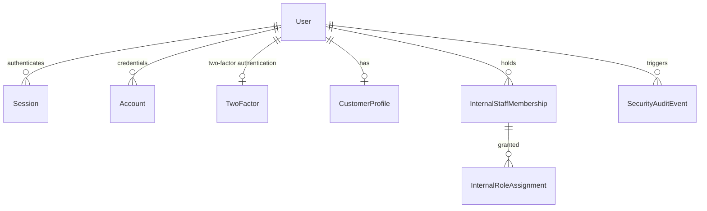
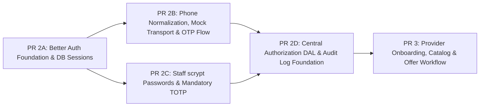

# ADR 14: Identity, Authentication, Sessions, MFA & Authorization Architecture

- **Status:** PROPOSED (UNDER ARCHITECTURAL REVIEW)
- **Date:** 16 September 2026
- **Authors:** WaffarhaCars Core Architecture Team
- **Target Systems:** Next.js 16.3.5 App Router, Node.js 24 LTS, PostgreSQL 17.11, Prisma 7.10.0 (`@prisma/adapter-pg`)
- **Primary Upstream Dependency:** `better-auth@1.7.5` (MIT License)
- **Supersedes:** Monolithic PR 2 Scope

---

## 1. Decision Statement & Library Security Policy

WaffarhaCars adopts **`better-auth@1.7.5`** as its leading provisional authentication foundation for both consumer mobile-first OTP authentication and internal staff credential/MFA authentication. Authentication primitives (passwords, tokens, verification challenges, and database sessions) are managed by Better Auth in the application's primary PostgreSQL 17 database. Authorization primitives (actor roles, staff permissions, multi-branch scoping, maker-checker governance, and object-level authorization) are strictly owned by a WaffarhaCars server-side Data Access Layer (DAL).

### 1.1 Evaluated Version & Compatibility Baseline:

- **Evaluated Version:** `better-auth@1.7.5` (pinned exact release on the 1.7.x line).
- **License:** **MIT License** (permissive open source; unrestricted self-hosted commercial use).
- **Target Runtime Compatibility:** Target compatibility to be proven in PR 2A (Node.js 24 LTS native ESM, Next.js 16.3.5 App Router Route Handlers, and Prisma 7.10.0 with `@prisma/adapter-pg`). Architectural suitability is provisionally accepted pending an installed prototype, CLI-generated schema, clean build, and PostgreSQL 17.11 integration tests passing in PR 2A.

### 1.2 Upstream Maintenance & Security Vulnerability Policy:

1. **Supported Version Constraint:** Better Auth's official maintenance policy explicitly supports only the **`latest`** release line. Upstream security fixes and patches are applied exclusively to current releases.
2. **Mandatory Pre-Install Review of Security Advisories:** Before introducing or bumping Better Auth dependencies, the engineering team must review published [GitHub Security Advisories](https://github.com/better-auth/better-auth/security/policy) for the package.
3. **Exact-Version Pinning:** Better Auth and its subpackages must be pinned to exact versions in `package.json` (e.g. `"better-auth": "1.7.5"`, avoiding `^` or `~` semver ranges) to ensure deterministic builds and audit integrity.
4. **Dependabot & Security Upgrade Protocol:** Automated dependency updates must be reviewed promptly. Because Better Auth generates and manages database schema structures, **every minor or major upgrade requires re-running schema generation (`auth generate` via pinned `auth@1.7.5`), reviewing the resulting Prisma schema diff, and generating an explicit migration via `prisma migrate dev --create-only`**.
5. **Security Posture Realism:** Package maturity does not eliminate vulnerability risk. Better Auth is an actively evolving open-source framework with past security advisories (such as origin verification and session handling edge cases). Adopting Better Auth requires prompt, reviewed handling of security releases rather than assuming passive immunity.

---

## 2. Actor and Authentication Matrix

WaffarhaCars serves distinct operational actors across consumer, provider, and internal organizational boundaries. All session timeout durations listed below are **proposed pilot defaults pending founder approval**:

| Actor                         | Primary Authentication         | Required Second Factor                                   | Session Duration (Proposed Pilot Default - Absolute Cap) | Idle Timeout (Proposed Pilot Default - Idle Limit) | Reauthentication Triggers                                      | Account Recovery Method                                                                                                                                                                                                                                                                                                                                                 | Initial Provisioning                                                                                              | Risk Basis & Operational Context                                                                                                           |
| :---------------------------- | :----------------------------- | :------------------------------------------------------- | :------------------------------------------------------- | :------------------------------------------------- | :------------------------------------------------------------- | :---------------------------------------------------------------------------------------------------------------------------------------------------------------------------------------------------------------------------------------------------------------------------------------------------------------------------------------------------------------------- | :---------------------------------------------------------------------------------------------------------------- | :----------------------------------------------------------------------------------------------------------------------------------------- |
| **Anonymous Visitor**         | None (Public Browsing)         | None                                                     | N/A                                                      | N/A                                                | N/A                                                            | N/A                                                                                                                                                                                                                                                                                                                                                                     | N/A                                                                                                               | Unauthenticated catalog browsing. Zero access to personal data, reservations, or internal tools.                                           |
| **Customer / Car Owner**      | Egyptian Mobile OTP (`+20`)    | None (SMS OTP is restricted out-of-band primary factor)  | 30 Days (Absolute)                                       | 7 Days (Idle)                                      | Reservation cancellation; Profile phone change                 | Phone change requires active fresh session + new-phone OTP. Without an active session, automatic recovery is unavailable; a new phone creates a new account. Manual migration of old identity is deferred until WaffarhaCars establishes a defensible identity-proofing procedure (historical reservation or vehicle details alone are rejected as insufficient proof). | Self-service on-demand upon first reservation booking                                                             | Low administrative privilege; convenience-first consumer flow. 7-day idle timeout prevents repeat logins on personal mobile devices.       |
| **Provider Workshop Worker**  | Egyptian Mobile OTP (`+20`)    | None (Pilot baseline; note: onboarding deferred to PR 3) | 12 Hours (Absolute)                                      | 2 Hours (Idle)                                     | Daily shift start; Sensitive check-in dispute                  | Provider Manager / Internal Ops manual verification                                                                                                                                                                                                                                                                                                                     | Pre-provisioned by Provider Manager or Ops; invited via mobile number (PR 3)                                      | High device sharing risk on workshop floor. Strict 2-hour idle timeout and 12-hour shift limit prevent session hijacking across shifts.    |
| **Provider Workshop Manager** | Egyptian Mobile OTP (`+20`)    | Optional TOTP (Pilot); Mandatory (Post-Pilot)            | 12 Hours (Absolute)                                      | 2 Hours (Idle)                                     | Worker invitation; Staff assignment changes                    | Internal Ops identity proofing and verification                                                                                                                                                                                                                                                                                                                         | Provisioned during merchant onboarding by WaffarhaCars Ops (PR 3)                                                 | Access to branch commission summaries. Payout/bank details cannot be modified via self-service in pilot (restricted to Ops maker-checker). |
| **Internal Sales Staff**      | Work Email + Password (scrypt) | Mandatory TOTP (RFC 6238)                                | 10 Hours (Absolute)                                      | 1 Hour (Idle)                                      | Draft offer commercial submission                              | Single-use encrypted backup codes or two-person Admin reset                                                                                                                                                                                                                                                                                                             | Provisioned through server-only Better Auth provisioning API and domain membership by Platform Admin / HR (PR 2C) | Segregation of duties (Maker role). 1-hour idle timeout protects unattended corporate workstations.                                        |
| **Internal Operations Staff** | Work Email + Password (scrypt) | Mandatory TOTP (RFC 6238)                                | 10 Hours (Absolute)                                      | 1 Hour (Idle)                                      | Offer approval (Checker); Commission dispute adjustment        | Single-use encrypted backup codes or two-person Admin reset                                                                                                                                                                                                                                                                                                             | Provisioned through server-only Better Auth provisioning API and domain membership by Platform Admin (PR 2C)      | Highest operational impact (Checker role). Approvals require fresh active session and mandatory MFA.                                       |
| **Internal Finance Staff**    | Work Email + Password (scrypt) | Mandatory TOTP (RFC 6238)                                | 8 Hours (Absolute)                                       | 30 Minutes (Idle)                                  | Merchant payout batch generation                               | Single-use encrypted backup codes or two-person Admin reset                                                                                                                                                                                                                                                                                                             | Provisioned through server-only Better Auth provisioning API and domain membership by Platform Admin (PR 2C)      | Direct financial impact. 30-minute idle timeout reduces unattended workstation exposure.                                                   |
| **Platform Administrator**    | Work Email + Password (scrypt) | Mandatory TOTP + Encrypted Backup Codes                  | 4 Hours (Absolute)                                       | 15 Minutes (Idle)                                  | Role escalation; System configuration changes; Staff MFA reset | Offline break-glass procedure (Managing Director / Founder manual sign-off)                                                                                                                                                                                                                                                                                             | Bootstrapped via separately reviewed, one-time auditable environment orchestration                                | Total system authority. Minimum session duration (4 hours) and aggressive idle timeout (15 minutes).                                       |

---

## 3. Library Comparison Decision Matrix

| Evaluation Dimension                | Better Auth (1.7.5)                                                                                                                             | Auth.js (NextAuth v5)                                                                                                                | Fully Custom Auth                                                                              | External Managed IdP (Clerk / Auth0 / Supabase)                                                                                                             |
| :---------------------------------- | :---------------------------------------------------------------------------------------------------------------------------------------------- | :----------------------------------------------------------------------------------------------------------------------------------- | :--------------------------------------------------------------------------------------------- | :---------------------------------------------------------------------------------------------------------------------------------------------------------- |
| **Next.js 16 App Router Support**   | Native Route Handler and Server Action integration                                                                                              | Supported via `next-auth` beta handlers                                                                                              | Requires custom middleware and session wrappers                                                | Supported via vendor Next.js SDKs                                                                                                                           |
| **Prisma 7 & PostgreSQL 17**        | Native Prisma adapter supporting `@prisma/adapter-pg`                                                                                           | Supported via `@auth/prisma-adapter`                                                                                                 | Fully manual schema authoring and migrations                                                   | User directory stored in vendor cloud; referencing user IDs in local models requires data synchronization (e.g. webhooks, direct API calls, or dual writes) |
| **Phone Number OTP Support**        | Official `phoneNumber` plugin with `sendOTP` hook                                                                                               | Not selected: equivalent native phone OTP support not established in this review                                                     | Full control, but requires hand-rolling token crypto, expiry, and rate limits                  | Supported on select vendor tiers; proprietary SMS pipes                                                                                                     |
| **Email / Password Support**        | Built-in using native Node.js `scrypt` hasher                                                                                                   | Supported via Credentials provider                                                                                                   | Must implement hashing, salt management, timing-safe checks                                    | Built-in on vendor console                                                                                                                                  |
| **TOTP & Backup Codes**             | Official `twoFactor` plugin with encrypted secrets                                                                                              | Not selected: equivalent native TOTP plugin support not established in this review                                                   | High implementation and cryptographic audit burden                                             | Built-in on vendor console                                                                                                                                  |
| **Database Sessions**               | Native PostgreSQL `session` table with direct token lookup and server-side revocation                                                           | Supports database sessions via Prisma adapter or stateless JWTs; custom hooks required for granular database lifecycle control       | Custom session table design, token rotation, and cleanup required                              | Session state held in vendor cloud; local verification relies on vendor JWTs or session introspection                                                       |
| **Session Revocation**              | Built-in server-side revocation endpoints                                                                                                       | Limited out-of-the-box with JWTs                                                                                                     | Must hand-roll revocation tokens and tracking tables                                           | Supported via vendor management APIs                                                                                                                        |
| **Rate Limiting & Abuse Controls**  | Built-in client-facing IP/endpoint rate limiting (configurable windows, storage-backed adapters; does not cover direct `auth.api` server calls) | Rate limiting is not built-in; typically implemented via edge middleware or external storage (e.g. Upstash/Redis, database counters) | Must implement sliding window or token bucket rate limiters                                    | Built-in on vendor edge                                                                                                                                     |
| **Origin & Cookie Protections**     | Built-in Origin verification, Fetch Metadata headers, and `SameSite=Lax` cookies                                                                | Built-in CSRF protection                                                                                                             | Vulnerable to subtle cookie attribute misconfigurations                                        | Handled by vendor domain/cookies                                                                                                                            |
| **Account Linking**                 | Native User / Account model                                                                                                                     | Supported via adapter callbacks                                                                                                      | Full control, high logic complexity                                                            | Managed by vendor rules                                                                                                                                     |
| **Testability Without Sending SMS** | Native `testUtils({ captureOTP: true })` in test instances                                                                                      | Complex mocking of Credentials callbacks                                                                                             | High testability, high code volume                                                             | Requires third-party mocking or vendor sandbox                                                                                                              |
| **Vendor Independence & Licensing** | Self-hosted open-source library (MIT license); identity and sessions reside in local PostgreSQL database                                        | Self-hosted open-source library; identity data resides in local database via adapter                                                 | Self-hosted proprietary application codebase                                                   | Third-party proprietary SaaS; user identities hosted in vendor cloud; export and migration workflows required if transitioning                              |
| **Operational Complexity**          | Moderate: single library embedded within Next.js process; requires managing database migrations for generated tables                            | Moderate: embedded library; requires configuring custom credential shims for phone OTP                                               | Very High: ongoing maintenance of cryptographic routines, cookie flags, and session management | Moderate to High: external service dependency, network latency, external data synchronization, and vendor SDK versioning                                    |
| **Schema Ownership**                | Complete (`prisma/schema.prisma` under git control)                                                                                             | Complete via Prisma adapter                                                                                                          | Complete                                                                                       | Fragmented across vendor cloud and local database                                                                                                           |
| **Egypt-First Mobile Experience**   | High (Headless API allows custom Arabic/English RTL screens)                                                                                    | Moderate (Headless)                                                                                                                  | High (Bespoke)                                                                                 | Often requires vendor hosted widgets or restricted UI customizability                                                                                       |
| **Commercial / Cost Status**        | Free (MIT License, $0 software license fee)                                                                                                     | Free (Open source)                                                                                                                   | Engineering build and maintenance cost                                                         | Tiered commercial pricing; typically includes a free allowance followed by monthly per-MAU subscription fees                                                |

### Decision Summary:

- **Better Auth is the leading provisional choice**, subject to successful verification across the PR 2A runtime compatibility and PostgreSQL integration gates, the PR 2B OTP concurrency gate, and the PR 2C server-side trusted-device override gate.
- **Auth.js is not selected** because equivalent native phone OTP and TOTP plugin support was not established in this review without custom credential shims.
- **Fully custom authentication is rejected** to avoid re-implementing session lifecycle, cookie attributes, scrypt password hashing, and TOTP verification from scratch.
- **Managed identity providers are deferred** pending future commercial, data-residency, and domestic integration evaluation.

---

## 4. Identity Model & Generated Schema Authority

> [!IMPORTANT]
> **Better Auth Generated Schema is the Authoritative Source of Truth:**
> The tables and fields described below represent the architectural mapping for **Better Auth 1.7.5**. The **exact, authoritative Prisma schema is produced directly by Better Auth's schema generator (`auth generate` via pinned `auth@1.7.5`) in PR 2A and PR 2C**. Engineering will not manually rename or hand-craft library-owned fields, defaults, indexes, or constraints before running the generator.

### 4.1 PR 2A Schema Generation Workflow:

1. Pin the reviewed version: `"better-auth": "1.7.5"` in `package.json`.
2. Author minimal configuration in `src/lib/auth.ts` defining plugins and adapters.
3. Run Better Auth CLI generator: `npm run auth:schema:generate` (or `npx auth generate`).
4. Review the generated Prisma model definitions against architectural requirements.
5. Generate the database migration via `npx prisma migrate dev --create-only --name auth_core`.
6. Review the resulting SQL script in `prisma/migrations/`.
7. Commit the reviewed schema and migration.

### 4.2 Factual Storage & Configuration Semantics:

- **Identifier Strategy (UUIDs):** Better Auth generates random string/nanoid identifiers by default. Because WaffarhaCars standardizes on UUIDs (RFC 9562), Better Auth must be explicitly configured with:
  ```typescript
  database: {
    generateId: () => crypto.randomUUID(),
  }
  ```
- **Account Linking for Phone:** Phone authentication operates primarily via user record attributes and verification tokens; it does not automatically create an `Account` row with `providerId: "phone"` unless explicitly configured.
- **Session Tokens:** Session tokens in the `session` table are stored as **unique lookup strings**, not cryptographic hashes. The session cookie holds the plain token matching the database key.
- **Verification Records (No User Foreign Key):** Better Auth's `verification` table stores temporary challenge tokens indexed by `identifier` (e.g. canonical phone number or email) and `value`. **It does not maintain a foreign-key relationship to the `User` table**, allowing pre-registration challenges and anonymous OTP dispatch.
- **Server-Owned Custom Fields:** To protect server-owned attributes from client tampering, they must be registered with `input: false` in Better Auth's schema configuration:
  ```typescript
  user: {
    additionalFields: {
      isSuspended: {
        type: "boolean",
        defaultValue: false,
        input: false, // Server-owned; client cannot mutate during sign-up or updates
      },
    },
  },
  session: {
    additionalFields: {
      lastActivityAt: {
        type: "date",
        defaultValue: () => new Date(),
        input: false, // Server-owned; updated boundedly to track idle timeouts
      },
      lastReauthenticatedAt: {
        type: "date",
        required: false,
        input: false, // Server-owned; tracks step-up reauthentication timestamp
      },
    },
  },
  ```
- **Enforcement Boundary for `isSuspended`:** Better Auth does not natively block session resolution for suspended users. **Checking `user.isSuspended` and terminating session access is a WaffarhaCars-owned DAL enforcement rule** executed within the central session assertion helper (`assertAuthenticated`).

### 4.3 Proposed Schema Architecture:



> [!NOTE]
> `Verification` is an independent, identifier-based challenge table (`id`, `identifier`, `value`, `expiresAt`, `createdAt`, `updatedAt`) without a direct foreign key to `User`, as verified challenges may precede user creation.

1. **Better Auth Generated Models (PR 2A & PR 2C):**
   - `User`: `id`, `name`, `email`, `emailVerified`, `phoneNumber`, `phoneNumberVerified`, `image`, `isSuspended` (server-only, default false), `twoFactorEnabled` (boolean, default false, added by 2FA plugin), `createdAt`, `updatedAt`.
   - `Session`: `id`, `userId`, `token`, `expiresAt`, `ipAddress`, `userAgent`, `lastActivityAt` (server-only), `lastReauthenticatedAt` (server-only, nullable), `createdAt`, `updatedAt`.
   - `Account`: `id`, `userId`, `accountId`, `providerId`, `password` (hashed via scrypt), `createdAt`, `updatedAt`.
   - `Verification`: `id`, `identifier`, `value`, `expiresAt`, `createdAt`, `updatedAt`.
   - `TwoFactor` (`twoFactor` table, PR 2C): Dedicated table generated by Better Auth 1.7.5 `twoFactor` plugin currently containing:
     - `id` (string, primary key)
     - `userId` (string, foreign key referencing `User.id`; exact constraints determined by pinned CLI output)
     - `secret` (string, encrypted TOTP seed)
     - `backupCodes` (string, encrypted serialized backup codes)
     - `verified` (boolean, indicates completed enrollment; exact default determined by pinned CLI output)
     - `failedVerificationCount` (integer, tracks consecutive failed 2FA challenges; exact default determined by pinned CLI output)
     - `lockedUntil` (DateTime, nullable, second-factor lockout expiration timestamp)

2. **WaffarhaCars Domain-Owned Models (PR 2B / 2C / 2D):**
   - `CustomerProfile` (`customer_profiles`, PR 2B): `id`, `userId` (`UNIQUE`), `preferredLanguage` (`ar` | `en`), `notificationPreferences` (JSONB), `createdAt`, `updatedAt`.
   - `InternalStaffMembership` (`internal_staff_memberships`, PR 2C): `id`, `userId` (`UNIQUE`), `department` (`SALES` | `OPERATIONS` | `FINANCE` | `ADMIN`), `employeeNumber` (`UNIQUE`), `isActive`, `hiredAt`.
   - `InternalRoleAssignment` (`internal_role_assignments`, PR 2D): `id`, `staffMembershipId`, `role` (`SALES_AGENT` | `OPS_SUPERVISOR` | `FINANCE_OFFICER` | `PLATFORM_ADMIN`), `assignedAt`, `assignedBy`.
   - `SecurityAuditEvent` (`security_audit_events`, PR 2D): `id`, `actorUserId` (Nullable), `eventType`, `targetEntity`, `ipAddress`, `metadata` (JSONB), `timestamp`.

3. **Explicit Scope Exclusion:** Provider merchant organizations (`provider_organizations`), workshop locations (`provider_branches`), and staff branch assignments (`branch_assignments`) are **strictly deferred to PR 3**.

---

## 5. Phone-Number Policy, Temporary Email Strategy & Recycled SIM Risk

### 5.1 Maintained Parsing Library

WaffarhaCars mandates **[`libphonenumber-js`](https://gitlab.com/catamphetamine/libphonenumber-js)**, a maintained zero-dependency JavaScript port based on Google's libphonenumber metadata (not Google-maintained code). Handwritten regular expressions are prohibited.

### 5.2 Egyptian Mobile Invariants:

- **Country Code:** `+20` (Egypt).
- **National Significant Number (NSN):** 10 digits starting with `1`.
- **Allocation Blocks:** `010` (Vodafone), `011` (Etisalat), `012` (Orange), `015` (WE).
- **Mobile Number Portability (MNP) Warning:** Initial prefix allocations identify format validity only. Because Egypt enforces Mobile Number Portability, **application logic must never use the prefix to infer the user's active mobile network operator**.
- **Canonical Storage:** Serialized exclusively as E.164: `+201[0125]XXXXXXXX`.
- **Masked Presentation:** `+20 10 **** 1234`. Raw phone numbers must never be written to application logs.

### 5.3 Better Auth Phone Sign-Up: Temporary Email Strategy

Better Auth's core user model requires an email address. For Egyptian consumers registering via phone number, WaffarhaCars will implement Better Auth's documented `signUpOnVerification.getTempEmail` hook:

1. **Deterministic Pseudonymous Placeholder with Explicit Secret Key:**
   - Generate a deterministic placeholder email using an HMAC-SHA256 of the canonical E.164 phone number keyed by a dedicated secret:
   ```typescript
   const hash = crypto
     .createHmac("sha256", process.env.PHONE_ALIAS_HMAC_KEY!)
     .update(`phone-alias:v1\0${canonicalE164}`)
     .digest("hex")
     .slice(0, 32);
   const tempEmail = `phone_${hash}@phone.waffarhacars.invalid`;
   ```
2. **Key Entropy & Isolation:**
   - `PHONE_ALIAS_HMAC_KEY` must be a high-entropy secret of at least 32 cryptographically random bytes (`crypto.randomBytes(32)`).
   - It is stored securely in server environment orchestration, never committed to git, and kept strictly separate from `BETTER_AUTH_SECRET`.
3. **Domain Separation:**
   - The input to the HMAC is domain-separated with a versioned prefix (`phone-alias:v1\0${canonicalE164}`) to prevent cross-protocol collision.
   - The phone rate-limiting/cooldown throttle in PostgreSQL must use either a separate key (`PHONE_THROTTLE_HMAC_KEY`) or a distinct domain prefix (`phone-throttle:v1\0${canonicalE164}`) so that throttle hashes cannot be correlated with placeholder email addresses.
4. **Key Rotation & Versioning Policy:**
   - Because placeholder emails associate phone numbers with Better Auth `User` accounts, rotating `PHONE_ALIAS_HMAC_KEY` without a database migration would generate new placeholder emails for existing phone numbers, causing silent account duplication.
   - Key rotation requires a versioned protocol (e.g. migrating from `v1` to `v2`) with an explicit database migration script that updates existing placeholder emails before activating the new key.
5. **Privacy & Logging Restrictions:**
   - Raw phone numbers, HMAC keys, and full HMAC digests must never be written to application logs or client diagnostics.
6. **Reserved Non-Delivery Domain:**
   - Uses the RFC 2606 reserved `.invalid` top-level domain to guarantee that placeholder addresses can never be routed or delivered on public networks.
7. **Exclusion from Communications:**
   - Notification and transactional email dispatchers must explicitly check and skip addresses matching `*.invalid`.
8. **Secondary Email Attachment:**
   - When a customer subsequently provides an email address, an explicit email verification challenge is completed, after which `User.email` is updated with the real verified address and `User.emailVerified` is set to `true`.

### 5.4 Phone-Number Change & Recycled-SIM Policy:

- **Strict Identity Recovery Rule (Lean Cairo MVP):**
  1. **Self-Service Phone Change (Active Session Required):**
     - Caller must hold a fresh authenticated session (reauthenticated within the past 10 minutes).
     - Confirmation with an existing secondary factor or password must be performed where configured.
     - Live OTP verification must be successfully completed on the **new** mobile number.
     - Upon successful verification, all other active sessions for the user are immediately revoked.
     - A security audit event is recorded, and an alert is dispatched to any previously verified communication channel (such as verified email).
  2. **Lost Phone / No Active Session (Simpler Safer MVP Rule):**
     - Without access to the registered phone number / old factor or an already authenticated session, **automatic recovery and phone re-association are completely unavailable**.
     - A new phone number creates a new, separate customer account.
     - Manual migration or re-association of an old customer identity to a new phone number is **deferred** until WaffarhaCars establishes a defensible, audited identity-proofing procedure.
     - Historical reservation facts, vehicle registration numbers, or vehicle models alone are explicitly rejected as sufficient identity proof because they may be known by service advisers, parking valets, family members, or third parties.
- **Recycled-SIM Risk Analysis:** In mobile-first markets like Egypt, prepaid mobile numbers that experience prolonged dormancy are eventually disconnected and recycled back into the operator pool. A new subscriber receiving a recycled SIM could theoretically authenticate via OTP into an account created by the previous owner.
  - _Absence of Fixed Statutory Timeframe:_ Because Egyptian telecom recycling periods vary across operators, contract types, and regulatory churn policies, the architecture does not cite or assume an unverified fixed timeframe.
  - _Compensating Controls:_
    - Historical reservation views redact full payment instrument details, payment transaction IDs, and personal contact info.
    - Sensitive account operations (such as reservation cancellations or profile modifications) require fresh active session reauthentication.
  - _Residual Risk Acceptance:_ Short of requiring national ID card verification (which creates unacceptable onboarding friction for discount automotive bookings), OTP access to a recycled phone number represents an accepted residual risk of mobile-first authentication.
- **Provider Manager Financial Guard:** During the Cairo pilot, SMS-only authenticated workshop managers **are prohibited from modifying bank account or settlement payout details via self-service**. All payout modifications require an internal Operations maker-checker verification workflow.

---

## 6. Simplified OTP Architecture & Pluggable Transport Adapter

Rather than building duplicate custom endpoints, WaffarhaCars leverages Better Auth's official `phoneNumber` plugin for the challenge lifecycle and owns an internal transport adapter.

```
Client (Browser)                           Next.js (Better Auth)              WaffarhaCars Transport Adapter           Domestic Gateway
     │                                               │                                      │                                 │
     │ ── 1. authClient.phoneNumber.sendOtp() ────>  │                                      │                                 │
     │                                               │ [Generate Challenge & Store Record]  │                                 │
     │                                               │ ── 2. Trigger non-awaited sendOTP ──>│                                 │
     │ <─ 3. HTTP 200 (Challenge Accepted) ───────── │                                      │ ── 4. Dispatch SMS API ───────> │
     │                                               │                                      │ <─ 5. Gateway Response ──────── │
     │                                               │                                      │                                 │
     │ ── 6. authClient.phoneNumber.verify() ──────> │                                      │                                 │
     │                                               │ [Atomically Consume Challenge]       │                                 │
     │ <─ 7. Session Cookie Issued ───────────────── │                                      │                                 │
```

### 6.1 Delivery Semantics & Anti-Abuse Controls:

- **Non-Awaited Dispatch & Response Semantics:** Official Better Auth documentation recommends not awaiting `sendOTP` within the HTTP request lifecycle to avoid response-time enumeration attacks. The public HTTP 200 response indicates only that the verification challenge was **accepted for processing**—not that the upstream SMS gateway or mobile handset has received it.
- **Process Termination Resilience:** PR 2B must decide during implementation how background dispatch survives server process termination (evaluating provider-managed verification services like Twilio Verify / Infobip Verify versus a minimal durable delivery mechanism such as a lightweight queue). Unsafe, untracked fire-and-forget promises that crash silently or lose messages during container redeployments are strictly prohibited.
- **Pluggable Transport Adapter Contract:**
  ```typescript
  export interface OtpTransportResult {
    accepted: boolean;
    vendorMessageId?: string;
    rejectionReason?: string;
  }

  export interface OtpTransportAdapter {
    send(toCanonicalE164: string, code: string): Promise<OtpTransportResult>;
  }
  ```
- **WaffarhaCars-Owned Rate Limiting & Cooldown:** Better Auth's general rate limiter is primarily IP/endpoint based and operates across fixed time windows; it does **not** provide a native per-phone sliding-window limiter.
  - The 60-second per-phone resend cooldown and SMS-pumping defenses are **WaffarhaCars-owned controls**.
  - WaffarhaCars implements an atomic database-backed throttle in PostgreSQL keyed by a domain-separated HMAC of the canonical E.164 phone number (`hmac_sha256(phone, PHONE_THROTTLE_HMAC_KEY)`), combined with IP-based rate limiting.
  - **Public HTTP Endpoint Testing:** All rate-limiting and abuse-defense integration tests must exercise the public HTTP endpoint (`/api/auth/phone-number/send-otp`), because direct `auth.api` server calls bypass Better Auth's client-facing rate-limiting middleware.
- **Test Harness Isolation:** Deterministic test capture is enabled exclusively in test environments using Better Auth's official `testUtils({ captureOTP: true })`. Production initialization asserts that test plugins are excluded and fails closed if `OTP_PROVIDER=mock`.

### 6.2 PR 2B Concurrency Hard Gate & Atomic Verification Requirement:

> [!CAUTION]
> **OTP Concurrency Hard Gate Mandate:**
> Official Better Auth documentation notes that server-side OTP consumption does not automatically guarantee single-use enforcement under rapid concurrent requests unless the underlying verifier atomically consumes the challenge.
>
> **PR 2B must execute a strict concurrency test gate:**
>
> 1. Submit two identical valid OTP verification requests simultaneously against the same active challenge via the public HTTP endpoint.
> 2. Assert that **exactly one request succeeds in issuing a session**, while the competing request is rejected.
> 3. **If that test fails (i.e. race condition permits multiple sessions or double consumption), PR 2B is blocked immediately.**
> 4. The engineering team must stop and author an ADR amendment choosing either a provider-managed atomic verification service or a fully specified atomic local verifier.
> 5. No casual fallback implementation may be merged without proving atomic consumption and exactly-one-session behavior under concurrent load.

---

## 7. Session Policy & Capability-Gap Analysis

### 7.1 Factual Better Auth Session Mechanics:

- **Storage:** Stored in the PostgreSQL `session` table.
- **Token Format:** Better Auth stores an unhashed unique string token in the database and sets this value in an `HttpOnly`, `SameSite=Lax` cookie.
- **Expiration Controls:** Better Auth provides a single global `expiresIn` (session lifetime in seconds) and rolling `updateAge` (window after which user activity extends `expiresAt`). Better Auth does **not** natively support role-specific idle timeouts.
- **Cookie Cache:** Better Auth supports an optional `cookieCache` storing signed session data in a client cookie. **In PR 2A, `cookieCache` is disabled** to guarantee that session revocation takes effect immediately against PostgreSQL without waiting for cookie cache expiration.

### 7.2 Session Capability-Gap Analysis:

| Requirement                          | Better Auth Native (1.7.5)                    | WaffarhaCars Architecture                                 | Gap Resolution & Owning PR                                                                                                                            |
| :----------------------------------- | :-------------------------------------------- | :-------------------------------------------------------- | :---------------------------------------------------------------------------------------------------------------------------------------------------- |
| **Database Session Persistence**     | Native (`session` table in PostgreSQL)        | Direct PostgreSQL session store                           | **PR 2A:** Configured via Prisma adapter                                                                                                              |
| **Immediate Server-Side Revocation** | Native (`revokeSession`, `revokeAllSessions`) | Instant session termination on logout/suspension          | **PR 2A:** Native API calls; `cookieCache` disabled                                                                                                   |
| **Global Session Ceiling**           | Native (`expiresIn`)                          | Platform outer boundary (e.g. 30 days)                    | **PR 2A:** Configured pilot default                                                                                                                   |
| **Dual Idle vs. Absolute Timeouts**  | Single rolling `expiresAt` timestamp          | Two-tier timeout policy (idle + absolute cap)             | **PR 2A / 2D:** PR 2A adds server-owned `lastActivityAt`; PR 2D DAL verifies `createdAt` against absolute cap and `lastActivityAt` against idle limit |
| **Actor-Specific Session Durations** | Uniform global `expiresIn`                    | Strict timeouts for staff vs. long sessions for customers | **PR 2D:** DAL asserts role-specific absolute caps and idle windows                                                                                   |
| **Sensitive Reauthentication Gate**  | `freshAge` checks initial creation            | Step-up reauthentication for critical actions             | **PR 2A / 2D:** PR 2A adds server-owned `lastReauthenticatedAt`; PR 2D DAL asserts recent reauthentication timestamp                                  |

### 7.3 Implementation Mechanism for Idle and Step-Up Timeouts:

1. **Global Maximum Ceiling:** Better Auth's global `expiresIn` is configured to the maximum duration required by consumers (30 days).
2. **Actor-Specific Absolute Caps:** Enforced server-side in the DAL (`assertAuthenticated`) by comparing `session.createdAt` against the role's absolute limit (e.g. 4 hours for Admin, 8–10 hours for Staff, 12 hours for Workshop Worker).
3. **True Role-Specific Idle Limits:** True idle tracking requires a server-owned `lastActivityAt` timestamp registered on `Session` in PR 2A (`input: false`). The DAL verifies that `now - session.lastActivityAt < idleLimit`. To prevent database write amplification, `lastActivityAt` is updated in a bounded, throttled manner (e.g. at most once every 5 minutes during active requests). `updatedAt` and `updateAge` alone are not presented as reliable role-specific idle tracking.
4. **Step-Up Reauthentication Assurance:** Sensitive mutations require a server-owned `lastReauthenticatedAt` timestamp on `Session` (registered in PR 2A with `input: false`). Better Auth's initial `createdAt` is not proof that a later step-up reauthentication occurred. The DAL enforces that sensitive actions (payout batch generation, role escalation, phone change) require `now - session.lastReauthenticatedAt < 10 minutes`.
5. **Required Verification Tests in PR 2D:**
   - Continuous user activity keeps session active within idle limits.
   - Inactivity exceeding the actor's idle limit triggers session rejection and invalidation.
   - Exceeding the actor's absolute ceiling terminates the session regardless of ongoing activity.
   - Changing a user's role immediately applies the updated timeout limits.
   - Performing step-up reauthentication refreshes `lastReauthenticatedAt` and unlocks sensitive actions.

---

## 8. Internal Staff Password Authentication & Mandatory TOTP

### 8.1 First Factor: Passwords via Default `scrypt`

- **Password Policy:** Minimum 12 characters (NIST SP 800-63B compliant).
- **Hashing Algorithm:** Managed by Better Auth's default password hasher using Node.js native `crypto.scrypt`.
- **Brute-Force Protection:** Enforced via client-facing IP- and endpoint-based rate limiting. _Note on Account Lockout:_ Better Auth password sign-in does not natively lock user accounts after failed password attempts (only the `twoFactor` plugin tracks failed second-factor attempts). Full password account lockout is documented as a deferred requirement to be implemented via custom storage-backed throttling in PR 2C.

### 8.2 Second Factor: Mandatory TOTP via Official `twoFactor` Plugin

Better Auth 1.7.5's official `twoFactor` plugin provides RFC 6238 TOTP and single-use backup codes.

#### 1. Factual Schema for Better Auth 1.7.5:

- `User` model gains `twoFactorEnabled` (boolean, default false).
- Generated dedicated `twoFactor` table contains: `id`, `userId` (foreign key referencing `User.id`; exact constraints determined by pinned CLI output), `secret`, `backupCodes`, `verified` (exact default determined by CLI output), `failedVerificationCount` (exact default determined by CLI output), and `lockedUntil`.
- TOTP secrets (`secret`) and backup codes (`backupCodes`) are encrypted at rest using `BETTER_AUTH_SECRET`.
- The pinned CLI generator output (`auth generate` via pinned `auth@1.7.5`) remains the final authority on Prisma definitions; fields must not be renamed prior to generation.

#### 2. Trusted-Device Enforcement Policy:

> [!IMPORTANT]
> **Server-Side Enforcement of Trusted Devices:**
> In Better Auth, `trustDevice` is a caller-controlled boolean parameter passed during TOTP verification (`authClient.twoFactor.verifyTOTP({ code, trustDevice: true })`). It is **not** a global configuration flag like `twoFactor({ trustDevice: false })`.
>
> **Enforceable Security Policy:**
>
> 1. Internal staff requests with `trustDevice: true` must be rejected or overridden server-side.
> 2. PR 2C must identify and test the exact Better Auth server hook or boundary (e.g. pre-verification route hook or request interceptor) used to enforce this override.
> 3. PR 2C must include a dedicated integration test that calls the public Better Auth verification endpoint directly with `trustDevice: true` for a staff user and proves that **no trusted-device bypass cookie is issued**.
> 4. Relying on the client-side UI to pass `trustDevice: false` is strictly insufficient.
> 5. If pinned Better Auth cannot enforce this safely server-side, PR 2C is blocked pending an ADR amendment.

#### 3. Mandatory Staff-MFA Enrollment State Machine & Provisioning:

Better Auth only challenges users who have successfully enabled 2FA (`twoFactorEnabled: true`). Un-enrolled staff would otherwise authenticate with password alone. The architecture mandates the following state machine:

1. **Server-Only Provisioning Workflow (Direct Prisma / SQL Inserts Prohibited):**
   - Public email/password self-registration is strictly disabled.
   - Staff credentials must be created through a server-only Better Auth-supported provisioning API/workflow, **never via direct Prisma inserts into Better Auth-owned `User` or `Account` tables**, ensuring password hashing (scrypt) and account metadata are correctly initialized by the library.
   - Provisioning creates the credential account through Better Auth, then creates the domain-owned `InternalStaffMembership` transactionally or with compensating cleanup upon failure.
   - **No Shared or Default Passwords:** Generating, using, or committing shared, static, or default passwords is strictly prohibited. Passwords must never be committed to git, stored in environment variables, printed to logs, or submitted in pull requests.
   - **Bootstrap Platform Admin:** Initial provisioning of the root Platform Administrator requires a separately reviewed, one-time auditable bootstrapping process using secure, ephemeral environment orchestration.
   - The first-login activation mechanism, temporary credential rotation, and forced initial password/TOTP setup journey must be proven in PR 2C.
2. **Initial Enrollment State:** Newly provisioned staff accounts have `User.twoFactorEnabled = false` and no verified `twoFactor` record.
3. **Forced Setup Journey:** Upon initial password sign-in, the user's session is granted zero staff or administrative permissions. The session is strictly confined to the TOTP enrollment route (`/staff/mfa/enroll`).
4. **DAL Privilege Block:** `twoFactorEnabled = false` or an unverified two-factor record (`twoFactor.verified = false`) must block **every staff privilege** in the DAL and route boundaries except the enrollment and recovery endpoints.
5. **Authorization Requirement:** An active internal membership (`InternalStaffMembership.isActive = true`) plus verified TOTP enrollment (`User.twoFactorEnabled = true` AND `twoFactor.verified = true`) is strictly required before any staff authorization succeeds.
6. **Direct SQL Mutation Prohibited:** Directly changing `twoFactorEnabled = true` in SQL is prohibited; the account must complete Better Auth's cryptographic setup flow so the secret and backup codes are properly initialized.
7. **Native Endpoint vs. Wrapper:** The native Better Auth sign-in endpoint (`/api/auth/sign-in/email`) plus a staff UI is used. If a wrapper or dedicated Route Handler is retained, its security purpose must be documented, and the central DAL / middleware must guarantee that logging in via the native endpoint cannot bypass the mandatory TOTP requirement.

#### 4. Factor Independence & Recovery:

- **Factor Independence:** Password (Knowledge) + Authenticator App TOTP (Possession) satisfies two-factor independence under NIST SP 800-63B guidelines.
- **Administrative Recovery:** If a staff member loses their authenticator app and backup codes, MFA reset requires a **two-person administrative rule** (written authorization from the Managing Director / Founder and technical execution by Platform Admin).

---

## 9. Server-Side Data Access Layer (DAL) & Scoped Authorization

Authentication verifies identity; authorization determines object-level access permissions.

### 9.1 Core Architectural Invariants:

1. **Structured HTTP Semantics:**
   - **HTTP 401 Unauthorized:** Returned when authentication is missing, invalid, revoked, or expired.
   - **HTTP 403 Forbidden:** Returned when an authenticated caller lacks required permissions, when a staff user has not completed mandatory TOTP enrollment, or when a user is suspended (`isSuspended: true`).
   - **Object-Ownership Policy (403 vs. 404):** Object-ownership failures (such as a customer attempting to access another customer's reservation or a workshop accessing another branch's data) must follow the domain's documented 403/404 policy to avoid leaking whether private entities exist.
2. **Centralized Data Access Layer (DAL):** Domain business logic resides in server-side repositories. Route Handlers and Server Actions must call DAL functions rather than querying Prisma models directly.
3. **Zero Client Trust:** Route parameters (`userId`, `branchId`, `role`) provided in request bodies or query strings are untrusted. The DAL extracts caller identity and permissions strictly from the validated session.
4. **Append-Oriented Security Audit Log:** Denial events, authentication failures, and privilege elevations are written to `security_audit_events`.
   - _Security Limitation:_ The audit table is append-oriented with restricted application database permissions, but is **not cryptographically tamper-evident** (a database administrator with direct SQL access can modify records). Cryptographic hash-chaining or external WORM logging is deferred post-pilot.
   - _Abuse Guard:_ To prevent denial-of-service via database storage exhaustion, audit logging for unauthenticated requests is rate-limited and deduplicated.

### 9.2 Scoping Boundary by Pull Request:

- **PR 2D Scope:** Central session assertions, internal staff role resolution, static permission catalog, and generic protected test fixtures.
- **Offer Maker-Checker Rules:** Deferred to **PR 3** (where `offers` and offer revisions are introduced).
- **Workshop Branch Check-In Scoping:** Deferred to the **Provider Workshop slice** (where branch assignment tables are introduced).
- **Customer Reservation Ownership:** Deferred to the **Reservation slice** (where reservation domain tables are introduced).

---

## 10. Threat Modeling & Security Controls

| Threat Scenario                  | Attack Vector                                                        | Prevention Controls                                                                                                                                                                                                       | Detection Controls                                                                                                           | Recovery Controls                                                                                                                                |
| :------------------------------- | :------------------------------------------------------------------- | :------------------------------------------------------------------------------------------------------------------------------------------------------------------------------------------------------------------------ | :--------------------------------------------------------------------------------------------------------------------------- | :----------------------------------------------------------------------------------------------------------------------------------------------- |
| **OTP Brute Force**              | Automated script guessing 6-digit codes                              | - Max 3 attempts per challenge<br>- 180s expiry<br>- WaffarhaCars-owned atomic phone throttle keyed by `hmac_sha256(phone, PHONE_THROTTLE_HMAC_KEY)`<br>- Client-facing IP-based rate limiting on public endpoint (PR 2B) | Runtime attempt counter tracks invalid tries (prevention control); centralized security intrusion alerting is deferred.      | Challenge destroyed on 3rd failure; 15-minute phone cooldown enforced by DB throttle (verified in PR 2B integration test).                       |
| **OTP Replay**                   | Re-submitting previously used OTP                                    | - Atomic single-use challenge consumption in verifier (PR 2B concurrency hard gate)                                                                                                                                       | No separate production alert in pilot; rejection is verified by PR 2B integration tests.                                     | Zero session issued; challenge invalidated immediately (verified in PR 2B integration test).                                                     |
| **Account Enumeration**          | Probing phone numbers to discover existing users                     | - Generic acceptance responses (HTTP 200 indicates accepted for processing)<br>- Non-awaited asynchronous `sendOTP` dispatch (PR 2B)                                                                                      | Deferred (requires centralized metric anomaly infrastructure).                                                               | Client-facing IP rate limiting reduces abuse from a single observed IP (does not stop distributed attacks) (verified in PR 2B integration test). |
| **Session Hijacking / Fixation** | Stealing cookie via XSS or sniffing                                  | - `HttpOnly`, `Secure`, `SameSite=Lax` cookies<br>- No tokens in `localStorage`<br>- Native database session lookup in PostgreSQL<br>- `cookieCache` disabled (PR 2A)                                                     | Deferred (requires client-side anomaly detection or IP drift tracking).                                                      | Immediate server-side session revocation via Better Auth API (`revokeSession`) against PostgreSQL (verified in PR 2A integration test).          |
| **CSRF**                         | Cross-origin request forged by third-party site                      | - `SameSite=Lax` cookies<br>- Better Auth `Origin` validation against `trustedOrigins`<br>- Fetch Metadata (`Sec-Fetch-Site`) checks (PR 2A)                                                                              | Origin and Fetch Metadata enforcement verified by PR 2A integration tests; centralized security alerting is deferred.        | Request rejected with HTTP 403 before reaching application handlers (verified in PR 2A integration test).                                        |
| **Credential Stuffing (Staff)**  | Automated login using leaked password lists                          | - Mandatory TOTP for internal staff (PR 2C)<br>- Client-facing IP rate limiting on sign-in endpoint (PR 2C)<br>- Second-factor lockout via `twoFactor.lockedUntil` after consecutive failed attempts (PR 2C)              | Security audit log records authentication failures in database (PR 2D); centralized intrusion alert thresholds are deferred. | Administrative password reset and second-factor unlock via two-person rule (deferred post-pilot operational runbook).                            |
| **Client Role Tampering**        | Submitting `role: "ADMIN"` or unauthorized claims in request payload | - Client request payloads validated with Zod<br>- Caller identity and roles resolved strictly from server-side database session in DAL (PR 2D)                                                                            | Unauthorized access and unexpected payload fields recorded in security audit log (PR 2D); production alerting is deferred.   | Payload stripped; access denied with HTTP 403; event recorded in `security_audit_events` (verified in PR 2D integration test).                   |
| **Stolen Provider Device**       | Workshop device stolen or accessed while logged in                   | - 12-hour absolute shift limit and 2-hour idle timeout enforced server-side in DAL (PR 2D)                                                                                                                                | Deferred (requires automated device telemetry).                                                                              | Remote session revocation by Provider Manager or Operations via DAL / Better Auth session revocation (verified in PR 2D integration test).       |
| **Concurrent OTP Race**          | Submitting valid OTP twice simultaneously                            | - Concurrency test hard gate in PR 2B; requires atomic challenge consumption verifier (PR 2B test)                                                                                                                        | No separate production alert in pilot; exactly-one acceptance is verified by the PR 2B concurrency test.                     | Exactly one request issues session; competing request rejected with error (verified in PR 2B integration test).                                  |

---

## 11. Proposed PR Split (Decomposing PR 2)

The original monolithic PR 2 ("Identity, Sessions, MFA & RBAC") is decomposed into four focused implementation PRs without circular domain dependencies:



---

### PR 2A: Authentication Library Foundation, Generated Schema & Database Sessions

- **Business Outcome:** Functional Better Auth core instance mounted in Next.js 16 App Router managing database sessions in PostgreSQL 17 via Prisma 7.
- **Runtime Compatibility Proof:** Proves target compatibility of Node.js 24 LTS, Next.js 16.3.5, and Prisma 7.10.0 with `@prisma/adapter-pg` via working prototype, clean build, and PostgreSQL 17.11 integration tests.
- **Exact Schema Ownership:**
  - `User`: Base identity record with `isSuspended` registered with `input: false`.
  - `Session`: Database sessions with `lastActivityAt` and `lastReauthenticatedAt` registered with `input: false`.
  - `Account`: Credential accounts (scrypt passwords).
  - `Verification`: Identifier-based challenge records without user foreign key.
- **File-Level Scope:**
  - `package.json`: Pin `"better-auth": "1.7.5"`.
  - `src/lib/auth.ts`: Better Auth instance configuration with `generateId: () => crypto.randomUUID()`, `cookieCache: { enabled: false }`, and Prisma adapter.
  - `src/app/api/auth/[...all]/route.ts`: Better Auth App Router Route Handler.
  - `prisma/schema.prisma`: Generated Better Auth models and `prisma migrate dev --create-only` migration.
- **Security Invariants:**
  - Tokens stored unhashed in database; matched via unique lookup string.
  - Session cookie flags: `HttpOnly`, `Secure`, `SameSite=Lax`.
  - `cookieCache` disabled to guarantee immediate server-side revocation.
  - Origin verification enabled against configured `trustedOrigins`.
- **Integration Tests:**
  - Session creation, retrieval, and immediate server-side revocation against PostgreSQL 17.11.
  - Unauthenticated access returns HTTP 401.
  - Origin header validation rejecting untrusted origins.
- **Exclusions:** No phone OTP flow; no staff UI; no TOTP plugin; no RBAC permissions.

---

### PR 2B: Phone Normalization, Mock Transport Adapter & Consumer OTP Flow

- **Business Outcome:** Egyptian phone number canonicalization, pluggable OTP transport contract with test capture, and customer mobile login flow.
- **Exact Schema Ownership:**
  - `customer_profiles`: Consumer profile table linked 1:1 with `User.id`.
- **File-Level Scope:**
  - `src/lib/phone.ts`: `libphonenumber-js` wrapper for Egyptian mobile validation and E.164 normalization.
  - `src/lib/otp/types.ts`: `OtpTransportAdapter` and `OtpTransportResult` interfaces.
  - `src/lib/otp/mock-adapter.ts`: In-memory transport adapter with test capture.
  - `src/lib/otp/throttle.ts`: WaffarhaCars-owned atomic database throttle keyed by `hmac_sha256(phone, PHONE_THROTTLE_HMAC_KEY)`.
  - `src/lib/auth.ts`: Mount `phoneNumber` plugin with non-awaited `sendOTP` and `getTempEmail` hook.
  - `src/app/[locale]/auth/login/page.tsx`: Consumer mobile OTP login interface (Arabic/English RTL).
- **Security Invariants:**
  - Phone numbers strictly validated against Egyptian formats (`+201[0125]XXXXXXXX`).
  - Public HTTP 200 response indicates challenge accepted for processing (non-awaited dispatch).
  - 60-second resend cooldown and phone rate limiting enforced atomically in PostgreSQL.
  - Production fails closed if `OTP_PROVIDER=mock`.
  - 3 attempts, 180s expiry, 60s cooldown defaults.
  - Raw phone numbers excluded from application logs.
- **Concurrency Test Hard Gate:**
  - Public HTTP endpoint integration test submitting two concurrent verification requests against the same challenge.
  - Exactly one session must be issued; competing request must fail.
  - Failure halts PR 2B pending an ADR amendment for an atomic verifier.
- **Integration Tests:**
  - Phone validation unit tests for Egyptian prefixes (010, 011, 012, 015) and rejection of invalid numbers.
  - Public HTTP endpoint testing (`/api/auth/phone-number/send-otp`) for rate limiting and resend cooldown.
  - Concurrency test proving single-use challenge consumption.
- **E2E Tests:**
  - Customer phone OTP login journey in Arabic and English using mock transport.
- **Exclusions:** No live SMS vendor SDKs; no staff portal views; no provider branch tables or workshop worker onboarding (deferred to PR 3).

---

### PR 2C: Internal Staff Provisioning, scrypt Passwords & Mandatory TOTP

- **Business Outcome:** High-assurance authentication for internal staff with scrypt password hashing and mandatory Better Auth RFC 6238 TOTP.
- **Exact Schema Ownership:**
  - `internal_staff_memberships`: Employee record and department mapping.
  - Better Auth 1.7.5 2FA fields: `User.twoFactorEnabled` (boolean) and dedicated `twoFactor` table (`id`, `userId` referencing `User.id` with exact constraints determined by CLI output, `secret`, `backupCodes`, `verified`, `failedVerificationCount`, `lockedUntil`).
- **File-Level Scope:**
  - `src/lib/auth.ts`: Mount `twoFactor` plugin with encrypted storage via `BETTER_AUTH_SECRET`.
  - `src/lib/auth/trusted-device-guard.ts`: Server-side boundary overriding or rejecting `trustDevice: true` for staff.
  - `src/app/api/v1/staff/auth/login/route.ts`: Staff login endpoint wrapper or UI integration.
  - `src/components/staff/TotpEnrollmentModal.tsx`: Staff TOTP enrollment interface.
- **Security Invariants:**
  - Public staff registration disabled; accounts provisioned via server-only Better Auth provisioning API and domain membership.
  - Direct Prisma inserts into Better Auth `User` or `Account` tables strictly prohibited.
  - Shared or default passwords strictly prohibited; bootstrap root admin uses separately reviewed, one-time auditable process.
  - Passwords hashed with native `scrypt` (minimum 12 characters).
  - Dedicated `twoFactor` table generated by Better Auth 1.7.5; fields not renamed prior to generation.
  - TOTP secrets and backup codes encrypted at rest using `BETTER_AUTH_SECRET`.
  - Single-use backup codes removed upon consumption.
  - **Server-Side Trusted Device Rejection:** Requests with `trustDevice: true` for staff are overridden or rejected server-side.
  - **Mandatory Staff MFA State Machine:** `twoFactorEnabled: false` or unverified 2FA record blocks all staff privileges except enrollment route (`/staff/mfa/enroll`).
- **Integration Tests:**
  - Staff password authentication and rate-limited invalid attempt handling.
  - TOTP secret generation, QR URI generation, and time-step verification.
  - Single-use backup code verification and consumption.
  - Direct public Better Auth verification call with `trustDevice: true` asserts no bypass cookie is issued.
- **E2E Tests:**
  - Staff login with email/password -> prompted for TOTP -> submits code -> access granted.
- **Exclusions:** No offer maker-checker approval logic; no provider catalog.

---

### PR 2D: Central Authorization DAL Primitives, Internal Roles & Security Audit Log

- **Business Outcome:** Central server-side Data Access Layer enforcing deny-by-default primitives, internal staff role resolution, actor-specific session timeouts, and security audit logging.
- **Exact Schema Ownership:**
  - `internal_role_assignments`: Role bindings for internal staff.
  - `security_audit_events`: Append-oriented security audit ledger.
- **File-Level Scope:**
  - `src/lib/dal/index.ts`: Central DAL session assertions (`assertAuthenticated`).
  - `src/lib/dal/permissions.ts`: Static permission catalog and role-to-permission mapping.
  - `src/lib/dal/audit.ts`: Bounded/deduplicated security audit logging helper.
- **Security Invariants:**
  - Structured HTTP semantics: unauthenticated calls throw HTTP 401; unauthorized calls or unverified MFA throw HTTP 403.
  - Object-ownership checks follow documented 403 vs. 404 policy to prevent entity enumeration.
  - User suspension (`isSuspended: true`) enforced in DAL, returning HTTP 403.
  - Enforces actor-specific absolute session caps (using `session.createdAt`) and true idle limits (using server-owned `lastActivityAt`).
  - Enforces sensitive step-up reauthentication (using server-owned `lastReauthenticatedAt`).
  - Client-submitted role or branch claims ignored; identity resolved strictly from session.
  - Audit log recording rate-limited against unauthenticated probes to prevent storage exhaustion.
  - Zero raw tokens or passwords in audit metadata.
- **Integration Tests:**
  - Role-based permission checks for internal departments.
  - Session timeout tests: continuous activity extending session within idle limits; inactivity exceeding idle limit triggering rejection; absolute expiry terminating session; step-up authentication verification.
  - Security audit event persistence on access denial with rate-limiting.
  - Generic protected fixture assertions.
- **E2E Tests:**
  - Unauthorized navigation attempts to staff portal views blocked.
- **Exclusions:** No offer approval logic (PR 3); no reservation ownership checks (Reservation slice); no workshop branch checks (Provider slice).

---

## 12. Open Decisions Requiring Founder Approval

| Decision Item                                    | Context & Trade-Offs                                                                                                      | Status                                                                                                                                                                                             | Founder Action Required                                               |
| :----------------------------------------------- | :------------------------------------------------------------------------------------------------------------------------ | :------------------------------------------------------------------------------------------------------------------------------------------------------------------------------------------------- | :-------------------------------------------------------------------- |
| **1. Live Egyptian OTP Gateway Selection**       | Domestic Egyptian gateways (e.g. Unifonic, Infobip, VictoryLink, CEQUENS) versus international aggregators (e.g. Twilio). | **Undecided.** Requires dedicated technical benchmark and commercial RFP.                                                                                                                          | Authorize vendor evaluation benchmark for Egyptian SMS gateway.       |
| **2. OTP Delivery Channel Strategy**             | Primary SMS versus WhatsApp Business API versus multi-channel fallback.                                                   | **Undecided.** Pilot baseline recommends SMS; WhatsApp fallback requires distinct commercial terms and template approval.                                                                          | Decide whether WhatsApp Business API is required for the Cairo pilot. |
| **3. Two-Person Staff MFA Reset Protocol**       | Recovery procedure when internal staff lose authenticator access and backup codes.                                        | **Recommended:** Two-person authorization (Managing Director / Founder manual sign-off + Platform Admin execution).                                                                                | Formally designate authorized recovery signatories.                   |
| **4. Exact Production Session Timeouts**         | Balances customer convenience against unauthorized access on shared devices.                                              | **Proposed pilot defaults (Unapproved):** Customers (30d absolute / 7d idle); Workshop Staff (12h absolute / 2h idle); Ops/Finance (8–10h absolute / 30–60m idle); Admin (4h absolute / 15m idle). | Review and approve proposed pilot session timeout defaults.           |
| **5. Passkey (FIDO2) Implementation Timeline**   | Phishing-resistant WebAuthn authentication for internal staff.                                                            | **Recommended:** Deploy passwords + TOTP for Cairo pilot (PR 2C); evaluate FIDO2 passkeys post-pilot.                                                                                              | Confirm passkey rollout milestone.                                    |
| **6. Provider Workshop Manager MFA Requirement** | Workshop managers access financial settlement statements. Should TOTP be mandatory during the pilot?                      | **Recommended:** Optional SMS OTP for pilot to minimize merchant friction; mandatory TOTP post-pilot when self-service payouts launch.                                                             | Decide whether merchant managers must use TOTP during the pilot.      |

---

## 13. References & Standards Compliance

- **Better Auth Documentation & Release 1.7.5:** Official Next.js integration, Prisma adapter, `phoneNumber` plugin, and `twoFactor` plugin.
- **OWASP:** Authentication Cheat Sheet, Session Management Cheat Sheet, and Authorization Cheat Sheet.
- **NIST SP 800-63B-4:** Digital Identity Guidelines (Authenticator Assurance Levels, Factor Independence).
- **Egyptian Law 151/2020 & ER 816/2025:** Personal Data Protection (Data minimization, phone number masking).
- **RFC 2606:** Reserved Top Level DNS Names (`.invalid` non-delivery domain).
- **RFC 6238:** TOTP: Time-Based One-Time Password Algorithm.
- **RFC 7807:** Problem Details for HTTP APIs (Sanitized structured errors).
- **RFC 9562:** Universally Unique Identifiers (UUIDs).
- **libphonenumber-js:** Maintained JavaScript library based on Google libphonenumber metadata.
